# PR MCP Builder

## 공공기관 규정 MCP 빌더

[](#windows-실행판)
[](pyproject.toml)
[](#ai-프로그램에-mcp-연결)
[](https://github.com/chrisryugj/kordoc)
[](#처리-구조)
[](LICENSE)

PDF, HWP, HWPX, DOCX 형식의 공공기관 규정을 **기관 → 규정 → 개정 버전 → 장·절·조문** 구조로 정리하고, 사람이 승인한 내용만 검색 색인과 MCP 응답에 포함하는 Windows용 빌더입니다.

단순히 모든 문장을 같은 크기로 잘라 유사도 검색만 하지 않습니다. 규정명과 목차를 먼저 좁힌 뒤 최신 유효 개정본의 조문을 찾고, 필요한 경우 이전 개정 이력까지 추적합니다. 같은 기관의 개정판을 다시 넣으면 본문 앞부분의 제정·개정 이력과 시행일을 읽어 기존 규정 계열에 새 버전으로 연결합니다.

> [!IMPORTANT]
> 현재 개발 중인 공개 소스 기반 개발판입니다. Streamlit 화면은 로컬 운영자용이며, 실제 기관 적용 전 문서 형식, 개정 이력, 반출 범위와 보안 정책에 맞춘 검증이 필요합니다. 승인되지 않은 청크는 검색 색인과 MCP 응답에 포함하지 마세요.

## 가장 쉬운 실행

### Windows 실행판

배포 ZIP을 사용하는 경우 다음 세 단계만 수행합니다.

1. `PR-MCP-Builder-Windows-x64-<버전>.zip`을 일반 폴더에 완전히 압축 해제합니다.
2. 폴더 안의 **`PR MCP Builder.exe`**를 더블클릭합니다.
3. 브라우저에서 자동으로 열린 로컬 화면을 사용합니다.

작업 데이터는 기본적으로 `%LOCALAPPDATA%\PR MCP Builder\data`에 저장됩니다. `8501` 포트가 사용 중이면 실행기가 다음 빈 포트를 자동으로 선택합니다.

### 소스 코드 실행

Python 3.11 이상을 설치한 뒤 프로젝트 폴더에서 **`START_HERE.bat`**를 더블클릭합니다. 첫 실행에는 가상환경과 패키지 설치를 위해 인터넷 연결이 필요합니다. 이후 기본 주소는 `http://127.0.0.1:8501`입니다.

같은 실행을 터미널에서 직접 시작하려면 다음 명령을 사용합니다. 로컬 운영 화면은 외부에 노출하지 않도록 `127.0.0.1`에만 바인딩합니다.

```powershell
.\.venv\Scripts\python.exe -m streamlit run frontend\streamlit_app.py --server.address 127.0.0.1
```

소스 실행 시 작업 데이터는 프로젝트 폴더의 `data\`에 저장됩니다. Windows 실행판은 위에서 안내한 `%LOCALAPPDATA%\PR MCP Builder\data`를 사용합니다.

실행 조건만 확인하려면 다음 명령을 사용합니다.

```powershell
.\START_HERE.bat --check
```

## 처리 구조

```text
기관 선택
→ 규정 파일 업로드
→ 규정명·개정일·시행일·개정 이력 인식
→ 규정/버전/목차/조문 계층 색인
→ AI 제안 검토 + 사람 원문 대조
→ 승인된 최신 유효본만 검색·MCP에 반영
→ Codex·Claude 로컬 연결 또는 ChatGPT·Claude HTTPS 연결
```

- 기관별 작업 공간, 대기 파일, 프로젝트 저장, 승인 데이터와 MCP 산출물을 분리합니다.
- 같은 기관 안에서도 규정 ID와 버전 ID를 분리해 과거 개정본을 보존합니다.
- 사람에게 승인되지 않은 청크는 검색 색인과 MCP 응답에 포함하지 않습니다.
- 전체 규정을 다시 탑재해도 같은 기관명·규정명·개정 이력에서 동일한 계층 구조를 재구성합니다.
- MCP 서버 이름은 고정값이 아닙니다. 선택 기관에서 안전한 기본 이름을 만들고, 생성 화면에서 사용자가 수정할 수 있습니다.
- 저장 위치도 고정하지 않습니다. 사용자가 선택한 폴더의 절대 경로를 클라이언트별 설정에 반영합니다.

## 20초 사용 흐름

<p align="center">
  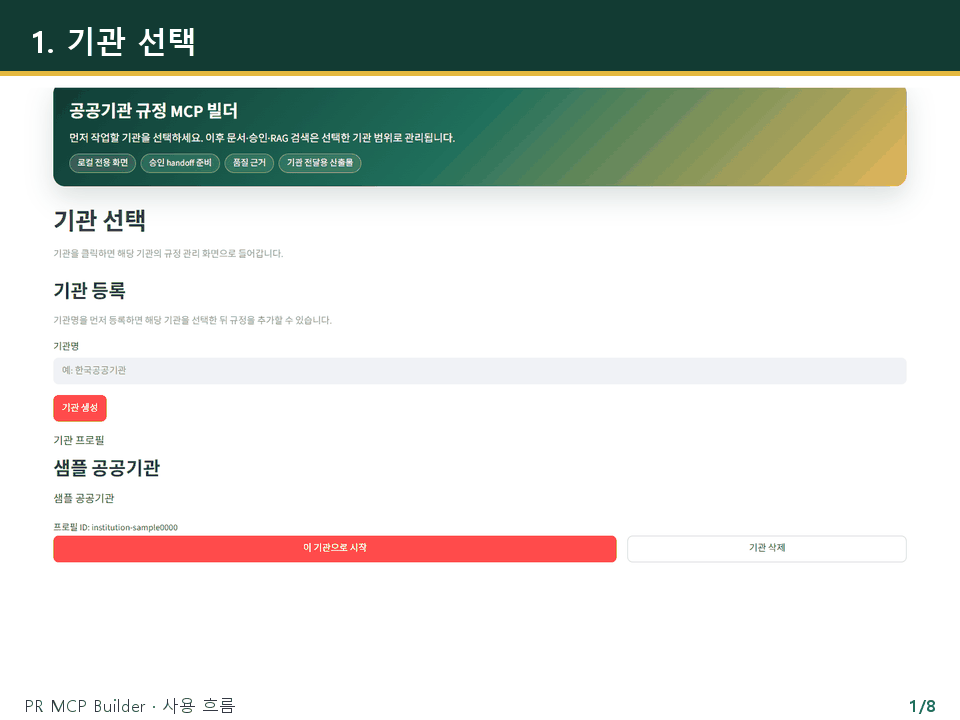
</p>

## 화면 사용 순서

아래 화면을 따라 기관 선택부터 MCP 연결까지 순서대로 진행합니다.

### 1. 기관 선택

첫 화면에서는 기관명만 입력하거나 등록된 기관을 선택합니다. 이 단계에서는 저장 프로젝트 불러오기, API 키, 규정 파일 또는 MCP 설정을 표시하지 않습니다. 기관을 선택한 뒤 열리는 두 번째 대시보드부터 해당 기관의 프로젝트 저장·불러오기를 사용할 수 있습니다.

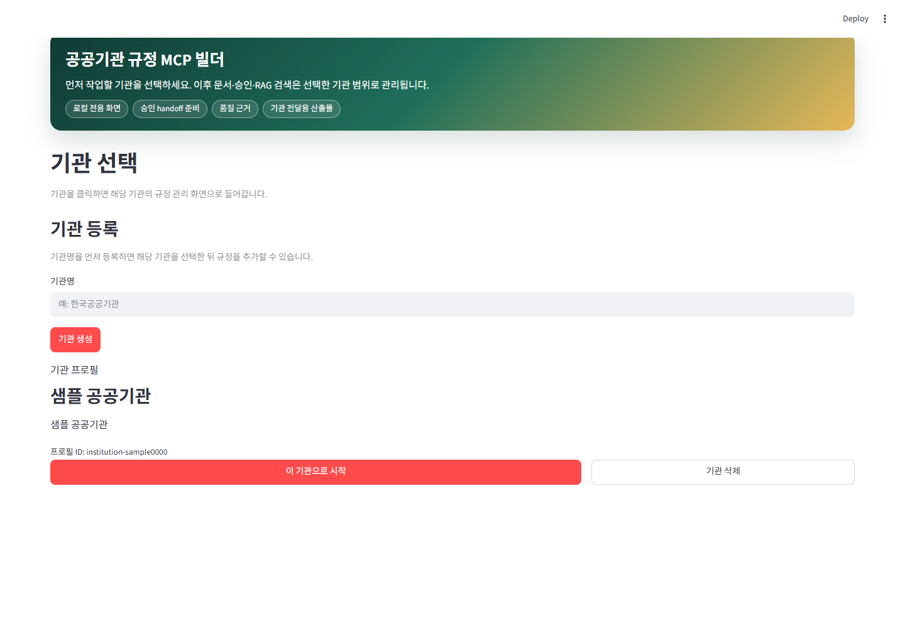

기관을 선택한 뒤부터 문서, 승인 기록, 검색 범위와 MCP 산출물은 선택 기관 범위로 제한됩니다. 다른 기관의 저장 프로젝트나 문서 ID를 불러와도 현재 기관과 일치하지 않으면 화면에서 차단합니다.

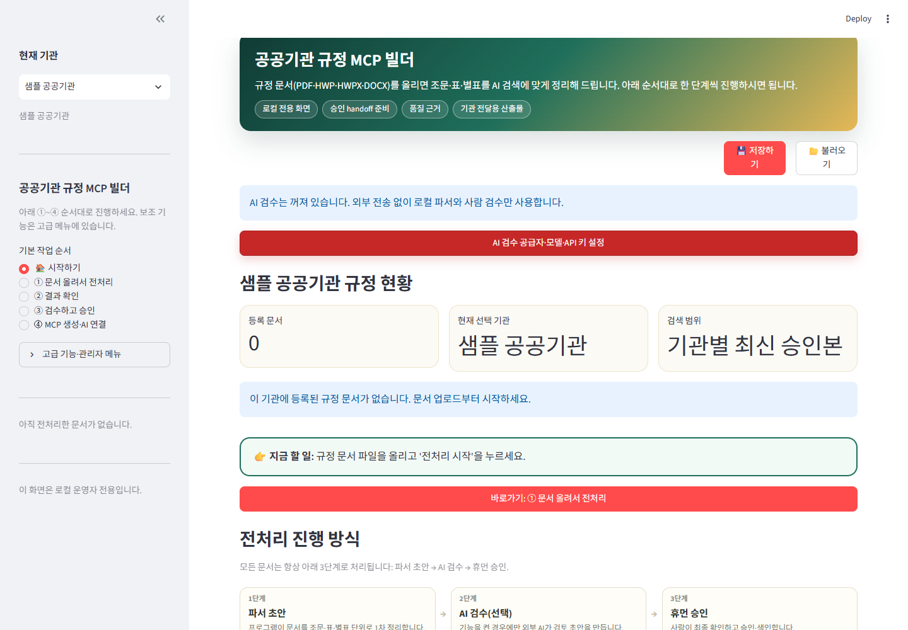

### 2. 규정 업로드와 전처리

`① 문서 올려서 전처리`에서 PDF, HWP, HWPX 또는 DOCX 파일을 선택합니다. 여러 파일을 한 번에 넣어도 규정 계열과 개정 버전 순서로 분류합니다.

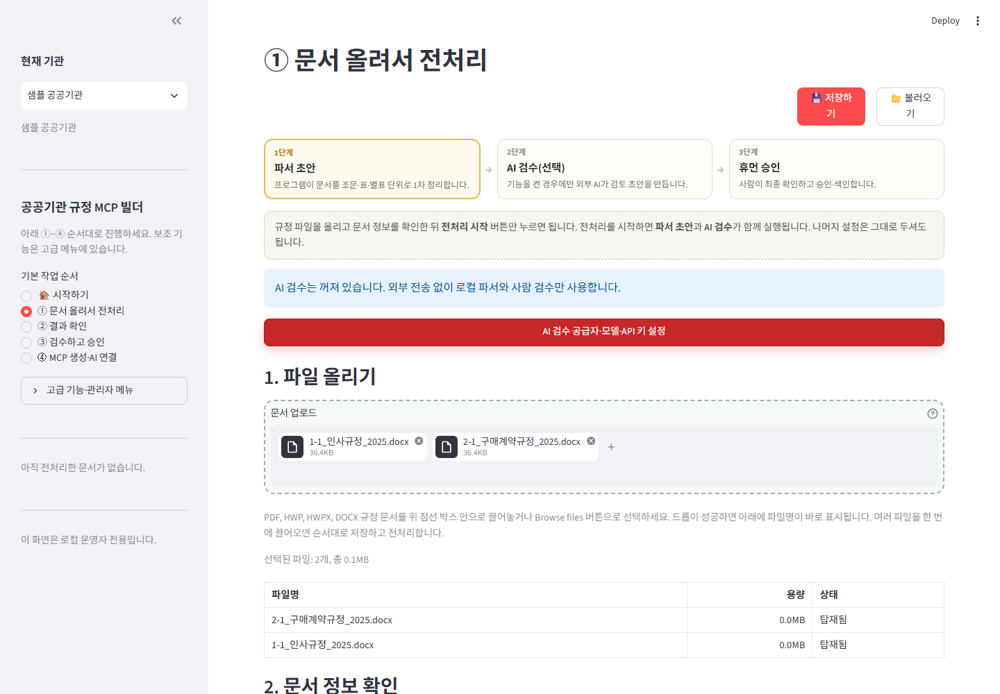

자동 인식은 파일명만 보지 않습니다. 본문 앞부분의 `제정`, `개정`, `전부개정`, 시행일과 개정 이력을 우선해 규정명과 버전을 정합니다. 특수한 문서만 `자동 인식값을 직접 수정`에서 보완합니다.

전처리 중에는 실제 작업 단계와 처리 건수를 게이지로 표시합니다. 큰 통합 규정집도 `규정 1/N`, 구조 저장, 청크 저장, 검사 결과 저장, 내보내기와 경과 시간이 계속 갱신됩니다.

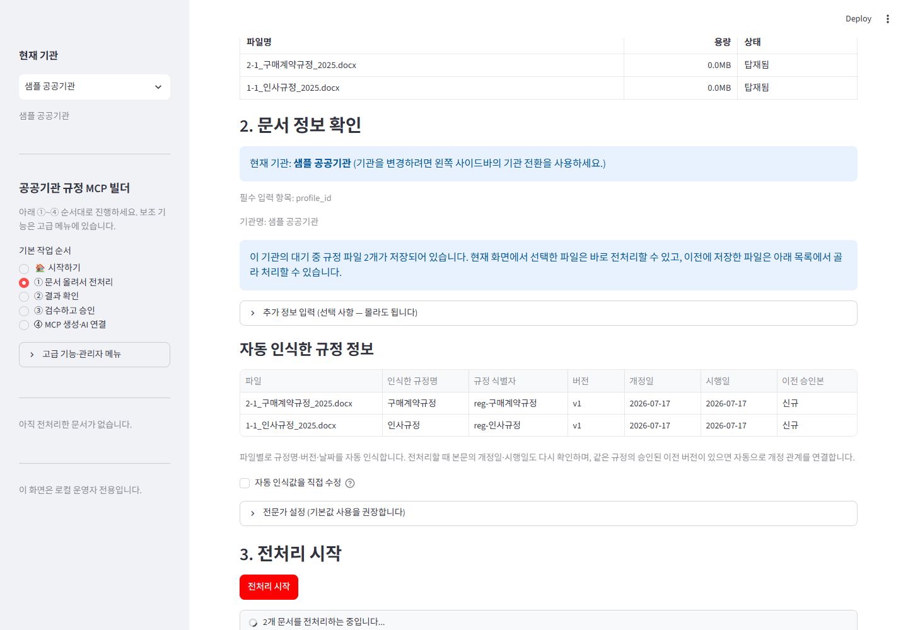

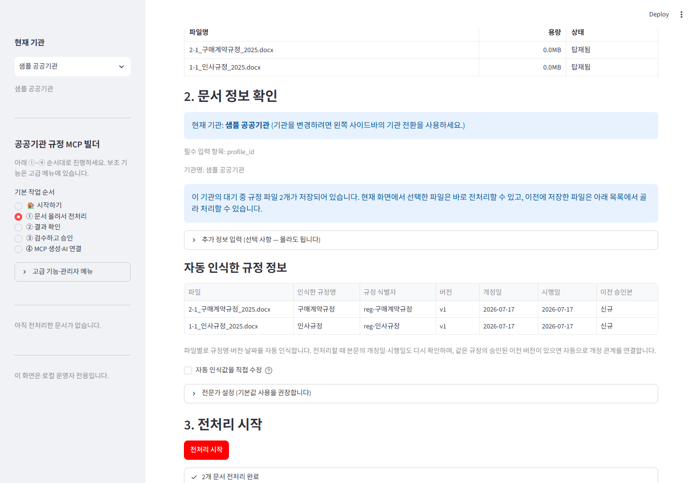

### 선택 기능: 외부 AI 검수

AI 검수는 필수 전처리가 아니라 선택 기능이며 기본값은 꺼짐입니다. 끈 상태에서는 외부로 내용을 보내지 않고 로컬 파서와 사람 검수만 사용합니다. 켠 경우에만 품질 경고가 있는 조문, 표, 별표, 부록과 깨진 문자 같은 의심 구간을 선택한 공급자에 보내 검수 초안을 받습니다.

지원하는 공급자는 다음과 같습니다.

| 공급자 | 입력 항목 | 모델 선택 |
| --- | --- | --- |
| OpenAI | API 키, API 주소 | `gpt-4.1-mini` 권장, 다른 모델 또는 직접 입력 가능 |
| Azure OpenAI | 리소스 엔드포인트, API 키 | 기관 Azure 배포 이름 입력 |
| Anthropic Claude | API 키, API 주소 | Claude 모델 목록 또는 직접 입력 |
| OpenAI 호환 API | 사내·로컬 API 주소, 선택적 키 | Ollama·사내 게이트웨이의 모델 ID 직접 입력 |

OpenAI에서는 구조화된 지시 준수, 속도와 비용의 균형을 기준으로 `gpt-4.1-mini`를 이 제품의 기본 권장값으로 표시합니다. 이 모델은 Chat Completions와 structured outputs를 지원합니다. 자세한 사양은 [OpenAI 공식 GPT-4.1 mini 문서](https://developers.openai.com/api/docs/models/gpt-4.1-mini)를 확인합니다.

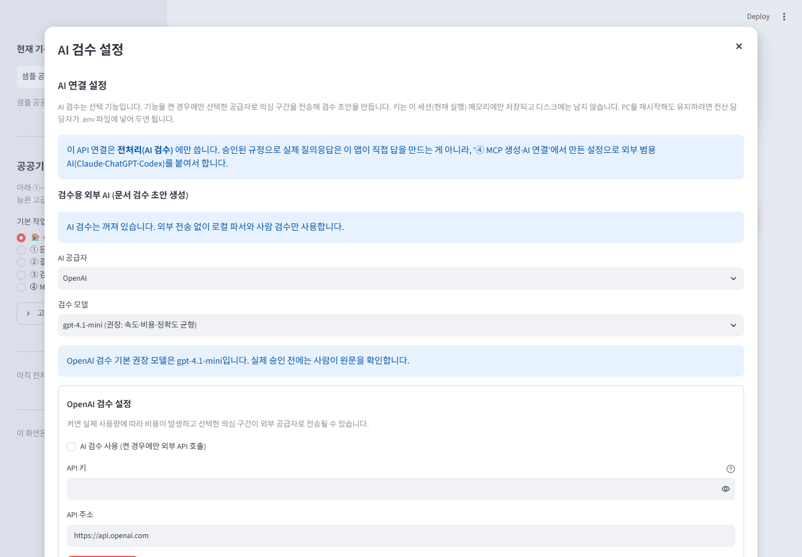

README 촬영용 샘플에서는 외부 API 키를 넣지 않았으므로 실제 AI 문장 수정은 실행되지 않았고, 로컬 파서가 위험 구간을 표시한 검수 초안이 중심이었습니다. 따라서 AI 검수 결과가 없거나 수정 제안이 적어도 오류가 아닙니다. AI 검수는 자동 승인 기능이 아니며, 결과를 사용하더라도 사람이 원문과 대조한 뒤 반영 여부를 결정해야 합니다.

### 3. 결과 확인

구조 노드 수, 청크 수, 이슈, 품질 점수와 인식된 규정·버전 정보를 확인합니다. 140개 이상의 규정이 들어 있는 파일도 먼저 규정과 목차를 좁히고 조문으로 들어갈 수 있도록 계층 색인을 만듭니다.

여러 규정 파일을 함께 올리면 모두 기본 선택된 `함께 처리할 규정 디렉터리`가 먼저 표시됩니다. `규정 열기`를 누르면 그 규정의 상세 데이터만 불러오므로 대량 문서 전체를 매번 화면에 펼치지 않습니다. 선택한 규정에서는 다음 내용을 확인할 수 있습니다.

- 현재 규정과 직전·이전·이후 개정판 관계
- 목차와 청크 위치, 원문 페이지, 신뢰도와 경고
- 선택 청크의 원문과 전처리 결과 좌우 비교, 직전·현재·다음 청크 문맥

체크된 규정은 결과 확인, 검수·승인, MCP 생성 단계까지 한 작업 묶음으로 유지됩니다. 일부 규정을 이번 MCP에서 제외하려는 경우에만 체크를 해제합니다.

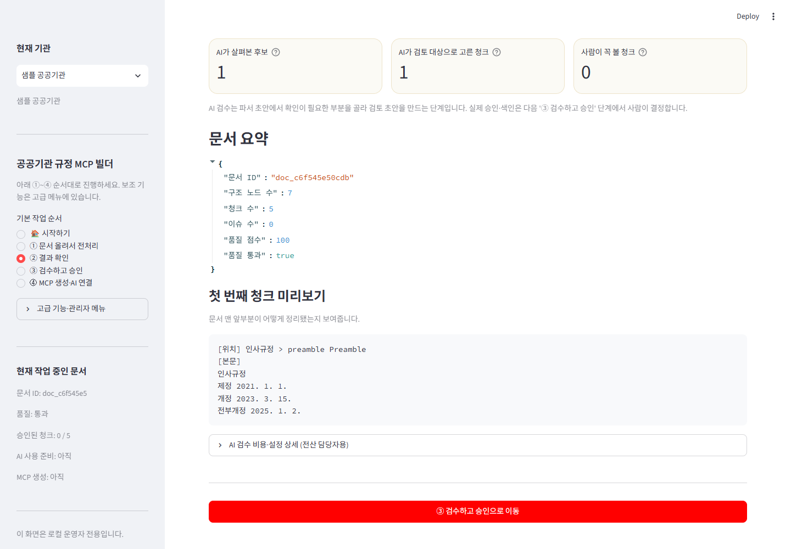

### 4. AI·사람 검수

검수는 청크별로 진행할 수도 있고 전체 버튼으로 마칠 수도 있습니다.

- `전체 규정 자료 AI 검수 완료`: 기존 상태와 관계없이 전체 AI 제안을 한 번에 확인 처리합니다.
- `전체 규정 자료 사람 확인 완료`: 전체 청크의 사람 확인을 한 번에 완료합니다.
- `나머지 부분 AI 점검 전체 완료`: 이미 개별 처리한 `반영`·`반영 안 함` 결정은 보존하고, 아직 결정하지 않은 AI 제안만 확인 완료 처리합니다.
- `나머지 부분 사람 점검 전체 완료`: 이미 사람이 확인한 청크는 그대로 두고, 아직 미확인인 청크만 확인 완료 처리합니다.

따라서 일부 청크를 먼저 자세히 수정한 뒤 나머지만 일괄 점검해도 앞선 작업이 덮어써지지 않습니다. AI 일괄 점검은 최종 승인을 대신하지 않으며, 승인 전 사람이 원문과 수정 후 결과를 확인해야 합니다.

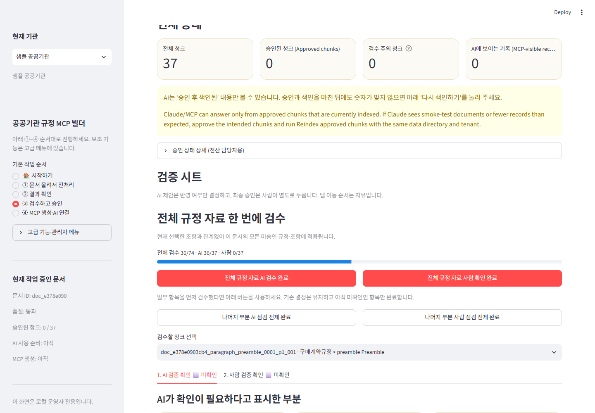

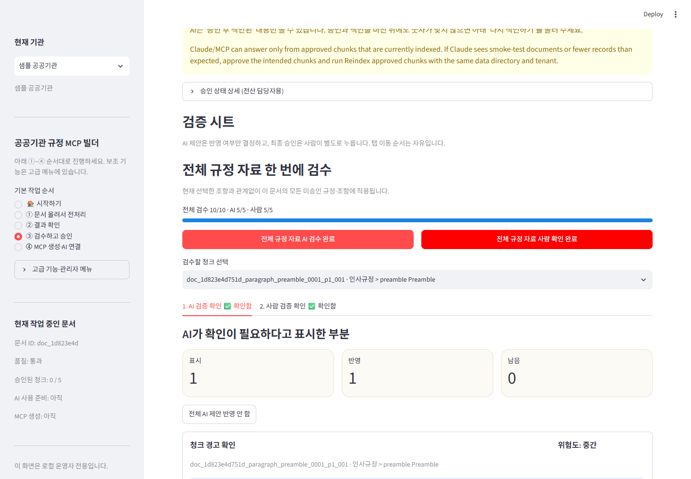

`승인하고 색인`을 누르면 검수 완료된 청크만 승인 색인에 들어갑니다. 승인된 최신 유효본과 MCP에 노출되는 기록 수가 일치하는지 화면에서 확인합니다. 이 순서는 **승인된 규정만 MCP 데이터로 생성**하기 위한 필수 게이트입니다.

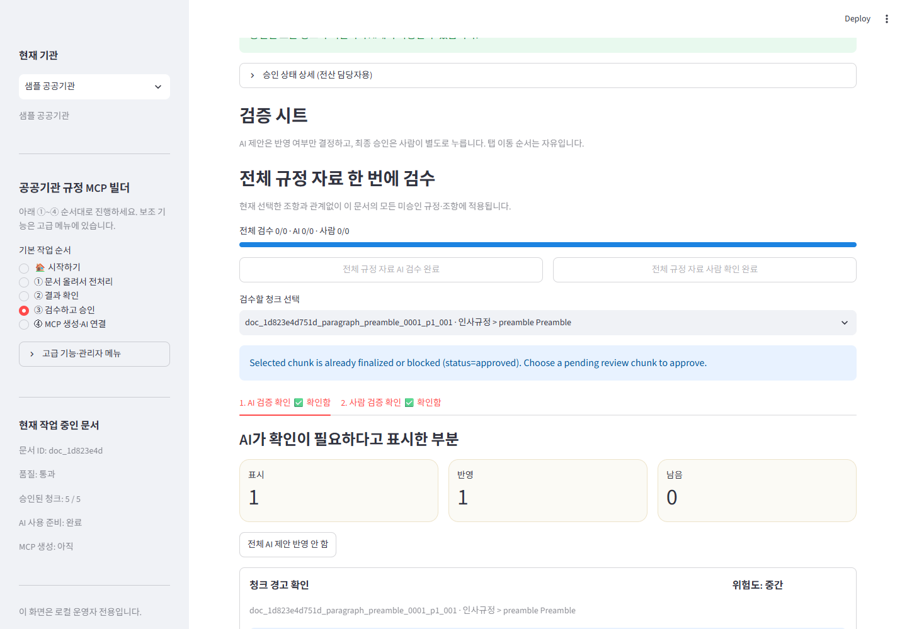

### 5. MCP 범위와 연결 대상 선택

`④ MCP 생성·AI 연결`에서 데이터 범위를 선택합니다.

- `선택한 규정 N개`: 앞 단계에서 체크한 규정을 빠짐없이 하나의 MCP에 포함합니다. 기본 선택입니다.
- `현재 연 규정만`: 디렉터리에서 현재 열어 본 규정 하나만 포함합니다.
- `선택 기관의 승인 규정 전체`: 현재 기관의 승인된 최신 유효 규정을 모두 포함합니다.

`선택한 규정 N개`에서는 각 규정의 승인 청크 수와 MCP 노출 기록 수를 표로 확인합니다. 하나라도 검수·승인·색인이 끝나지 않았으면 누락된 채 생성하지 않고 MCP 생성 버튼을 잠급니다.

그다음 통합형 ChatGPT Desktop, Codex CLI, Claude Desktop, Claude Code, ChatGPT 웹 또는 Claude HTTPS 중 실제로 사용할 대상을 선택합니다. 최신 ChatGPT Desktop은 Codex 플러그인 MCP 설정을 통합하므로 로컬 stdio 방식으로 연결할 수 있습니다.

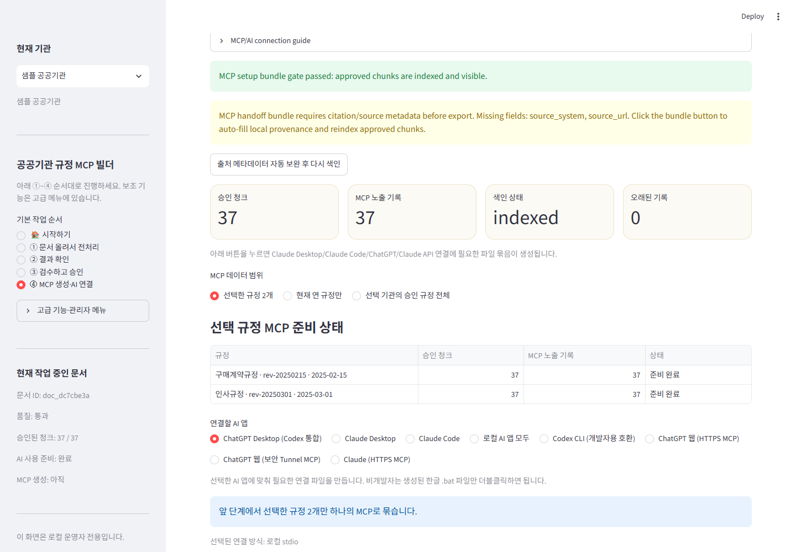

### 6. MCP 파일 묶음 생성

`생성할 MCP 이름`을 사용자가 직접 입력하고 저장 폴더를 확인한 뒤 `MCP로 쓸 파일 묶음 만들기` 버튼을 누릅니다. 폴더명에서 만든 값은 입력 예시로만 표시되며 자동으로 적용되지 않습니다. 이름을 입력하지 않으면 ZIP, BAT, 연결 설정을 생성할 수 없고, 입력한 이름만 각 AI 앱의 MCP 이름으로 등록됩니다.

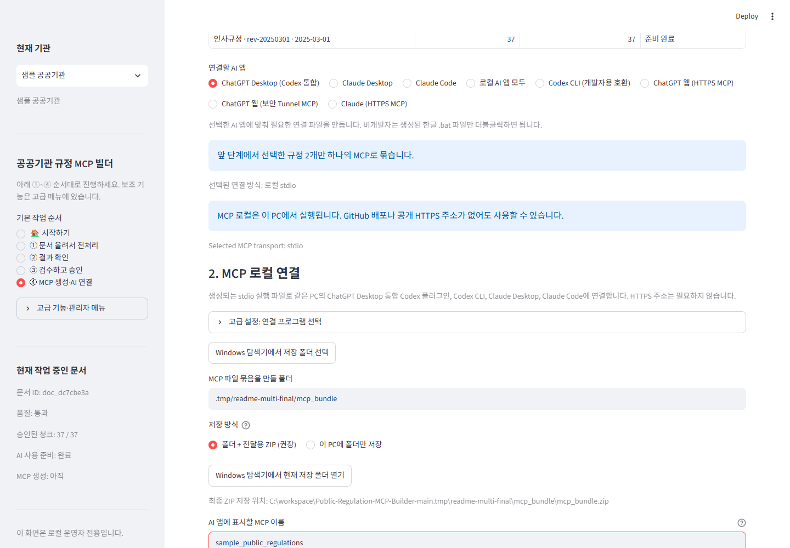

승인 데이터 복사, 계층 DB 생성, 연결 설정 작성, 스크립트 생성과 ZIP 압축 진행률이 실제 완료 항목에 맞춰 표시됩니다. `C:\` 루트처럼 쓰기 권한이 제한될 수 있는 위치를 직접 지정하지 말고 문서, 바탕 화면 또는 사용자가 선택한 폴더에 저장합니다.

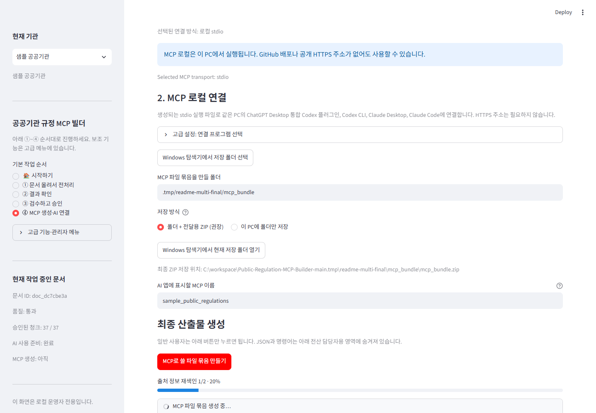

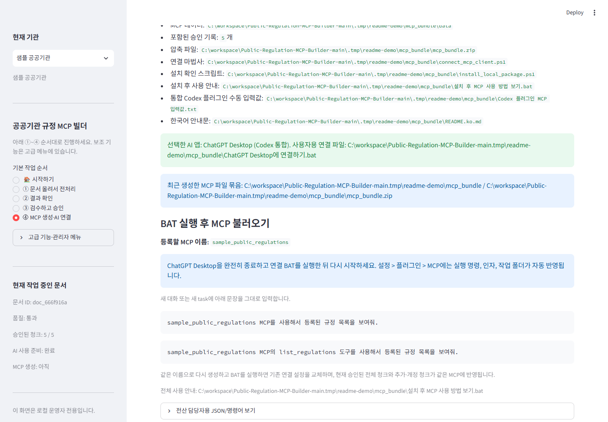

생성 폴더에는 선택한 클라이언트에 맞는 더블클릭용 파일이 들어갑니다.

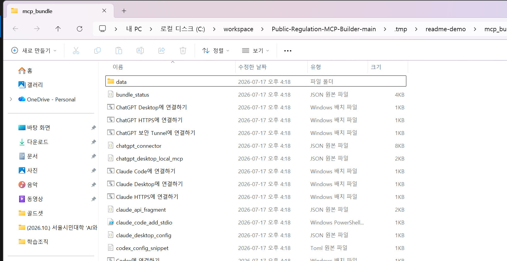

## 대량 규정 진행 표시

800페이지 또는 140개 이상 규정이 포함된 통합 문서는 페이지 이동과 저장도 오래 걸릴 수 있습니다. 다음 작업은 흰 화면에서 무응답으로 기다리게 하지 않고 진행 창을 유지합니다.

- 전처리: 현재 파일, 내부 규정 번호, 구조·청크·검사·내보내기 건수와 경과 시간
- 다음 단계 이동: 문서·청크·목차·색인 상태를 백그라운드에서 미리 읽는 실제 진행률과 heartbeat
- 전체/나머지 검수: 완료 청크 수와 전체 청크 수
- 승인·색인: 승인 묶음 수, 색인 단계, 경과 시간
- MCP 생성: 승인 데이터 복사, 계층 DB와 BM25 생성, 연결 파일 작성, ZIP 압축 바이트 수

내부 라이브러리가 세부 건수를 잠시 주지 않는 구간에도 `작업 중...`, 경과 시간과 마지막 완료 단계를 0.5초마다 갱신합니다. 추정 진행률은 실제 측정값보다 앞서 완료 처리하지 않으며, 실제 완료 이벤트를 받은 뒤에만 100%가 됩니다.

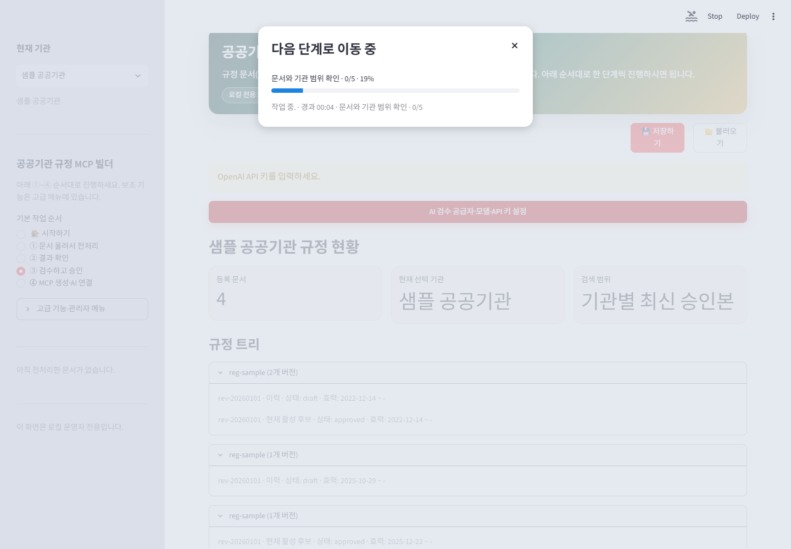

## 로컬 연결

비개발자는 PowerShell 스크립트나 JSON 설정을 직접 편집할 필요가 없습니다.

1. 연결할 AI 앱을 완전히 종료합니다.
2. MCP 생성 폴더에서 사용할 앱의 배치 파일을 더블클릭합니다.
3. `연결 상태 확인하기.bat`를 더블클릭해 오류가 없는지 확인합니다.
4. AI 앱을 다시 실행하고 새 대화를 엽니다.
5. 새 대화 또는 task에서 `입력한이름 MCP를 사용해서 등록된 규정 목록을 보여줘.`라고 호출합니다.

| 대상 | 사용자가 실행할 파일 | 프로그램이 처리하는 설정 |
| --- | --- | --- |
| ChatGPT Desktop (Codex 통합) | `ChatGPT Desktop에 연결하기.bat` | `%USERPROFILE%\.codex\config.toml`을 백업하고 플러그인 MCP의 이름·명령·인자·작업 폴더를 등록 |
| Codex CLI 호환 | `Codex에 연결하기.bat` | 사용자 Codex 설정에 현재 MCP 서버명과 실제 폴더 경로를 등록 |
| Claude Desktop | `Claude Desktop에 연결하기.bat` | `%APPDATA%\Claude\claude_desktop_config.json`을 백업한 뒤 병합 |
| Claude Code | `Claude Code에 연결하기.bat` | `claude mcp add ...` 형식의 로컬 stdio 등록 실행 |

각 앱은 같은 승인 데이터를 사용하지만 설정 파일과 등록 방식이 다르므로 연결 버튼도 분리합니다. 통합형 ChatGPT Desktop은 앱을 완전히 종료한 뒤 BAT를 실행하고 다시 시작하면 `설정 → 플러그인 → MCP`에 입력한 이름과 실제 실행 경로가 표시됩니다. 사용자가 실행 명령이나 인자를 직접 입력할 필요는 없습니다.

같은 MCP 이름으로 다시 생성하고 BAT를 실행하면 기존 항목을 중복 추가하지 않고 새 경로와 설정으로 교체합니다. 생성할 때 현재 승인된 전체 청크를 다시 묶으므로 추가 규정과 개정판 청크도 같은 MCP 이름으로 조회됩니다. 폴더를 옮겼다면 새 폴더에서 연결 BAT를 다시 실행합니다.

생성 폴더의 `설치 후 MCP 사용 방법 보기.bat`는 클라이언트별 확인 명령과 실제 MCP 이름이 들어간 첫 호출 문장을 보여줍니다. 자동 등록이 되지 않을 때만 `Codex 플러그인 MCP 입력값.txt`의 값을 통합형 ChatGPT Desktop 플러그인 화면에 수동 입력합니다.

생성 파일의 의미, 수동 점검 명령과 장애 해결 절차는 [MCP 빠른 연결 안내](docs/mcp_quickconnect_ko.md)에 정리되어 있습니다.

## ChatGPT 웹 연결

위의 통합형 ChatGPT Desktop 로컬 플러그인과 ChatGPT 웹 앱 연결은 서로 다릅니다. ChatGPT 웹의 사용자 지정 MCP 앱은 인터넷에서 접근 가능한 원격 MCP 엔드포인트가 필요합니다. `localhost`나 로컬 stdio를 ChatGPT 웹에 직접 연결할 수 없으므로 HTTPS 배포 또는 승인된 보안 Tunnel을 사용합니다.

생성 화면의 연결 방식 표기에서 `MCP HTTP - URL로 연결`은 운영자가 준비한 HTTPS 주소를 사용하고, `OpenAI Secure MCP Tunnel`은 생성된 `run_openai_secure_tunnel.ps1`을 이용하는 보안 Tunnel 흐름을 뜻합니다.

1. 생성 화면에서 `ChatGPT HTTPS` 또는 `ChatGPT 보안 Tunnel`을 선택합니다.
2. HTTPS 방식이면 공개 기본 주소를 입력합니다. 화면이 최종 `/mcp` 주소를 표시합니다.
3. MCP 묶음을 승인된 서버에 배포하고 TLS와 인증을 구성합니다.
4. ChatGPT의 `Settings` 또는 워크스페이스 설정에서 `Apps` → `Create`를 엽니다.
5. 생성한 HTTPS MCP URL을 입력하고 `Scan tools` 후 앱을 만듭니다.
6. 새 대화에서 입력한 MCP 이름의 앱을 선택하거나 `@MCP이름`으로 지정한 뒤 `MCP이름에서 등록된 규정 목록을 보여줘.`라고 호출합니다.

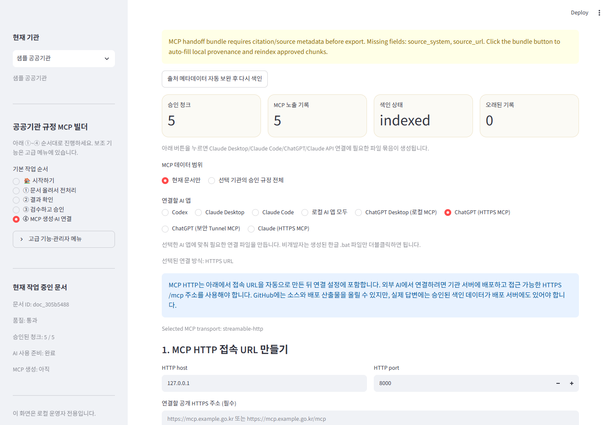

플랜과 워크스페이스 관리자 정책에 따라 개발자 모드나 사용자 지정 앱 메뉴가 보이지 않을 수 있습니다. 최신 조건은 OpenAI 공식 문서의 [Developer mode와 custom MCP apps](https://help.openai.com/en/articles/12584461-developer-mode-apps-and-full-mcp-connectors-in-chatgpt-beta) 및 [Apps in ChatGPT](https://help.openai.com/en/articles/11487775-connectors-in-chatgpt)를 확인합니다.

## Claude 연결

같은 PC의 Claude Desktop과 Claude Code는 로컬 stdio 방식이 가장 간단합니다. 위 표의 배치 파일을 실행하면 됩니다.

Claude 웹 또는 원격 환경에서 사용하려면 다음 순서로 연결합니다.

1. 생성 화면에서 `Claude HTTPS`를 선택하고 공개 HTTPS 기본 주소를 입력합니다.
2. 생성한 MCP 묶음을 승인된 서버에 배포합니다.
3. Claude의 `Settings` → `Connectors`에서 사용자 지정 커넥터를 추가합니다.
4. 최종 `/mcp` URL과 필요한 인증 정보를 등록합니다.


로컬 Claude Desktop 설정과 원격 커넥터 설정은 서로 다릅니다. 원격 MCP URL을 `claude_desktop_config.json`의 로컬 stdio 항목처럼 넣지 않습니다. 자세한 내용은 Anthropic 공식 문서의 [로컬 Claude Desktop MCP](https://support.anthropic.com/en/articles/10949351-getting-started-with-local-mcp-servers-on-claude-desktop)와 [원격 custom connectors](https://support.anthropic.com/en/articles/11503834-building-custom-connectors-via-remote-mcp-servers)를 확인합니다.

## HTTPS 배포 경계

PR MCP Builder가 자동으로 만드는 범위는 승인 데이터, 계층 검색 DB, MCP 서버 실행 파일, 클라이언트 설정과 연결 스크립트입니다. 다음 항목은 기관 전산 담당자가 운영 환경에 맞게 준비해야 합니다.

- 공개 또는 기관 승인 도메인과 DNS
- TLS 인증서와 HTTPS reverse proxy
- OAuth, mTLS 또는 bearer token 인증
- 서버 방화벽, 감사 로그, 백업과 비밀정보 관리
- ChatGPT/Claude 워크스페이스의 커넥터 승인

원격 MCP를 사용하면 MCP가 반환한 승인 규정 내용이 외부 AI 서비스로 전송될 수 있습니다. 공개 자료 또는 별도 반출 승인을 받은 자료에만 사용하고, 비공개 규정은 로컬 stdio 또는 승인된 내부망 MCP를 우선합니다.

## 개정판 업데이트 방식

예를 들어 같은 기관의 `인사규정1.hwp`, `인사규정2.hwp`, `인사규정3.hwp`를 넣으면 다음 기준으로 정리합니다.

1. 본문에서 규정명과 제정·개정·전부개정 이력을 찾습니다.
2. 같은 기관과 정규화된 규정명을 하나의 규정 계열로 묶습니다.
3. 개정일, 시행일과 내용 해시로 버전을 구분합니다.
4. 최신 승인본을 현재 유효본으로 사용하고 이전 승인본은 개정 이력으로 보존합니다.
5. 질의 시 기관 → 규정 → 목차/조문 → 최신 유효 버전 순으로 좁혀 검색합니다.

본문 이력이 누락되거나 날짜가 충돌하는 문서는 자동 확정하지 않고 검토 대상으로 표시합니다. 파일명은 보조 단서일 뿐 최종 개정 판단의 유일한 기준이 아닙니다.

## 지원 범위와 제한

| 항목 | 현재 범위 |
| --- | --- |
| 운영체제 | Windows 10/11 64비트 우선 지원 |
| 입력 | PDF, HWP, HWPX, DOCX |
| 구조 | 기관 → 규정 → 개정 버전 → 목차/조문 → 승인 청크 |
| 로컬 UI | Streamlit, 기본 `127.0.0.1` 바인딩 |
| 검색 | 계층 탐색 + 최신 유효본 필터 + BM25/벡터 후보 검색 |
| HWP 표 | 기본 추출 후 선택적 Kordoc CLI로 보강, 사람 검수 필요 |
| 스캔 PDF | OCR 백엔드와 한국어 언어 지원을 별도 설정해야 함 |
| 외부 연결 | 승인된 HTTPS 배포 또는 보안 Tunnel 필요 |

### 선택적 Kordoc 보강

HWP 표 추출을 보강할 때는 [Kordoc 프로젝트](https://github.com/chrisryugj/kordoc)를 별도로 설치할 수 있습니다. PR MCP Builder는 Kordoc이 추출한 셀·열 구조를 기본 파서 결과와 대조하고, 일치도가 충분한 표를 검수 후보로 연결합니다. Kordoc 결과도 자동 승인하지 않으며 원본 표와 사람이 대조해야 합니다.

- 이 프로젝트에서의 역할: HWP를 중심으로 표 셀, 열 위치와 병합 구조 보강
- 연동 방식: 사용자가 별도로 설치한 Kordoc CLI를 subprocess로 호출
- 배포 범위: PR MCP Builder 소스와 Windows ZIP에 Kordoc 소스·실행 파일을 포함하지 않음
- 검수 원칙: Kordoc 표 매칭·승격·미매칭 결과에 검수 표시를 남기고 승인 전 원문 대조

Kordoc 소스나 실행 파일이 포함되지 않음이 기본 배포 원칙입니다.

Kordoc은 Chris가 공개한 별도 MIT 프로젝트입니다. 사용 전 [Kordoc 라이선스](https://github.com/chrisryugj/kordoc/blob/main/LICENSE)와 이 저장소의 [THIRD_PARTY_NOTICES.md](THIRD_PARTY_NOTICES.md)를 함께 확인하세요.

## 보안 원칙

- 전처리 자체를 보안 통제로 간주하지 않습니다.
- 검사, 분류, 사람 승인, 감사 로그와 미승인 청크 색인 차단이 실제 통제입니다.
- 원본 규정, 런타임 산출물, API 키, 토큰과 사용자 로컬 경로를 공개 저장소에 커밋하지 않습니다.
- 공유 배포에서는 인증, 기관별 테넌트 격리, 접근 제어와 기관 보안 정책을 별도로 적용합니다.
- 공개 배포 전 [SECURITY.md](SECURITY.md)와 [공개 저장소 이력 정책](docs/public_repository_history_policy_ko.md)을 확인합니다.

## 개발자 검증과 빌드

```powershell
python -m unittest discover -s tests -v
python -m build --sdist --wheel
python scripts\audit_release_hygiene.py --workflow-scope available --include-untracked --include-source-path-scan
```

Windows portable ZIP은 다음 명령으로 만듭니다.

```powershell
powershell -ExecutionPolicy Bypass -File scripts\build_windows_portable.ps1 -Version 0.1.0
```

결과 파일은 `dist\PR-MCP-Builder-Windows-x64-0.1.0.zip`입니다. `data/`, `reports/`, `.tmp/`, `build/`, `dist/`, 가상환경과 실제 기관 문서는 Git에 커밋하지 않습니다.

자세한 설계와 운영 문서는 [docs](docs/)를 참고합니다. 소스 코드는 [MIT License](LICENSE)를 따르며 외부 구성요소의 조건은 [THIRD_PARTY_NOTICES.md](THIRD_PARTY_NOTICES.md)에 정리되어 있습니다.
