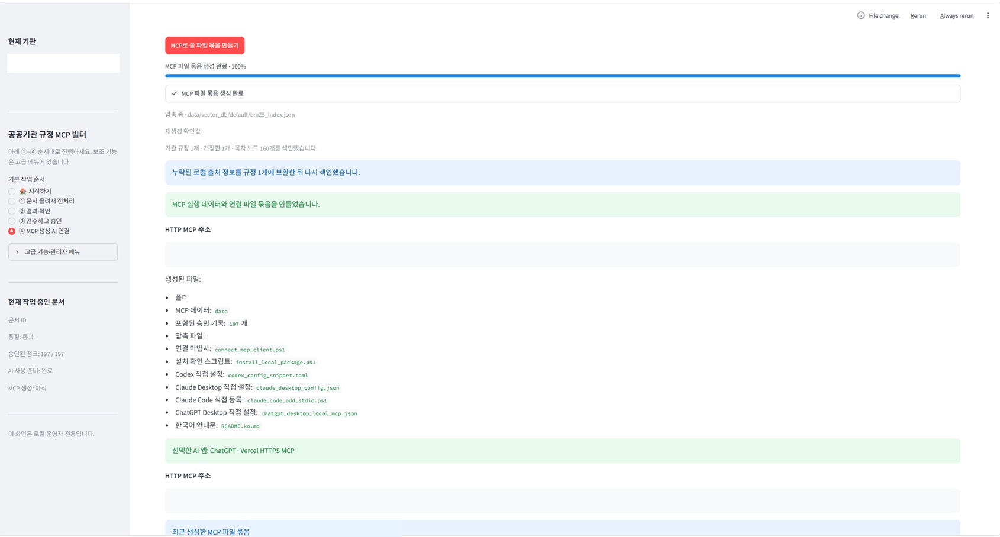
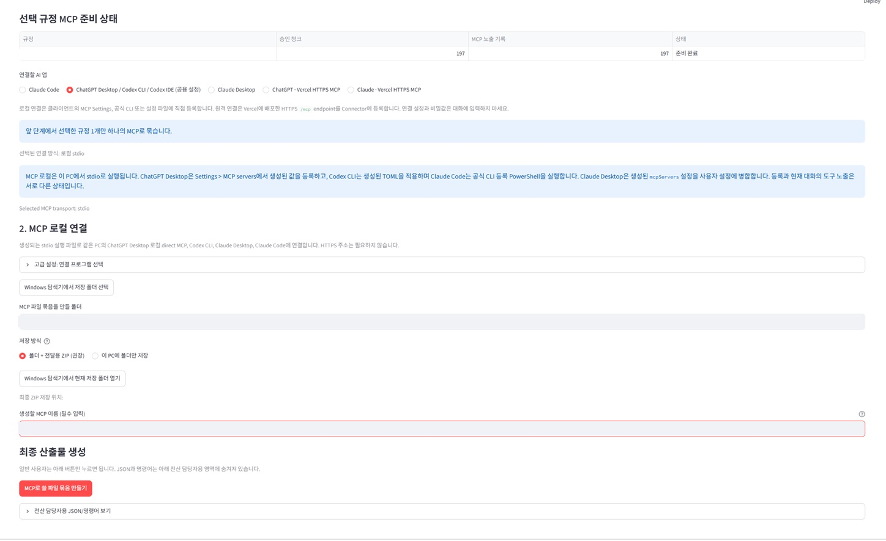
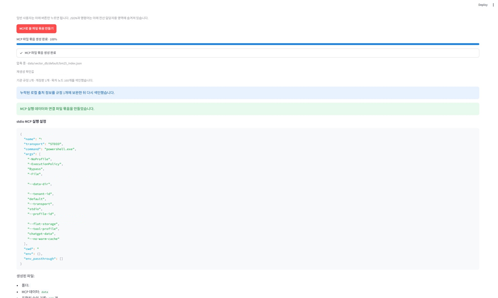
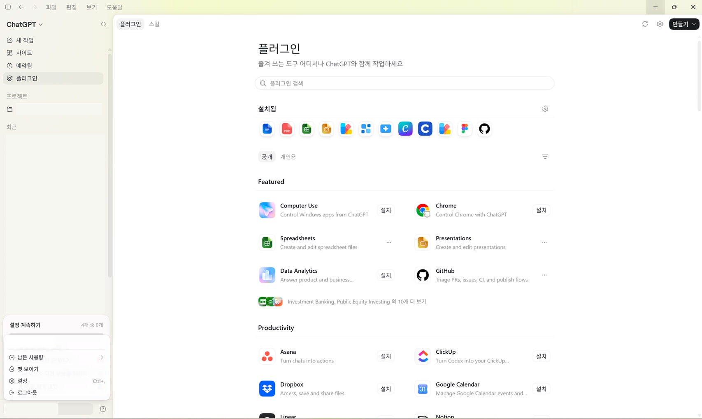
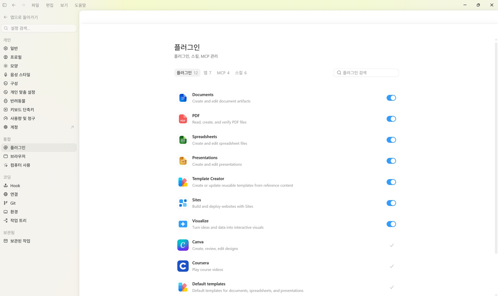
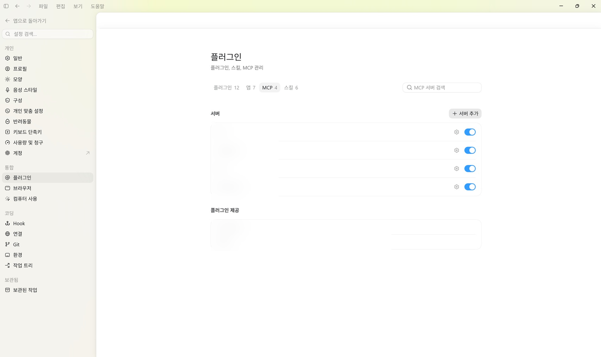
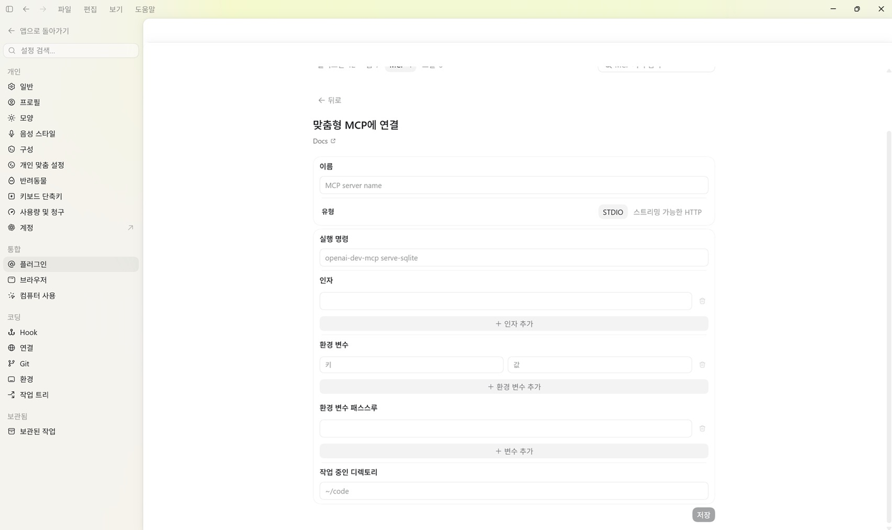
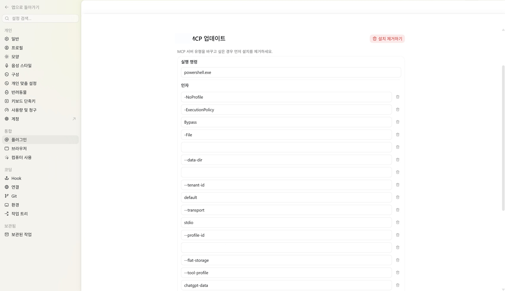
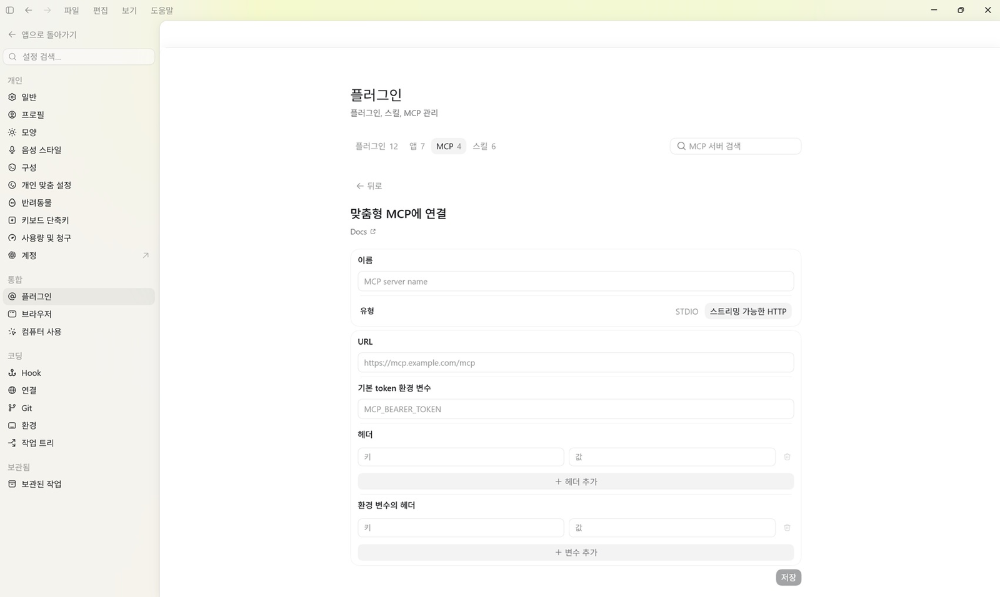

# PR MCP Builder

[](https://github.com/koul777/Public-Regulation-MCP-Builder/releases/latest)
[](pyproject.toml)
[](docs/mcp_quickconnect_ko.md)
[](LICENSE)


공공기관 규정 파일을 정리하고, **사람이 확인해 승인한 내용만** ChatGPT·Codex·Claude에서
검색하게 만드는 Windows용 프로그램입니다.

PDF·HWP·HWPX·DOCX 파일을 올리면 규정명, 개정판, 목차와 조문을 정리합니다. 처리 결과를
사람이 원문과 비교해 승인하면 AI 프로그램에서 사용할 MCP 검색 도구를 만듭니다.

현재 개발 중인 공개 소스 프로젝트이며 Windows 10/11 64비트 우선 지원입니다.
Streamlit 화면은 로컬 운영자용이며 완성형 공개 SaaS 화면이 아닙니다.

> [!IMPORTANT]
> 문서를 올렸다고 바로 AI 검색에 공개되지 않습니다. 승인하지 않은 내용은 MCP의
> `search`와 `fetch` 결과에 포함하지 않습니다.
> 사람 검수와 승인을 거쳐 승인된 규정만 MCP 데이터로 생성합니다.
> 사람에게 승인되지 않은 청크는 검색 색인과 MCP 번들에 포함하지 않습니다.

이 안내서는 MCP를 처음 들어 본 사람도 위에서부터 그대로 따라 할 수 있도록 작성했습니다.
화면 예시는 이해를 돕기 위한 샘플이며 앱 버전에 따라 버튼 위치나 이름이 조금 달라질 수
있습니다. **경로, 서버 이름, ID는 예시를 타이핑하지 말고 내 PC에서 생성된 값을
복사하세요.**

## 이 문서에서 할 일

1. 프로그램을 내려받고 규정 파일을 처리합니다.
2. 원문과 처리 결과를 비교한 뒤 사용할 조문을 승인합니다.
3. 아래 두 연결 중 하나를 선택합니다.
   - 같은 PC에서 쓰는 **로컬 STDIO**
   - 웹이나 다른 기기에서도 쓰는 **Vercel HTTPS**
4. AI 프로그램에 MCP를 등록합니다.
5. `search`와 `fetch`를 실제로 호출해 연결을 검증합니다.

바로 이동:

- [완전 처음이라면 여기부터](#0-완전-처음이라면-여기부터)
- [처음 설치하고 승인 데이터 만들기](#1-처음-설치하고-승인-데이터-만들기)
- [방법 A~E 중 내 앱 하나 고르기](#2-다섯-방법-중-하나-선택하기)
- [방법 A: Claude Code 로컬 STDIO](#method-a)
- [방법 B: ChatGPT Desktop / Codex CLI / Codex IDE 로컬 STDIO](#method-b)
- [방법 C: Claude Desktop 로컬 STDIO](#method-c)
- [방법 D: ChatGPT · Vercel HTTPS MCP](#method-d)
- [방법 E: Claude · Vercel HTTPS MCP](#method-e)
- [search와 fetch로 최종 확인하기](#3-search와-fetch로-최종-확인하기)
- [문제 해결표](#4-문제-해결표)

## 먼저 알아둘 네 단어

| 단어 | 쉬운 뜻 |
| --- | --- |
| MCP | AI 프로그램이 이 규정 검색기에 질문할 수 있게 해 주는 연결 규칙 |
| 번들 | 설정 파일, 실행 파일, 승인 검색 데이터를 한 폴더에 모은 것 |
| STDIO | 같은 PC의 AI 프로그램이 Python 서버를 직접 켜고 대화하는 로컬 연결 |
| HTTPS | Vercel에 서버를 배포하고 `https://.../mcp` 주소로 접속하는 원격 연결 |

`search`는 승인된 규정을 찾아 결과 목록과 `id`를 돌려줍니다. `fetch`는 그 `id`를 받아
원문 내용과 출처를 돌려줍니다. 따라서 **서버 이름이 보이는 것만으로는 성공이 아니며,
두 도구가 모두 동작해야 연결 완료**입니다.

## 0. 완전 처음이라면 여기부터

처음에는 **로컬 STDIO부터 성공시킨 뒤**, 꼭 인터넷 주소가 필요할 때만 Vercel HTTPS로
넘어가는 것을 권장합니다. 로컬 STDIO는 Vercel 계정, Node.js, 도메인과 공개 서버가
필요하지 않아 문제 원인을 찾기 쉽습니다.

### 0-1. 나에게 맞는 출발점

| 지금 상황 | 먼저 읽을 곳 | 필요한 것 |
| --- | --- | --- |
| 같은 PC의 Claude Code에서 사용 | [방법 A](#method-a) | Claude Code CLI, 생성한 번들 폴더 |
| 같은 PC의 ChatGPT Desktop에서 사용 | [방법 B](#method-b) | ChatGPT Desktop, 생성한 번들 폴더 |
| 같은 PC의 Codex CLI 또는 IDE에서 사용 | [방법 B](#method-b) | Codex CLI 또는 IDE, 생성한 TOML |
| Claude Desktop과 이 프로그램을 같은 PC에서 사용 | [방법 C](#method-c) | Claude Desktop, 생성한 번들 폴더 |
| ChatGPT에서 Vercel 주소로 원격 사용 | 로컬 검색 성공 후 [방법 D](#method-d) | Vercel 계정, Node.js, 공개 승인 데이터 |
| Claude에서 Vercel 주소로 원격 사용 | 로컬 검색 성공 후 [방법 E](#method-e) | Vercel 계정, Node.js, 공개 승인 데이터 |
| 아직 규정 파일을 처리하지 않음 | [1장](#1-처음-설치하고-승인-데이터-만들기) | Windows PC, 규정 원문 |

**처음 연결하는 사람의 권장 순서**

```text
Windows 실행판 설치
  → 규정 1개 업로드
  → 원문과 비교
  → 사람 승인
  → 색인 완료 확인
  → 방법 A·B·C 중 사용할 로컬 앱 하나 연결
  → search와 fetch 확인
  → 필요할 때만 Vercel HTTPS 배포
```

### 0-2. 이 문서의 명령과 경로 읽는 법

- 회색 명령 상자 오른쪽 위에 복사 버튼이 보이면 눌러서 복사합니다.
- **Claude Desktop 로컬 연결에서는 서버 이름이나 Python 경로를 다시 타이핑하지
  않습니다.** Builder가 만든 JSON 복사 상자를 사용합니다.
- Vercel 주소도 예시를 고쳐 쓰지 않습니다. 배포가 끝난 뒤 PowerShell의 `Aliased:`
  줄에 나온 실제 주소를 복사합니다.
- `C:\MCP-Bundles\...`는 설명용 예시입니다. 생성 완료 화면이나 내 파일 탐색기의 실제
  경로를 복사합니다.
- JSON 안의 `C:\\MCP-Bundles\\...`처럼 역슬래시가 두 개인 것은 정상입니다. JSON이
  Windows 경로를 안전하게 저장한 모습입니다.
- PowerShell 명령이 여러 줄이면 줄 끝의 백틱 `` ` ``까지 포함해 한 덩어리로
  복사합니다. 불편하면 한 줄로 붙여 넣어도 됩니다.
- 명령을 실행하는 검은색 또는 파란색 창을 이 문서에서는 **PowerShell**이라고 부릅니다.

### 0-3. 원하는 폴더에서 PowerShell 여는 가장 쉬운 방법

1. 파일 탐색기로 명령을 실행할 폴더를 엽니다.
2. 위쪽 주소 표시줄의 폴더 경로를 한 번 클릭합니다.
3. 경로 대신 `powershell`이라고 입력하고 `Enter`를 누릅니다.
4. 열린 창의 줄 앞에 현재 폴더 이름이 보이면 준비 완료입니다.
5. 문서의 명령을 붙여 넣고 `Enter`를 누릅니다.

명령 실행 중 빨간 글씨가 보이면 창을 바로 닫지 마세요. 마지막 20줄을 복사하거나
캡처해 두면 [문제 해결표](#4-문제-해결표)에서 원인을 찾기 쉽습니다. API 키, 토큰,
기관명과 개인 경로가 포함됐다면 공유하기 전에 가립니다.

### 0-4. 시작 전 1분 점검

- [ ] 규정 파일 한 개 이상을 사람이 원문과 비교했다.
- [ ] 사용할 조문을 승인했다.
- [ ] 승인 데이터의 검색 색인이 완료됐다.
- [ ] 번들 폴더를 앞으로 이동하거나 이름을 바꾸지 않을 위치에 만들었다.
- [ ] 로컬 연결이면 방법 A·B·C에서 선택한 앱을 설치하고 로그인했다.
- [ ] Vercel 연결이면 외부 공개가 허용된 데이터인지 담당자에게 확인했다.

## 1. 처음 설치하고 승인 데이터 만들기

### 1-1. 프로그램 내려받기

1. [최신 Windows 실행판](https://github.com/koul777/Public-Regulation-MCP-Builder/releases/latest)을
   엽니다.
2. Windows용 ZIP 파일을 내려받습니다.
3. ZIP 파일에서 바로 실행하지 말고, 새 폴더에 **압축을 모두 풉니다**.
4. 압축을 푼 폴더에서 `PR MCP Builder.exe`를 실행합니다.
5. Windows가 실행 여부를 물으면 게시자와 내려받은 주소가 이 저장소의 Release인지 먼저
   확인합니다.

개발자가 소스에서 실행하는 방법은 [개발자용 실행과 검증](#개발자용-실행과-검증)에
있습니다.

### 1-2. 기관 선택

기관을 만들거나 기존 기관을 선택합니다. 문서와 승인 데이터는 선택한 기관 범위로
분리됩니다.


선택 후 대시보드에서 현재 작업 상태와 다음 단계를 확인합니다.


### 1-3. 규정 파일 올리기

1. `① 파일 추가·전처리`로 이동합니다.
2. PDF·HWP·HWPX·DOCX 규정 파일을 선택합니다.
3. 여러 규정은 한 번에 올릴 수 있지만 처음이라면 한 파일로 연습하는 것이 쉽습니다.
4. 자동 인식된 규정명, 버전과 개정일을 원문과 비교합니다.
5. 값이 맞으면 전처리를 시작합니다.


처리가 끝나면 완료 표시가 나타납니다.


### 1-4. 처리 결과 확인

`② 결과 확인`에서 처리할 규정을 불러옵니다. 품질 결과가 표시되어도 자동 승인된 것은
아닙니다.


여러 규정을 올렸다면 각 규정의 품질과 상태를 확인합니다.


원문, 전처리 결과와 앞뒤 문맥을 비교합니다. 조문 번호, 제목, 본문, 별표와 표 내용이
원문과 다르면 승인하기 전에 수정하거나 다시 처리합니다.


### 1-5. 사람이 검수하고 승인

AI 제안은 참고용입니다. 사람이 원문을 확인하고 승인한 내용만 검색 색인과 MCP에
들어갑니다.


승인 화면에서 사용할 조문을 선택하고 승인 동작을 실행합니다.


색인 완료 상태가 표시돼야 MCP 생성 단계로 갈 수 있습니다.


> [!WARNING]
> 원문 업로드, 미승인 데이터, API 키, 비밀번호와 기관 내부 비밀 자료를 공개 저장소나
> 공개 Vercel 배포에 넣지 마세요.

## 2. 다섯 방법 중 하나 선택하기

`④ MCP 생성·AI 연결`에 보이는 다섯 동그라미와 아래 방법 A~E는 **순서와 이름이
정확히 같습니다.** 내가 실제로 사용할 앱 한 줄만 고른 뒤 그 방법만 따라갑니다.

| 방법 | Builder에서 누를 정확한 글자 | 연결되는 곳 | 최종적으로 옮길 값 |
| --- | --- | --- | --- |
| **A** | `Claude Code` | 같은 PC의 Claude Code CLI | 생성된 `claude_code_add_stdio.ps1` 실행 |
| **B** | `ChatGPT Desktop / Codex CLI / Codex IDE (공용 설정)` | 같은 PC의 ChatGPT Desktop 또는 Codex | ChatGPT는 각 칸의 값, Codex는 생성된 TOML 블록 |
| **C** | `Claude Desktop` | 같은 PC의 Claude Desktop | Builder가 만든 전체 JSON 또는 서버 한 항목 |
| **D** | `ChatGPT · Vercel HTTPS MCP` | ChatGPT의 원격 MCP | 검증을 통과한 고정 `https://...vercel.app/mcp` 주소 |
| **E** | `Claude · Vercel HTTPS MCP` | Claude의 원격 Connector | 검증을 통과한 고정 `https://...vercel.app/mcp` 주소 |

> [!IMPORTANT]
> **방법 A·B·C는 로컬 STDIO이고, 방법 D·E는 Vercel HTTPS입니다.**
>
> - A·B·C에는 이 PC의 `command`, `args`, `env` 또는 생성된 설정 파일을 사용합니다.
> - D·E에는 Vercel의 HTTPS `/mcp` URL만 사용합니다.
> - Claude Desktop의 **개발자 > 구성 편집**과 Claude의 **Connectors**는 서로 다른
>   화면입니다.
> - ChatGPT Desktop의 **STDIO** 입력 화면과 **스트리밍 가능한 HTTP** 입력 화면도
>   서로 다른 화면입니다.
> - `Claude Code`는 명령창에서 쓰는 Claude CLI인 방법 A이고, `Claude Desktop`은
>   설정 JSON을 편집하는 데스크톱 앱인 방법 C입니다.

아래 다섯 줄 중 **내가 실제로 쓸 앱 한 줄만** 고르면 됩니다.

1. **Claude Code / Claude CLI**에 붙일 것 → **방법 A**
2. **ChatGPT Desktop / Codex CLI / Codex IDE**에 붙일 것 → **방법 B**
3. **Claude Desktop 앱의 JSON 설정 파일**에 붙일 것 → **방법 C**
4. **ChatGPT의 HTTPS MCP URL 칸**에 붙일 것 → **방법 D**
5. **Claude Connectors의 HTTPS URL 칸**에 붙일 것 → **방법 E**

헷갈리면 이 한 줄만 기억하면 됩니다.

- **A는 Claude Code(Claude CLI)** 입니다.
- **C는 Claude Desktop** 입니다.
- **D와 E는 로컬 명령이 아니라 HTTPS URL만 넣는 원격 연결**입니다.

### 방법 A — Claude Code 로컬 STDIO

1. Builder에서 `Claude Code` 왼쪽 동그라미를 누릅니다.
2. 저장 폴더와 MCP 이름을 넣고 **MCP로 쓸 파일 묶음 만들기**를 누릅니다.
3. 생성된 번들 폴더를 열고 그 폴더에서 PowerShell을 엽니다.
4. `.\claude_code_add_stdio.ps1`을 실행합니다.
5. `claude mcp list`에서 방금 만든 이름을 확인합니다.
6. Claude Code를 다시 열고 `search`와 `fetch`를 차례로 호출합니다.

[방법 A 화면과 명령을 그대로 따라가기](#method-a)

### 방법 B — ChatGPT Desktop / Codex CLI / Codex IDE 로컬 STDIO

1. Builder에서
   `ChatGPT Desktop / Codex CLI / Codex IDE (공용 설정)` 왼쪽 동그라미를 누릅니다.
2. 저장 폴더와 MCP 이름을 넣고 번들을 만듭니다.
3. **ChatGPT Desktop**이라면 **설정 > 플러그인 > MCP > + 서버 추가 > STDIO**를
   누릅니다.
4. Builder의 `Name`, `Command`를 같은 이름의 칸에 붙여 넣습니다.
5. Builder의 `Argument 1` 한 줄을 첫째 인자 칸에 붙여 넣고, **+ 인자 추가**를 누른
   다음 `Argument 2` 한 줄을 둘째 칸에 붙여 넣습니다. 마지막 번호까지 한 칸에 한
   줄씩 반복합니다.
6. Builder의 `Environment`, `Environment passthrough`, `Working directory`도 같은
   이름의 칸으로 옮겨 저장합니다.
7. **Codex CLI 또는 Codex IDE**라면 생성된 `codex_config_snippet.toml`의 블록 전체를
   사용자 `~/.codex/config.toml`에 붙여 넣고 Codex를 다시 시작합니다.
8. 새 대화에서 `search`와 `fetch`를 차례로 호출합니다.

[방법 B 화면과 각 입력 칸을 그대로 따라가기](#method-b)

### 방법 C — Claude Desktop 로컬 STDIO

1. Builder에서 `Claude Desktop` 왼쪽 동그라미를 누릅니다.
2. 저장 폴더와 MCP 이름을 넣고 번들을 만듭니다.
3. Builder 완료 화면에서 **첫 번째 JSON 상자**인
   **처음 연결할 때: 설정 파일 전체에 붙여 넣을 JSON 복사**를 누릅니다.
4. Claude Desktop에서
   **프로필 > 설정 > 개발자 > 로컬 MCP 서버 > 구성 편집**을 누릅니다.
5. 처음 설치한 빈 설정 파일이면 **열린 `claude_desktop_config.json` 파일 전체**를
   선택해 3번에서 복사한 JSON으로 바꾸고 저장합니다.
6. 기존 서버가 있으면 지우지 말고 Builder의 **두 번째 JSON 상자**인
   **기존 서버가 있을 때: `mcpServers` 안에 넣을 새 서버 한 항목 복사**를 사용합니다.
   정확한 삽입 위치는 [방법 C의 기존 설정 병합 예시](#claude-existing-config)에
   완성된 JSON으로 보여 줍니다.
7. Claude Desktop을 완전히 종료했다가 다시 열고 `running`을 확인합니다.
8. 새 대화에서 `search`와 `fetch`를 차례로 호출합니다.

[방법 C 화면과 JSON 위치를 그대로 따라가기](#method-c)

### 방법 D — ChatGPT · Vercel HTTPS MCP

Vercel 주소가 아직 없다면 D를 먼저 누르는 것이 아닙니다. 원격 선택지는 검증된
`https://.../mcp` 주소가 있어야 생성 버튼이 켜집니다.

1. 승인·색인된 데이터로 로컬 번들을 하나 만든 뒤
   [Vercel 공통 준비 V-1~V-7](#vercel-common)을
   따라 Production 배포와 검증을 끝냅니다.
2. Builder로 돌아와 `ChatGPT · Vercel HTTPS MCP` 왼쪽 동그라미를 누릅니다.
3. **배포된 Vercel HTTPS `/mcp` 주소** 칸에 V-7을 통과한 전체 주소를 붙여 넣습니다.
4. 번들을 만든 뒤 ChatGPT의
   **설정 > 플러그인 > MCP > + 서버 추가 > 스트리밍 가능한 HTTP**를 누릅니다.
5. 이름을 넣고 URL 칸에 같은 `/mcp` 주소를 붙여 넣어 저장합니다.
6. 새 대화에서 `search`와 `fetch`를 차례로 호출합니다.

[방법 D의 정확한 URL 입력 칸 보기](#method-d)

### 방법 E — Claude · Vercel HTTPS MCP

1. 주소가 아직 없다면 먼저
   [Vercel 공통 준비 V-1~V-7](#vercel-common)을
   끝냅니다.
2. Builder로 돌아와 `Claude · Vercel HTTPS MCP` 왼쪽 동그라미를 누릅니다.
3. **배포된 Vercel HTTPS `/mcp` 주소** 칸에 V-7을 통과한 전체 주소를 붙여 넣고
   번들을 만듭니다.
4. Claude에서 **설정 또는 Customize > Connectors > 사용자 지정 커넥터 추가**를
   누릅니다.
5. 이름을 넣고 URL 칸에 같은 `/mcp` 주소를 붙여 넣어 저장합니다.
6. 새 대화에서 `search`와 `fetch`를 차례로 호출합니다.

[방법 E의 정확한 Connector 입력 칸 보기](#method-e)

### 생성 완료 화면 읽는 법

`MCP 파일 묶음 생성 완료`가 나오면 아래의 **직접 MCP 연결 및 최종 확인**까지 내려갑니다.
이 영역은 두 방식을 항상 비교해 보여 주고, 이번에 선택한 방식에는 실제 다음 명령과 등록
위치를 표시합니다.

#### 실제 생성 완료 화면에서 확인할 곳

아래는 MCP 파일 묶음을 실제로 생성한 직후의 화면입니다. 기관명, 문서 ID, 확인 해시,
번들 이름과 실제 Vercel 도메인은 공개용으로 지웠습니다.



위에서 아래로 다음 다섯 곳을 확인합니다.

1. **MCP 파일 묶음 생성 완료**: 로컬 번들과 연결 파일 생성이 끝났다는 뜻입니다.
2. 첫 번째 **HTTP MCP 주소**: Vercel에 등록할 `/mcp` 주소 자리입니다. 캡처에서는
   지웠지만 내 화면에서는 실제 주소를 끝까지 복사합니다.
3. **생성된 파일**: `connect_mcp_client.ps1`, 앱별 설정 파일, `README.ko.md` 등이
   만들어졌는지 확인합니다.
4. 초록색 **선택한 AI 앱**: 이번에 먼저 따라야 할 연결 절차를 알려 줍니다.
5. 아래쪽 **최근 생성한 MCP 파일 묶음**: 방금 만든 ZIP과 폴더를 다시 찾을 위치입니다.

> [!IMPORTANT]
> 이 화면의 초록색 완료 문구는 **로컬 파일 생성 완료**입니다. Vercel 배포 완료가
> 아닙니다. Vercel은 [V-6](#v-6-production-배포)의 `vercel --prod`를 실행한 뒤
> `Ready`, `Aliased`와 원격 smoke 성공까지 확인해야 합니다.

#### 생성 버튼을 누르기 전 — 연결 앱·저장 폴더·서버 이름

완료 화면보다 먼저 아래 입력 화면이 나옵니다. 여기서 선택한 앱에 따라 아래쪽에 표시되는
등록 안내와 생성 설정 파일이 달라집니다. 캡처의 규정명, 저장 경로, ZIP 경로와 서버 이름은
공개용으로 지웠습니다. **내 화면에서는 이 칸을 비우지 말고 실제 값을 입력해야 합니다.**

##### ChatGPT Desktop 또는 Codex에 로컬 STDIO로 연결할 때



위 화면에서는 다음 순서로만 움직입니다.

1. 맨 위 **선택 규정 MCP 준비 상태**의 오른쪽 상태가 `준비 완료`인지 확인합니다.
2. **연결할 AI 앱**에서
   `ChatGPT Desktop / Codex CLI / Codex IDE (공용 설정)` 왼쪽 동그라미를 누릅니다.
3. 바로 아래에 `선택된 연결 방식: 로컬 stdio`가 보이는지 확인합니다.
4. **Windows 탐색기에서 저장 폴더 선택**을 누르고, 나중에 옮기지 않을 폴더를 고릅니다.
5. 처음에는 **폴더 + 전달용 ZIP (권장)**을 그대로 선택합니다.
6. **생성할 MCP 이름 (필수 입력)**에 앱에서 알아보기 쉬운 이름을 넣습니다.
   이 값은 폴더 경로나 실행 명령이 아니라 MCP 서버 목록에 표시될 이름입니다.
7. 빨간 **MCP로 쓸 파일 묶음 만들기** 버튼을 한 번 누르고 100%가 될 때까지 기다립니다.

`Claude Desktop`, `ChatGPT · Vercel HTTPS MCP` 같은 다른 동그라미를 동시에 선택하는 것이
아닙니다. 한 번 생성할 때 하나의 연결 앱만 고릅니다.

##### Claude Desktop에 로컬 STDIO로 연결할 때


Claude Desktop은 위 화면에서 다음 차이만 주의합니다.

1. **연결할 AI 앱**에서 `Claude Desktop` 왼쪽 동그라미를 누릅니다.
2. `Claude · Vercel HTTPS MCP`가 아니라 `Claude Desktop`이 선택됐는지 다시 봅니다.
3. 저장 폴더와 MCP 이름을 채우고 **MCP로 쓸 파일 묶음 만들기**를 누릅니다.
4. 생성이 끝나면 아래 방법 C에서 **JSON 복사 → 구성 편집 → 파일 전체 붙여 넣기**를
   순서대로 진행합니다.

> [!TIP]
> 저장 경로와 서버 이름이 회색 또는 흰색 빈칸처럼 보이는 것은 공개용 비식별 처리입니다.
> 실제 사용자는 Builder가 표시한 경로와 자신이 입력한 서버 이름을 그대로 사용합니다.

- **같은 Windows PC의 Claude Code·ChatGPT Desktop·Codex·Claude Desktop에서 쓸 것**이면
  방법 A·B·C 중 해당 앱의 로컬 STDIO 절차만 따라갑니다.
- **ChatGPT 또는 Claude에서 Vercel 주소로 원격 사용할 것**이면 방법 D 또는 E로 갑니다.
- 화면에 `command`, `args`, `env`가 보이면 로컬 STDIO 안내입니다. 이때는 URL을 넣지 않습니다.
- 화면에 `https://.../mcp`가 보이면 Vercel HTTPS 안내입니다. 이때는 내 PC의 폴더 경로나
  `command`, `args`, `env`를 넣지 않습니다.
- 어느 쪽이든 마지막은 서버 이름이 보이는 것에서 끝나지 않고 `search`와 `fetch`가 실제로
  성공해야 완료입니다.
- **로컬 STDIO를 선택한 경우**: 생성된 실제 `command/args/env`, 앱별 설정 파일,
  `doctor_mcp_connection.ps1`, `validate_mcp_smoke.ps1`, 완전 재시작 순서가 보입니다.
- **Vercel HTTPS를 선택한 경우**: 입력한 Production `/mcp` URL, staging 명령,
  `vercel --prod`, Connectors 등록, 원격 smoke 순서가 보입니다.
- 번들 폴더에는 양쪽 연결 파일이 들어갈 수 있지만, **현재 선택한 방식의 절차부터**
  완료합니다.
- `MCP 파일 묶음 생성 완료`는 Vercel 배포 완료가 아닙니다. Vercel은 `Ready`와
  `Aliased` URL을 확인하고 원격 smoke까지 통과해야 합니다.

화면의 문구를 다음처럼 읽으면 됩니다.

| 완료 화면에 보이는 항목 | 정확한 뜻 | 지금 할 일 |
| --- | --- | --- |
| `MCP 실행 데이터와 연결 파일 묶음을 만들었습니다` | 내 PC에 번들 폴더를 만들었음 | 아래 `최근 생성한 MCP 파일 묶음` 경로 열기 |
| `HTTP MCP 주소` | 앞으로 등록할 원격 주소 | Vercel이 `Ready`가 되기 전에는 아직 사용하지 않기 |
| `선택한 AI 앱` | 이번에 우선 보여 줄 등록 절차 | 표시된 앱의 안내부터 따라 하기 |
| `생성된 파일` | 로컬 번들 안의 설정·진단 파일 목록 | 파일명과 폴더 경로 확인 |
| `직접 MCP 연결 및 최종 확인` | 실제 설치·배포·검증 안내 | 이 영역 끝의 `search`·`fetch`까지 완료 |

> [!IMPORTANT]
> 완료 화면에 HTTPS 주소가 이미 적혀 있어도 서버가 자동으로 인터넷에 올라간 것은
> 아닙니다. **번들 생성 → staging 생성 → Vercel Production 배포 → 원격 smoke**는 서로
> 다른 네 단계입니다.

초보자 기준으로는 이 화면을 아래처럼 읽으면 됩니다.

1. 맨 위 `이번에 선택한 방식` 줄을 먼저 봅니다.
2. `로컬 STDIO`라면 `claude_desktop_config.json` 또는 해당 앱 설정 파일만 따라갑니다.
3. `Vercel Streamable HTTP(HTTPS)`라면 로컬 명령은 무시하고 `vercel --prod` 뒤
   `Aliased:` 줄에서 복사한 실제 `/mcp` 주소만 사용합니다.
4. `doctor_mcp_connection.ps1`, `validate_mcp_smoke.ps1`는 로컬 진단용입니다.
5. `reg-rag-mcp-vercel-stage`, `vercel`, `reg-rag-mcp-client-config-smoke`는 원격 배포 및 검증용입니다.
6. 마지막 줄의 `search then fetch` 예시까지 성공해야 끝입니다. 서버 이름만 보여도 아직 완료가 아닙니다.


<a id="method-a"></a>

## 방법 A 상세: Claude Code 로컬 STDIO 연결

1. Builder의 `④ MCP 생성·AI 연결`에서 `Claude Code` 왼쪽 동그라미를 누릅니다.
2. **선택된 연결 방식: 로컬 stdio**가 보이는지 확인합니다.
3. 저장 폴더와 MCP 이름을 넣고 **MCP로 쓸 파일 묶음 만들기**를 누릅니다.
4. 생성이 끝나면 Windows 파일 탐색기에서 방금 만든 번들 폴더를 엽니다.


위 그림은 위치를 설명하는 예시입니다. 그림 속 `C:\MCP-Bundles\my-regulations`를
입력하지 말고, 방금 Builder가 만든 **내 번들 폴더**를 여세요.

5. 탐색기 위쪽 주소 표시줄을 클릭하고 `powershell`을 입력한 뒤 `Enter`를 누릅니다.
6. 열린 PowerShell에서 아래 한 줄을 실행합니다.

```powershell
.\claude_code_add_stdio.ps1
```

7. 같은 PowerShell에서 아래 명령으로 등록된 서버 이름을 확인합니다.

```powershell
claude mcp list
```

8. 목록에 방금 만든 서버 이름이 보이면 그 이름을 그대로 넣어 다시 조회합니다. 예를
   들어 내 서버 이름을 `test2`로 만들었다면 아래처럼 실행합니다.

```powershell
claude mcp get test2
```

9. Claude Code를 완전히 종료했다가 다시 열고 새 대화에서 아래 두 줄을 보냅니다.

```text
연결한 규정 MCP의 search 도구로 복무를 검색해 줘.
첫 번째 검색 결과의 id를 fetch 도구에 넣어 원문과 출처를 보여 줘.
```

`search` 결과와 `fetch` 본문·출처가 모두 나오면 방법 A가 끝난 것입니다. 생성된
스크립트는 공식 `claude mcp add --transport stdio --scope user` 형식으로 등록합니다.

아래 그림처럼 `search`, `fetch`와 본문 반환이 모두 성공해야 끝입니다. 서버 이름만
목록에 보이는 것은 아직 연결 완료가 아닙니다.


<a id="method-b"></a>

## 방법 B 상세: ChatGPT Desktop / Codex CLI / Codex IDE 로컬 STDIO 연결

> [!IMPORTANT]
> ChatGPT의 **인자**는 여러 줄을 한 칸에 붙여 넣는 것이 아닙니다.
> Builder의 `Argument 1`을 첫 번째 칸에 넣고, **+ 인자 추가**를 눌러
> `Argument 2`를 두 번째 칸에 넣습니다. 마지막 번호까지 한 줄씩 반복합니다.

### B-1. Builder에서 ChatGPT Desktop 또는 Codex 번들 만들기

1. Builder의 `④ MCP 생성·AI 연결` 화면까지 내려갑니다.
2. **연결할 AI 앱**에서
   `ChatGPT Desktop / Codex CLI / Codex IDE (공용 설정)`을 누릅니다.
3. **로컬 STDIO**가 선택되었는지 확인합니다.
4. 저장할 폴더와 MCP 이름을 입력합니다.
5. 빨간 **MCP로 쓸 파일 묶음 만들기** 버튼을 누릅니다.
6. `100%`와 **MCP 파일 묶음 생성 완료**가 보일 때까지 기다립니다.


### B-2. Builder에서 복사할 값 찾기

1. 생성 완료 화면을 아래로 내립니다.
2. **ChatGPT/Codex Desktop에 등록하는 방법**을 찾습니다.
3. 아래 순서로 값이 나오는지 확인합니다.

```text
Name 복사 상자
Transport: STDIO 표시
Command 복사 상자
Argument 1부터 마지막 번호까지 각각의 복사 상자
Environment 키·값 복사 상자
Environment passthrough 복사 상자
Working directory 복사 상자
```

4. `Transport: STDIO`는 복사 상자가 아닙니다. B-3에서 ChatGPT의 **STDIO** 버튼을
   누르면 됩니다.
5. 화면은 닫지 않습니다. 다음 단계에서 나머지 코드 상자를 하나씩 복사합니다.



이 캡처는 생성 결과가 나타나는 위치를 보여 주는 이전 버전 화면입니다. 현재 Builder는
한 개의 긴 JSON 대신 `Name`, `Command`, `Argument 1/17`, `Argument 2/17`처럼
각 값을 별도 복사 상자로 보여 줍니다. **긴 JSON을 해석하지 말고 현재 화면의 개별 복사
상자를 사용하세요.**

스크린샷에서 가린 서버 이름과 경로를 직접 입력하지 마세요. 내 Builder 화면에는 실제 값이
들어 있습니다. **각 코드 상자의 복사 아이콘을 눌러 사용합니다.**

### B-3. ChatGPT Desktop에서 MCP 추가 화면 열기

#### 1. 플러그인 열기

1. 설치된 **ChatGPT Desktop 앱**을 엽니다.
2. 왼쪽 메뉴에서 **플러그인**을 누릅니다.



#### 2. MCP 탭 열기

1. 왼쪽 아래 계정 영역을 누릅니다.
2. **설정**을 누릅니다.
3. 설정 왼쪽 메뉴의 **플러그인**을 누릅니다.
4. 화면 위쪽의 `플러그인 / 앱 / MCP / 스킬` 중 **MCP**를 누릅니다.



#### 3. 새 서버 추가하기

1. MCP 화면 오른쪽 위 **+ 서버 추가**를 누릅니다.



2. **맞춤형 MCP에 연결** 화면에서 유형 **STDIO**를 누릅니다.



영문 화면에서는 같은 경로가
**Settings > MCP servers > Add server**로 보일 수 있습니다.

화면의 `openai-dev-mcp serve-sqlite`, `~/code`, `MCP server name`은 앱이 회색으로
보여 주는 예시입니다. 그대로 입력하지 말고 Builder의 복사 상자 값으로 바꿉니다.

### B-4. Name과 Command 넣기

#### Name 넣기

1. Builder로 돌아갑니다.
2. **Name** 아래 코드 상자의 복사 아이콘을 누릅니다.
3. ChatGPT로 돌아옵니다.
4. 맨 위 **이름** 칸을 클릭하고 `Ctrl+V`를 누릅니다.

#### Command 넣기

1. Builder의 **Command 복사** 아래 코드 상자를 복사합니다.
2. ChatGPT의 **실행 명령** 칸을 클릭하고 `Ctrl+V`를 누릅니다.

Command 칸에는 코드 상자 안의 **한 값만** 넣습니다. 생성 결과가 `powershell.exe`라면
`powershell.exe`만 넣습니다. 서버 이름이나 Arguments를 Command 칸에 넣지 않습니다.

### B-5. Arguments를 한 줄씩 서로 다른 칸에 넣기

Builder에 `Arguments (17개)`라고 보인다면 ChatGPT에도 인자 칸이 17개 있어야 합니다.
내 화면이 19개라고 표시되면 19칸을 만듭니다. **Builder에 표시된 숫자와 ChatGPT의
인자 칸 수가 같아야 합니다.**

#### Argument 1 넣기

1. Builder의 첫 번째 제목을 찾습니다. 17개인 예시는
   **Argument 1/17 — 아래 한 줄만 복사**로 보입니다.
2. 바로 아래 코드 상자의 복사 아이콘을 누릅니다.
3. ChatGPT의 첫 번째 **인자** 칸을 클릭합니다.
4. `Ctrl+V`를 누릅니다.

#### Argument 2 넣기

1. ChatGPT에서 **+ 인자 추가**를 한 번 누릅니다.
2. 두 번째 인자 칸이 생겼는지 확인합니다.
3. Builder의 다음 제목을 찾습니다. 17개인 예시는
   **Argument 2/17 — 아래 한 줄만 복사**로 보입니다.
4. 바로 아래 코드 상자의 **복사 아이콘**을 누릅니다.
5. ChatGPT의 두 번째 인자 칸을 클릭하고 `Ctrl+V`를 누릅니다.

#### 마지막 Argument까지 반복하기

1. ChatGPT에서 **+ 인자 추가**를 한 번 누릅니다.
2. Builder에서 다음 번호의 Argument 코드 상자 **한 줄만** 복사합니다.
3. ChatGPT에서 새로 생긴 다음 칸에 붙여 넣습니다.
4. Builder에서 분자가 분모와 같은 마지막 제목까지 반복합니다.
   17개인 예시는 `Argument 17/17`이 마지막입니다.
5. 마지막에는 **Builder에 표시된 개수 = ChatGPT의 인자 칸 개수**인지 셉니다.

> **한 인자 칸에는 한 줄만 넣습니다.**
> 번호, 따옴표, 쉼표, 대괄호를 추가하지 않습니다. 여러 Argument를 한 칸에 한꺼번에
> 붙여 넣지도 않습니다.



스크린샷에서 가린 경로와 ID 칸도 실제로는 비우면 안 됩니다. Builder의 같은 번호
Argument 상자에 들어 있는 실제 경로 또는 ID를 그대로 붙여 넣습니다.

### B-6. Environment와 Working directory 넣고 저장하기

#### Environment

1. Builder에 `Environment (0개)`와 `입력하지 않음`이 보이면 ChatGPT의 환경 변수 칸을
   비워 둡니다.
2. `Environment (1개)` 이상이면 ChatGPT에 이미 보이는 첫 번째 빈 키·값 행을
   사용합니다. 첫 값부터 **+ 환경 변수 추가**를 누르지 않습니다.
3. Builder의 **왼쪽 키 칸에 복사** 코드 상자를 복사해 첫 행의 왼쪽 **키** 칸에
   붙여 넣습니다.
4. Builder의 **오른쪽 값 칸에 복사** 코드 상자를 복사해 같은 행의 오른쪽 **값** 칸에
   붙여 넣습니다.
5. 두 번째 Environment가 보이면 **+ 환경 변수 추가**를 다시 누르고 같은 방식으로
   다음 키와 값을 넣습니다.

#### Environment passthrough

1. Builder에 `Environment passthrough (0개)`와 `입력하지 않음`이 보이면 비워 둡니다.
2. 1개 이상이면 ChatGPT에 이미 보이는 첫 번째 빈 패스스루 칸을 사용합니다.
   첫 값부터 **+ 변수 추가**를 누르지 않습니다.
3. Builder의 첫 번째 Passthrough 코드 상자 아래 한 줄을 그 첫 칸에 붙여 넣습니다.
4. 다음 번호가 있으면 **+ 변수 추가**를 다시 누르고 다음 한 줄을 새 칸에 넣습니다.

#### Working directory

1. Builder의 **Working directory 복사** 아래 코드 상자를 복사합니다.
2. ChatGPT의 **작업 중인 디렉터리** 칸에 보이는 `~/code` 예시를 지웁니다.
3. 복사한 값을 붙여 넣습니다.
4. 오른쪽 아래 **저장**을 누릅니다.

### B-7. 서버 켜고 `search`와 `fetch` 확인하기

1. ChatGPT Desktop을 완전히 종료했다가 다시 실행합니다.
2. **설정 → 플러그인 → MCP**로 이동합니다.
3. 방금 만든 서버가 목록에 있는지 확인합니다.
4. 서버 오른쪽 스위치가 꺼져 있으면 눌러 켭니다.


5. 새 대화를 엽니다.
6. 아래 두 줄을 통째로 복사해 대화창에 붙여 넣고 전송합니다.

```text
연결한 규정 MCP의 search 도구로 복무를 검색해 줘.
첫 번째 검색 결과의 id를 fetch 도구에 넣어 원문과 출처를 보여 줘.
```

`search` 결과와 `fetch` 본문·출처가 모두 나오면 ChatGPT Desktop 로컬 STDIO 연결
완료입니다.

### B-8. Codex CLI·IDE에 생성된 TOML 넣기

ChatGPT Desktop을 쓸 사람은 B-7에서 끝입니다. **Codex CLI 또는 Codex IDE를 쓸
사람만** 아래 순서를 계속합니다. ChatGPT의 인자 입력 화면은 열지 않습니다.

1. Codex CLI와 Codex IDE를 완전히 종료합니다.
2. Windows 파일 탐색기에서 Builder가 만든 번들 폴더를 엽니다.
3. `codex_config_snippet.toml`을 메모장이나 VS Code로 엽니다.
4. 파일 안에서 `Ctrl+A`를 누른 다음 `Ctrl+C`를 눌러 **파일 전체를 복사**합니다.
5. `Win+R`을 누릅니다.
6. 아래 한 줄을 그대로 입력하고 `Enter`를 누릅니다.

```text
notepad %USERPROFILE%\.codex\config.toml
```

7. 열린 `config.toml`이 비어 있으면 그대로 `Ctrl+V`를 누릅니다.
8. 기존 설정이 있으면 지우지 말고 **파일 맨 아래**를 클릭합니다.
9. `Enter`를 두 번 눌러 빈 줄을 만든 뒤 `Ctrl+V`를 누릅니다.
10. `Ctrl+S`로 저장하고 메모장을 닫습니다.
11. Codex CLI 또는 Codex IDE를 다시 실행합니다.
12. MCP 목록에서 방금 만든 서버가 보이는지 확인합니다.
13. 새 대화에서 B-7의 두 문장을 보내 `search`와 `fetch`를 실제로 호출합니다.

기존 파일이 아래처럼 다른 MCP 서버 하나를 가지고 있었다고 가정합니다.

```toml
[mcp_servers.weather]
command = "weather-mcp"
args = []
```

Builder가 만든 `codex_config_snippet.toml` 전체를 **그 아래에** 붙이면 위치는 아래처럼
됩니다. 이 예시의 경로나 이름을 직접 입력하지 말고, 내 번들의 파일 전체를 복사하세요.

```toml
[mcp_servers.weather]
command = "weather-mcp"
args = []

[mcp_servers.기관_규정]
command = "powershell.exe"
startup_timeout_sec = 45
cwd = "C:/MCP 번들/기관 규정"
args = [
  "-NoProfile",
  "-ExecutionPolicy",
  "Bypass",
  "-File",
  "C:/MCP 번들/기관 규정/run_mcp_stdio_server.ps1",
  "--data-dir",
  "C:/MCP 번들/기관 규정/data",
  "--tenant-id",
  "default",
  "--transport",
  "stdio",
  "--profile-id",
  "institution-example",
  "--flat-storage",
  "--tool-profile",
  "chatgpt-data",
  "--no-warm-cache",
]
```

확인할 것은 세 가지뿐입니다.

1. 기존 `weather` 블록은 그대로 남아 있습니다.
2. 새 `[mcp_servers.기관_규정]` 블록은 파일 맨 아래의 별도 블록입니다.
3. 같은 `[mcp_servers.기관_규정]` 제목이 이미 있으면 두 개를 만들지 말고 **기존 그
   블록만** 지운 뒤 새 블록으로 바꿉니다.

`search` 결과와 그 결과의 `id`를 사용한 `fetch` 본문·출처가 모두 나오면 Codex 연결
완료입니다.

<a id="method-c"></a>

## 방법 C 상세: Claude Desktop 로컬 STDIO 연결

> [!IMPORTANT]
> 이 안내에서는 명령어나 경로를 직접 만들지 않습니다. Builder에서 복사하고,
> Claude Desktop 설정 파일에 붙여 넣은 다음 `running`만 확인합니다.

> [!TIP]
> **처음 연결이면 C-1부터 C-7까지만 그대로 하면 끝입니다.**
>
> 1. Builder에서 `Claude Desktop`과 `로컬 STDIO`를 선택하고 번들을 만듭니다.
> 2. 완료 화면에서 **처음 연결할 때: 설정 파일 전체에 붙여 넣을 JSON 복사**를 누릅니다.
> 3. Claude Desktop에서 **프로필 → 설정 → 개발자 → 구성 편집**으로 들어갑니다.
> 4. 열린 `claude_desktop_config.json` 파일 전체에 `Ctrl+A` → `Ctrl+V` → `Ctrl+S`를 합니다.
> 5. Claude Desktop을 **종료(Quit)**까지 해서 완전히 끕니다.
> 6. Claude Desktop을 다시 켭니다.
> 7. **프로필 → 설정 → 개발자 → 로컬 MCP 서버**에서 파란색 `running`을 확인합니다.
>
> **C-8과 C-9는 기존 설정이 있거나 실패했을 때만 읽습니다.**

> [!NOTE]
> 실제 캡처에서는 계정 이름, 이메일, 최근 대화, 로컬 절대경로, 서버 이름과 ID처럼
> 공개하면 안 되는 글자만 주변과 같은 색으로 가렸습니다.
> 가려진 빈칸을 비워 두라는 뜻은 아닙니다.
> Windows 작업표시줄도 개인정보 노출을 막기 위해 제거했습니다.

### C-1. Builder에서 Claude Desktop 번들 만들기

1. Builder의 `④ MCP 생성·AI 연결` 화면까지 내려갑니다.
2. **연결할 AI 앱**에서 `Claude Desktop`을 누릅니다.
3. **로컬 STDIO**가 선택되었는지 확인합니다.
4. 저장할 폴더와 MCP 이름을 입력합니다.
5. 빨간 **MCP로 쓸 파일 묶음 만들기** 버튼을 누릅니다.
6. 파란 진행 막대가 `100%`가 되고 **MCP 파일 묶음 생성 완료**가 보일 때까지 기다립니다.


### C-2. Builder에서 JSON 복사하기

1. 생성 완료 화면을 아래로 내립니다.
2. **Claude Desktop에 등록하는 방법**을 찾습니다.
3. 먼저 보이는 **생성된 설정 파일 경로 복사**와 **Claude Desktop 설정 위치**는
   경로 확인용입니다. 이 두 상자의 복사 아이콘은 누르지 않습니다.
4. 제목이 정확히
   **처음 연결할 때: 설정 파일 전체에 붙여 넣을 JSON 복사**를 찾습니다.
5. 그 제목 바로 아래 코드 상자 오른쪽 위 **복사 아이콘**을 한 번 누릅니다.
6. 복사한 내용은 수정하지 않습니다. 서버 이름, Python 경로, `args`, `env`가 모두
   들어 있습니다.

> 아래 캡처는 이전 버전 Builder 화면이라 같은 상자의 제목이
> **병합할 `mcpServers` JSON 복사**로 보일 수 있습니다. 처음 연결이라면 그 상자 전체를
> 복사하면 됩니다. 현재 Builder에서는
> **처음 연결할 때: 설정 파일 전체에 붙여 넣을 JSON 복사**로 표시됩니다.


스크린샷에서 개인정보 보호를 위해 가린 서버 이름과 경로를 직접 입력하지 마세요.
**내 Builder 화면의 복사 아이콘으로 가져온 값만 사용합니다.**

### C-3. Claude Desktop 설정 파일 열기

#### 1. Claude Desktop에서 설정 열기

1. 설치된 **Claude Desktop 앱**을 엽니다.
2. 왼쪽 아래 **프로필 영역**을 누릅니다.
3. 열린 메뉴에서 톱니바퀴 모양 **설정**을 누릅니다.


#### 2. 구성 편집 누르기

1. 설정 창 왼쪽 메뉴를 아래로 내립니다.
2. `데스크톱 앱` 아래의 **개발자**를 누릅니다.
3. 오른쪽 **로컬 MCP 서버** 화면에서 **구성 편집**을 누릅니다.

클릭 경로는 **설정 > 개발자 > 로컬 MCP 서버 > 구성 편집**입니다.


#### 3. 설정 파일 열기

1. Windows 파일 탐색기가 열리면 가운데에서
   **`claude_desktop_config`** 파일을 찾습니다.
2. 파일을 두 번 클릭합니다.
3. 어떤 앱으로 열지 묻는다면 **메모장** 또는 **Visual Studio Code**를 선택합니다.


파일 확장명이 숨겨진 Windows에서는 `.json`이 보이지 않을 수 있습니다.
파일 종류가 **JSON 원본 파일**이면 맞습니다.

직접 폴더를 열어야 한다면 실제 위치는 아래입니다.

```text
%APPDATA%\Claude\claude_desktop_config.json
```

### C-4. JSON 붙여 넣고 저장하기

처음 설치해 설정 파일이 비어 있거나 `{}`만 보이는 경우입니다.

초보자는 아래 한 문장만 기억하면 됩니다.

- **Builder의 첫 번째 JSON 상자 전체를 복사해서, 열린 `claude_desktop_config.json` 파일 전체를 덮어씁니다.**

1. 열린 설정 파일 안을 한 번 클릭합니다.
2. 키보드에서 `Ctrl+A`를 눌러 기존 내용을 모두 선택합니다.
3. `Ctrl+V`를 눌러 C-2에서 복사한 JSON을 붙여 넣습니다.
4. `Ctrl+S`를 눌러 저장합니다.
5. 편집기를 닫습니다.

> **붙여 넣을 위치는 파일 전체입니다.** `{}` 안쪽에 넣는 것이 아닙니다.
> `{}`가 보이면 `Ctrl+A`로 `{}`까지 선택한 뒤 복사한 전체 JSON으로 바꿉니다.
> 초보자는 `mcpServers` 안쪽 줄을 손으로 맞추지 않습니다. **파일 전체 선택 후 그대로
> 붙여 넣기**만 하면 됩니다.


스크린샷의 서버 이름, 경로, profile ID는 공개용으로 가렸고 Windows 작업표시줄도
제거했습니다. 빈칸을 따라 입력하지 말고 C-2에서 복사한 JSON을 그대로 붙여 넣습니다.

파일 안에 다른 서버나 `preferences`가 이미 있었다면 덮어쓰지 마세요. 저장하지 말고
닫은 뒤 [C-8](#c-8-기존-설정이-있을-때-병합하기)로 내려갑니다.

### C-5. Claude Desktop 완전히 종료하고 다시 열기

1. Claude Desktop 창 오른쪽 위 `X`를 누릅니다.
2. Windows 화면 오른쪽 아래의 `^` **숨겨진 아이콘 표시**를 누릅니다.
3. Claude 아이콘을 마우스 오른쪽 버튼으로 누릅니다.
4. **종료(Quit)**를 누릅니다.
5. Claude Desktop을 다시 실행합니다.

창만 닫으면 이전 설정이 남을 수 있으므로 **종료(Quit)**까지 해야 합니다.

### C-6. `running` 확인하기

1. Claude Desktop 왼쪽 아래 **프로필**을 누릅니다.
2. **설정**을 누릅니다.
3. 왼쪽의 **개발자**를 누릅니다.
4. **로컬 MCP 서버**에서 방금 만든 서버 이름을 누릅니다.
5. 서버 이름 옆 파란 배지가 **`running`**인지 확인합니다.


이 화면에서는 다음 세 곳만 보면 됩니다.

1. 서버 이름 옆에 **`running`**
2. 가운데에 **명령어**와 **인수**
3. 아래에 **로그 보기**

`running`이 보이면 서버 실행까지 성공한 것입니다.

여기서 끝내지 말고 바로 아래 C-7까지 진행해야 실제 검색도 되는지 확인됩니다.

### C-7. `search`와 `fetch` 확인하기

1. Claude Desktop 설정 창을 닫습니다.
2. **새 대화**를 엽니다.
3. 아래 두 줄을 통째로 복사해 대화창에 붙여 넣고 전송합니다.

```text
연결한 규정 MCP의 search 도구로 복무를 검색해 줘.
첫 번째 검색 결과의 id를 fetch 도구에 넣어 원문과 출처를 보여 줘.
```

아래 세 가지가 모두 보이면 연결 완료입니다.

1. 설정 화면의 서버 상태가 `running`
2. 대화에서 `search` 도구가 호출됨
3. 첫 검색 결과를 `fetch`로 열어 본문과 출처가 표시됨

여기까지 되면 Claude Desktop 연결은 끝입니다.

<a id="claude-existing-config"></a>

### C-8. 기존 설정이 있을 때 병합하기

`claude_desktop_config.json`에 다른 서버나 `preferences`가 이미 있으면
`Ctrl+A`로 지우면 안 됩니다. 가장 쉬운 방법은 자동 병합입니다.

1. Claude Desktop을 **종료(Quit)**합니다.
2. 파일 탐색기에서 Builder가 만든 **번들 폴더**를 엽니다.
3. 탐색기 위쪽 주소 표시줄을 클릭합니다.
4. `powershell`이라고 입력하고 `Enter`를 누릅니다.
5. 열린 PowerShell에 아래 한 줄 전체를 붙여 넣고 `Enter`를 누릅니다.

```powershell
powershell.exe -NoProfile -ExecutionPolicy Bypass -File ".\connect_mcp_client.ps1" -InstallPackage -Target claude-desktop -InstallClaudeDesktop
```

6. 명령이 끝나면 Claude Desktop을 다시 실행합니다.
7. C-6으로 돌아가 `running`을 확인합니다.

정상이라면 PowerShell에서 `Installed-config stdio verification passed`가 보입니다.
이어서 `CLAUDE DESKTOP VERIFICATION REQUIRED`가 보여도 정상입니다. Claude를 다시 열어
`running`을 확인하라는 뜻입니다.

직접 붙여 넣기를 원한다면 Builder의 두 번째 상자인
**기존 서버가 있을 때: `mcpServers` 안에 넣을 새 서버 한 항목 복사**를 사용합니다.
이 상자는 기존 파일의 `"mcpServers": { ... }` 중괄호 안에만 추가합니다. JSON 쉼표가
헷갈리면 직접 편집하지 말고 위 자동 병합을 사용하세요.

#### 직접 병합할 때 정확히 어디에 붙여 넣는지

딱 두 줄로 요약하면 아래와 같습니다.

1. **첫 번째 JSON 상자**는 새 파일이거나 빈 파일일 때 파일 전체에 붙여 넣습니다.
2. **두 번째 JSON 상자**는 기존 파일에 다른 서버가 있을 때 `"mcpServers"` 중괄호 안에만 붙여 넣습니다.

아래 세 상자는 **위치를 설명하기 위한 완성 예시**입니다. 예시의 서버 이름이나 경로를
입력하지 말고, 내 Builder의 두 번째 복사 상자에 나온 내용을 사용합니다.

1. 기존 파일을 열면 아래처럼 다른 서버와 `preferences`가 있을 수 있습니다.

```json
{
  "mcpServers": {
    "weather-mcp": {
      "command": "C:\\Tools\\weather-mcp.exe",
      "args": []
    }
  },
  "preferences": {
    "theme": "dark"
  }
}
```

2. Builder에서 **기존 서버가 있을 때: `mcpServers` 안에 넣을 새 서버 한 항목 복사**의
   복사 아이콘을 누릅니다. 복사되는 모양은 아래처럼 **서버 이름 한 항목**입니다.

```json
"기관-규정": {
  "command": "C:\\Public Regulation MCP\\.venv\\Scripts\\python.exe",
  "args": [
    "-m",
    "scripts.run_regulation_mcp",
    "--data-dir",
    "C:\\MCP 번들\\기관 규정\\data",
    "--tenant-id",
    "default",
    "--transport",
    "stdio",
    "--profile-id",
    "institution-example",
    "--flat-storage",
    "--tool-profile",
    "full",
    "--no-warm-cache"
  ],
  "env": {
    "PYTHONPATH": "C:\\Public Regulation MCP",
    "PYTHONSAFEPATH": "1"
  }
}
```

3. 기존 `weather-mcp`의 마지막 `}` 뒤에 쉼표 `,`를 하나 붙이고, 바로 다음 줄에
   Builder에서 복사한 서버 한 항목을 붙여 넣습니다. 최종 파일은 아래처럼 됩니다.

```json
{
  "mcpServers": {
    "weather-mcp": {
      "command": "C:\\Tools\\weather-mcp.exe",
      "args": []
    },
    "기관-규정": {
      "command": "C:\\Public Regulation MCP\\.venv\\Scripts\\python.exe",
      "args": [
        "-m",
        "scripts.run_regulation_mcp",
        "--data-dir",
        "C:\\MCP 번들\\기관 규정\\data",
        "--tenant-id",
        "default",
        "--transport",
        "stdio",
        "--profile-id",
        "institution-example",
        "--flat-storage",
        "--tool-profile",
        "full",
        "--no-warm-cache"
      ],
      "env": {
        "PYTHONPATH": "C:\\Public Regulation MCP",
        "PYTHONSAFEPATH": "1"
      }
    }
  },
  "preferences": {
    "theme": "dark"
  }
}
```

확인할 것은 세 가지뿐입니다.

1. 새 서버는 `"mcpServers": {`와 그 닫는 `}` **사이**에 있습니다.
2. 기존 `weather-mcp`와 새 서버 **사이에만 쉼표가 하나** 있습니다.
3. 기존 `preferences`는 `mcpServers` 밖에 그대로 남아 있습니다.

새 서버를 파일 맨 아래에 붙이거나, `args` 대괄호 안에 넣거나, 두 번째
`"mcpServers"`를 새로 만들면 안 됩니다. 저장하기 전에
`python -m json.tool "$env:APPDATA\Claude\claude_desktop_config.json"`을 실행하면
JSON 쉼표나 중괄호 오류를 먼저 찾을 수 있습니다.

### C-9. `disconnected`일 때 진단하기

1. Builder가 만든 번들 폴더를 엽니다.
2. 탐색기 위쪽 주소 표시줄에 `powershell`을 입력하고 `Enter`를 누릅니다.
3. 아래 첫 줄을 실행하고, 끝나면 둘째 줄을 실행합니다.

```powershell
.\doctor_mcp_connection.ps1
.\validate_mcp_smoke.ps1
```

첫 명령은 Python·프로젝트·import 오류를 정확히 표시합니다. 둘째 명령은
`initialize` → `tools/list` → `search` → `fetch`까지 실제 STDIO 연결을 확인합니다.

<a id="vercel-common"></a>

## 방법 D·E 공통 준비: Vercel HTTPS 배포와 검증

Vercel HTTPS는 승인된 MCP runtime을 인터넷에서 접속 가능한 서버로 배포하는 방법입니다.
Vercel 홈페이지는 계정·환경변수·로그를 관리하고, 처음 배포할 파일 준비와 업로드는 내
PC의 PowerShell에서 진행합니다.

처음이라면 방법 A, B 또는 C의 로컬 `search`와 `fetch`가 먼저 성공한 뒤 진행하세요. 로컬에서도
검색되지 않는 데이터는 Vercel에 올린다고 검색되기 시작하지 않습니다.

> [!WARNING]
> Vercel로 전송한 MCP 응답은 외부 AI 서비스로 전달될 수 있습니다. 공개 자료 또는
> 반출 승인을 받은 자료에만 사용하세요. 기관 내부 자료에는 공개 무인증 모드를 사용하지
> 말고 bearer 인증이나 OAuth를 먼저 설계하세요.

### V-1. 준비물 확인

- Vercel 계정: <https://vercel.com>에서 **Sign Up** 후 이메일 또는 GitHub 계정으로 가입
- Node.js LTS와 npm: <https://nodejs.org>에서 **LTS** 설치판 사용
- Python 3.11 이상
- 사람 승인과 검색 색인이 끝난 MCP 번들의 `data` 폴더
- 프로젝트 소스가 있는 이 저장소

Vercel 주소가 전혀 없는 첫 배포라면 아래 순서로 준비합니다.

1. Builder에서 먼저 방법 A, B 또는 C의 **로컬 STDIO 번들**을 하나 만듭니다.
2. 생성된 번들 안의 `data` 폴더를 V-2의 첫 번째 질문에 사용합니다.
3. V-2부터 V-7까지 배포와 검증을 끝냅니다.
4. 그다음 Builder로 돌아가 방법 D 또는 E를 누르고 검증된 `/mcp` 주소를 입력합니다.

`④ MCP 생성·AI 연결`에서 방법 D 또는 E를 선택하면 앱별 안내를 볼 수 있지만, 실제
Production URL을 입력하기 전에는 생성 버튼이 비활성화됩니다. 화면의 URL 예시를
복사하지 말고 V-6에서 얻고 V-7에서 검증한 주소를 사용합니다.

Node.js를 설치한 뒤 새 PowerShell을 열고 다음 두 명령을 실행합니다.

```powershell
node --version
npm --version
```

두 명령 모두 숫자 버전을 보여야 합니다. `'node' 또는 'npm'을 찾을 수 없습니다`가
나오면 모든 PowerShell 창을 닫고 새로 연 뒤 다시 확인합니다.

### V-2. 배포 전용 폴더 만들기

프로젝트 폴더, 즉 `README.md`, `app`, `scripts`가 함께 보이는 폴더에서 PowerShell을
엽니다. 아래 블록 전체를 붙여 넣습니다. PowerShell이 두 경로를 차례로 물으면 파일
탐색기에서 복사한 실제 경로를 붙여 넣고 `Enter`를 누릅니다.

```powershell
$RuntimeDataDir = Read-Host "생성 번들의 data 폴더 전체 경로"
$StageDir = Read-Host "새 Vercel 배포 전용 폴더 전체 경로"
python scripts\prepare_vercel_mcp_deployment.py `
  --runtime-data-dir "$RuntimeDataDir" `
  --out-dir "$StageDir"
```

패키지를 설치해 CLI 명령을 사용할 수 있다면 같은 작업을 다음처럼 실행할 수 있습니다.

```powershell
reg-rag-mcp-vercel-stage `
  --runtime-data-dir "$RuntimeDataDir" `
  --out-dir "$StageDir"
```

이 명령은 전체 프로젝트나 원본 업로드 폴더를 배포하지 않고 다음 항목만 포함한
`vercel-mcp-stage`를 만듭니다.

- MCP 실행에 필요한 공개 소스
- `api/index.py` Vercel 진입점
- `vercel.json`
- 승인된 MCP runtime

기존 출력 폴더는 자동 덮어쓰지 않습니다. 기존 폴더를 재사용하려면 내용과 비밀값을
확인하고 새 빈 폴더를 선택하는 것이 안전합니다.

명령이 끝나면 방금 입력한 배포 전용 폴더를 파일 탐색기로 열어 최소한 다음 항목이
보이는지 확인합니다.

- `api` 폴더
- `app` 폴더
- `mcp_runtime` 폴더
- `vercel.json`
- `pyproject.toml`

하나라도 없으면 아직 배포하지 말고 staging 명령의 빨간 오류부터 해결합니다.

> [!CAUTION]
> `.env.local`, `.vercel`, 토큰, 원본 업로드와 보고서 전체를 ZIP이나 Git으로 함께
> 올리지 마세요. `.gitignore`만 믿고 폴더 전체를 수동 업로드하지 말고, 위 staging
> 명령으로 만든 범위를 배포 입력으로 사용하세요.

### V-3. Vercel CLI 설치하고 로그인

처음 한 번만 설치합니다.

```powershell
npm install -g vercel
vercel --version
vercel login
```

`vercel --version`이 버전을 보여야 설치된 것입니다. `vercel login`이 브라우저를 열면
방금 만든 Vercel 계정으로 로그인하고 승인합니다. 브라우저에 성공 표시가 나오면
PowerShell로 돌아와 로그인 완료 문구를 확인합니다. 토큰이나 로그인 링크를 다른
사람에게 보내지 마세요.

> [!NOTE]
> Vercel 홈페이지에서 빈 프로젝트를 먼저 만들 수도 있지만 필수는 아닙니다. 아래 CLI가
> 프로젝트 생성과 로컬 staging 폴더 연결을 수행합니다. 홈페이지는 이후 상태와 로그를
> 확인할 때 사용합니다.
>
> 즉, **홈페이지에도 들어가지만 실제 배포 명령은 PowerShell에서 실행**합니다.

### V-4. Vercel 프로젝트 만들고 staging 폴더 연결

아래 명령은 프로젝트 이름을 명령 안에서 찾아 바꾸지 않아도 됩니다. 한 줄씩 그대로
실행하고, 이름을 물을 때만 영문 소문자·숫자·하이픈으로 원하는 이름을 입력합니다.

```powershell
$StageDir = Read-Host "V-2에서 만든 배포 전용 폴더 전체 경로"
$VercelProject = Read-Host "새 Vercel 프로젝트 이름"
vercel project add $VercelProject
vercel link --yes --project $VercelProject --cwd "$StageDir"
```

PowerShell이 `새 Vercel 프로젝트 이름:`이라고 물으면 그때 한 번만 이름을 입력하고
`Enter`를 누릅니다. 완료 후 Vercel 홈페이지 Dashboard에 같은 이름의 프로젝트가
보입니다.

Dashboard에 프로젝트가 보인다고 배포가 끝난 것은 아닙니다. 반드시 뒤의
`vercel --prod`까지 실행하고, 출력의 마지막에 `Ready`와 `Aliased` 주소가 보여야 합니다.

명령이 팀을 선택하라고 물으면 개인 연습은 본인 계정을 선택합니다. 기존 프로젝트에
연결할지 묻고 처음 만드는 경우에는 새 프로젝트를 선택합니다. 프로젝트 이름에는 공백과
한글 대신 영문 소문자, 숫자, 하이픈을 사용합니다.

### V-5. 공개 또는 비공개 방식 선택

#### 공개해도 되는 승인 규정의 read-only endpoint

공개가 허용된 규정만 포함했고 누구나 `search`·`fetch`를 호출해도 되는 경우에만 다음
값을 Production 환경에 넣습니다.

```powershell
$StageDir = Read-Host "V-2에서 만든 배포 전용 폴더 전체 경로"
vercel env add MCP_ALLOW_UNAUTHENTICATED_HTTP production `
  --value "true" --yes `
  --cwd "$StageDir"

vercel env add MCP_TOOL_PROFILE production `
  --value "chatgpt-data" --yes `
  --cwd "$StageDir"
```

이 모드는 쓰기 도구 없이 원격 공개 범위를 `search`, `fetch`로 제한하는 용도입니다.

명령 실행 뒤 Vercel 홈페이지에서도 확인할 수 있습니다.

1. Dashboard에서 만든 프로젝트를 엽니다.
2. **Settings > Environment Variables**로 이동합니다.
3. `MCP_ALLOW_UNAUTHENTICATED_HTTP`와 `MCP_TOOL_PROFILE`이 Production에 있는지
   확인합니다.
4. 값이 없거나 오타가 있으면 배포하지 말고 먼저 수정합니다.

#### 기관 내부 자료나 비공개 endpoint

`MCP_ALLOW_UNAUTHENTICATED_HTTP=true`를 사용하지 않습니다. `MCP_AUTH_TOKEN`을 Vercel
Secret으로 관리하고 bearer 인증을 지원하는 클라이언트에 환경변수 이름만 연결하거나
OAuth를 구성합니다. 토큰 값을 README, JSON, TOML, Git 커밋에 기록하지 마세요.

ChatGPT 웹 hosted connector와 Claude remote connector의 인증 지원 범위가 다를 수
있으므로 기관 운영 배포는 [Vercel HTTPS MCP 배포 안내](docs/vercel_https_mcp_ko.md)의
인증 조건을 먼저 확인합니다.

### V-6. Production 배포

미리보기 배포로 오류를 먼저 확인한 뒤 Production으로 배포합니다.

```powershell
$StageDir = Read-Host "V-2에서 만든 배포 전용 폴더 전체 경로"
vercel --cwd "$StageDir"
vercel --prod --cwd "$StageDir"
```

마지막 출력에서 **`Ready`** 줄과 **`Aliased:`** 줄을 찾습니다. `Aliased:` 오른쪽에
실제로 표시된 `https://` 주소가 고정 Production 주소입니다.

1. `Aliased:` 오른쪽 주소만 마우스로 선택해 복사합니다.
2. 메모장에 한 번 붙여 넣습니다.
3. 주소 맨 끝에 `/mcp`를 붙입니다.
4. 완성한 전체 주소를 다시 복사합니다.

예를 들어 복사한 주소가 `https://my-regulation-mcp.vercel.app`이었다면 최종 주소는
`https://my-regulation-mcp.vercel.app/mcp`입니다. **예시 주소를 입력하지 말고 내
PowerShell에 나온 주소를 복사하세요.**


배포마다 생기는 긴 Preview URL 대신 고정 `Aliased` 주소를 사용하세요. 같은 Vercel
배포와 `/mcp` endpoint를 ChatGPT·Codex·Claude가 함께 사용하므로 앱마다 새 서버를
배포할 필요가 없습니다.

PowerShell 출력을 놓쳤다면 Vercel 홈페이지에서 다시 찾을 수 있습니다.

1. Dashboard에서 프로젝트를 엽니다.
2. **Deployments**에서 가장 최근 Production 배포를 엽니다.
3. 상태가 **Ready**인지 확인합니다.
4. **Domains** 또는 배포의 **Aliased** 주소에서 `.vercel.app` 주소를 복사합니다.
5. 복사한 주소 끝에 `/mcp`를 붙입니다.

브라우저 주소창에 `/mcp`를 열었을 때 일반 웹페이지 대신 오류나 메서드 안내가 보일 수
있습니다. MCP는 브라우저로 읽는 홈페이지가 아니므로 이것만으로 실패라고 판단하지 말고
반드시 다음 smoke 명령으로 프로토콜을 검사합니다.

### V-7. 주소를 등록하기 전에 프로토콜 검증

프로젝트 루트에서 실행합니다. 첫 줄을 실행하면 PowerShell이 URL을 물어봅니다.
V-6에서 만든 실제 `/mcp` 주소 전체를 붙여 넣고 `Enter`를 누르세요.

```powershell
$McpUrl = Read-Host "V-6에서 복사한 전체 /mcp 주소"
python scripts\run_mcp_client_config_smoke.py `
  --remote-url $McpUrl `
  --allow-unauthenticated-remote `
  --timeout-seconds 120 `
  --fail-on-issue
```

공개 무인증 endpoint일 때만 `--allow-unauthenticated-remote`를 사용합니다. 비공개
endpoint에는 설정한 인증을 사용합니다.

결과에서 다음이 모두 확인돼야 합니다.

- `mcp_initialized`: `true`
- `tools_discovered`: `true`
- `end_to_end_verified`: `true`
- `tool_names`: `search`, `fetch` 포함

이 네 값 중 하나라도 `false`이면 Claude나 ChatGPT에 등록하지 않습니다. Vercel Dashboard의
**Logs**에서 가장 최근 Function 오류를 확인하고 [문제 해결표](#4-문제-해결표)의
Vercel 항목을 먼저 처리합니다.

<a id="method-d"></a>

## 방법 D 상세: ChatGPT · Vercel HTTPS MCP 연결

1. V-7의 네 가지 검증값이 모두 성공했는지 확인합니다.
2. Builder의 `④ MCP 생성·AI 연결`로 돌아갑니다.
3. `ChatGPT · Vercel HTTPS MCP` 왼쪽 동그라미를 누릅니다.
4. **배포된 Vercel HTTPS `/mcp` 주소 (필수)** 칸에 V-7을 통과한 전체 URL을 붙여
   넣습니다.
5. **생성된 MCP HTTP URL**에도 같은 주소가 보이는지 확인하고 번들을 만듭니다.
6. ChatGPT Desktop에서 **설정 > 플러그인 > MCP > + 서버 추가**를 누릅니다.

### D-1. ChatGPT 원격 MCP 화면의 각 칸에 넣을 정확한 값

ChatGPT Desktop 원격 MCP 입력 화면은 아래와 같습니다.



화면 위쪽의 유형에서 **스트리밍 가능한 HTTP**를 선택해야 `실행 명령` 대신 `URL` 칸이
나타납니다. `STDIO`가 선택된 채라면 Vercel 주소를 넣을 수 없으므로 유형부터 바꾸세요.

초보자 기준으로는 아래 순서만 그대로 따라가면 됩니다.

1. **이름** 칸에 알아보기 쉬운 서버 이름을 넣습니다.
2. 유형을 **스트리밍 가능한 HTTP**로 바꿉니다.
3. 그다음 나타나는 **URL** 칸에 `https://.../mcp` 전체 주소를 넣습니다.
4. 공개 read-only 배포라면 **기본 token 환경 변수**, **헤더**, **환경 변수의 헤더**는 비워 둡니다.
5. 이 화면에는 `python.exe`, `powershell.exe`, `-m`, `PYTHONPATH`를 넣지 않습니다.

| 실제 화면의 원격 설정 칸 | 넣을 값 |
| --- | --- |
| **이름 (Name)** | 사용자가 알아볼 이름. 예: `기관 규정 MCP` |
| **유형 (Transport / Type)** | `스트리밍 가능한 HTTP` 또는 `Streamable HTTP` |
| **URL (MCP URL / Server URL)** | Vercel의 고정 `Aliased` 주소 끝에 `/mcp`를 붙인 전체 URL |
| **기본 token 환경 변수** | 공개 read-only endpoint는 비워 둠. bearer 인증을 설정했다면 토큰 값 자체가 아니라 배포 지침의 환경 변수 이름(예: `MCP_AUTH_TOKEN`) |
| **헤더** | 공개 read-only endpoint는 비워 둠. 승인된 별도 헤더 인증을 구성한 경우에만 키와 값을 입력 |
| **환경 변수의 헤더** | 공개 read-only endpoint는 비워 둠. 헤더 값을 로컬 환경 변수에서 읽도록 구성한 경우에만 사용 |
| **Command / Executable** | 넣지 않음 |
| **Arguments / Working directory / PYTHONPATH** | 넣지 않음 |

화면에 흐리게 보이는 `https://mcp.example.com/mcp`와 `MCP_BEARER_TOKEN`도
앱이 보여 주는 **예시 문구**입니다. 복사하지 마세요. V-6에서 복사하고 V-7에서 검증한
실제 Vercel 주소만 URL 칸에 붙여 넣습니다. 비밀 토큰 문자열 자체를 README나 URL 칸에
붙여 넣으면 안 됩니다.

예를 들어 Vercel `Aliased` 주소가 다음이라면

```text
https://my-regulation-mcp.vercel.app
```

MCP URL 칸에는 정확히 다음을 넣습니다.

```text
https://my-regulation-mcp.vercel.app/mcp
```

`https://`를 빼거나, 끝의 `/mcp`를 빼거나, 배포 staging 폴더의 `C:\...` 경로를
넣으면 연결되지 않습니다.

### D-2. 저장하고 실제 도구 확인

1. 이름을 입력합니다.
2. 유형이 **스트리밍 가능한 HTTP**인지 다시 확인합니다.
3. URL 칸에 V-7에서 검증한 전체 주소가 들어 있는지 확인합니다.
4. 공개 read-only endpoint라면 토큰과 헤더 칸을 비워 둡니다.
5. **저장**을 누르고 ChatGPT Desktop을 완전히 종료했다가 다시 엽니다.
6. **설정 > 플러그인 > MCP**에서 방금 만든 서버의 스위치를 켭니다.
7. [3장](#3-search와-fetch로-최종-확인하기)의 문장을 보내 `search`와 `fetch`를
   실제로 호출합니다.

<a id="method-e"></a>

## 방법 E 상세: Claude · Vercel HTTPS MCP 연결

1. V-7의 네 가지 검증값이 모두 성공했는지 확인합니다.
2. Builder의 `④ MCP 생성·AI 연결`로 돌아갑니다.
3. `Claude · Vercel HTTPS MCP` 왼쪽 동그라미를 누릅니다.
4. **배포된 Vercel HTTPS `/mcp` 주소 (필수)** 칸에 V-7을 통과한 전체 URL을 붙여
   넣습니다.
5. **생성된 MCP HTTP URL**에도 같은 주소가 보이는지 확인하고 번들을 만듭니다.
6. Claude 웹 또는 Desktop을 엽니다.
7. **설정 > 커넥터(Connectors)** 또는 **Customize > Connectors**를 엽니다.
8. **사용자 지정 커넥터 추가(Add custom connector)**를 누릅니다.
9. 이름에는 알아보기 쉬운 MCP 이름을 입력합니다.
10. URL에는 V-7을 통과한 같은 `/mcp` 전체 주소를 붙여 넣습니다.
11. 공개 read-only 배포는 별도 토큰을 입력하지 않습니다.
12. 저장한 뒤 새 대화에서 커넥터를 활성화합니다.
13. 커넥터가 목록에 보이면 [3장](#3-search와-fetch로-최종-확인하기)의 문장을 그대로
   보내 실제 도구 호출을 확인합니다.

이 화면은 로컬 STDIO 화면과 다릅니다. 아래 항목은 넣지 않습니다.

- `C:\\...\\python.exe`
- `-m scripts.run_regulation_mcp`
- `PYTHONPATH`
- `run_mcp_stdio_server.ps1`


Vercel 연결 화면에는 로컬 `command`, `args`, `cwd`, `PYTHONPATH`를 입력하지 않습니다.
필요한 것은 최종 HTTPS `/mcp` URL과, 비공개 서버일 때 승인된 인증뿐입니다.

전체 흐름을 한 장으로 보면 다음과 같습니다.


## 3. search와 fetch로 최종 확인하기

로컬 STDIO와 Vercel HTTPS 모두 같은 방식으로 최종 확인합니다.

1. AI 프로그램을 완전히 종료하고 다시 실행합니다.
2. 새 대화를 만듭니다.
3. 방금 등록한 MCP 서버 또는 커넥터를 활성화합니다.
4. 다음 요청을 그대로 보내되 검색어는 내 규정에 있는 말로 바꿉니다.

```text
연결한 규정 MCP의 search 도구로 인사규정을 찾아줘.
첫 번째 검색 결과의 id를 fetch 도구에 넣어 원문과 출처를 보여줘.
```

정상이라면 다음 순서가 보입니다.

1. MCP `search` 도구가 실행됩니다.
2. 한 개 이상의 검색 결과와 각 결과의 `id`가 나옵니다.
3. 그중 하나의 `id`로 MCP `fetch` 도구가 실행됩니다.
4. 승인된 규정 본문과 출처가 표시됩니다.

반대로 아래 중 하나라도 보이면 아직 완료가 아닙니다.

- 서버 이름만 보이고 도구 목록이 비어 있다.
- Claude Desktop에서 `running`이 아니라 `disconnected`다.
- `search`는 되지만 결과마다 `id`가 없다.
- `fetch`에 제목이나 본문을 넣고 있고, `search`가 준 `id`를 넣지 않았다.


다섯 항목을 모두 체크하면 연결 완료입니다.

- [ ] 서버 또는 커넥터가 목록에 보인다.
- [ ] Claude Desktop은 `running`이고, 다른 로컬 앱은 서버가 등록·활성화되어 있다.
- [ ] 도구 목록에 `search`와 `fetch`가 보인다.
- [ ] `search`가 한 개 이상의 결과를 반환한다.
- [ ] 검색 결과의 `id`로 `fetch`가 본문과 출처를 반환한다.

## 4. 문제 해결표

| 보이는 현상 | 주된 원인 | 해결 |
| --- | --- | --- |
| Claude Desktop 서버가 목록에 없음 | JSON 문법 오류, 잘못된 설정 파일, 재시작 안 함 | **설정 > 개발자 > 구성 편집**에서 생성 항목을 확인하고 완전히 재시작 |
| ChatGPT Desktop 서버가 목록에 없음 | 다른 MCP 화면에 입력했거나 저장 안 함 | **설정 > 플러그인 > MCP**에서 STDIO 또는 Streamable HTTP 유형과 저장 상태 확인 |
| Claude Code 또는 Codex 서버가 목록에 없음 | 등록 스크립트 미실행 또는 TOML 미반영 | `claude mcp list` 또는 `~/.codex/config.toml`을 확인하고 앱을 다시 시작 |
| Vercel 원격 서버가 목록에 없음 | 로컬 설정 화면에 URL을 입력했거나 Connector 저장 안 함 | 방법 D는 ChatGPT의 Streamable HTTP, 방법 E는 Claude Connectors에서 확인 |
| Claude Desktop가 `disconnected` | `command`, `args`, `env` 일부 누락 | 생성 JSON의 한 서버 항목을 수정 없이 다시 병합 |
| 연결 마법사 실행이 차단됨 | PowerShell 실행 정책 또는 명령 일부 누락 | README의 `powershell.exe -NoProfile -ExecutionPolicy Bypass ...` 전체 명령을 다시 복사 |
| Claude가 JSON 편집 뒤 시작되지 않음 | 쉼표·중괄호 오류 | 최신 `claude_desktop_config.json.bak-...`를 원래 파일명으로 복사해 복구 |
| `Python was not found` | 파일 없음 또는 wrapper probe 실패 | `doctor_mcp_connection.ps1`을 실행해 버전·marker·project root·import 진단 확인 |
| Python은 있는데 import 실패 | Python 3.11 미만, 잘못된 프로젝트 Python, 의존성 누락 | 생성기가 검증한 프로젝트 Python을 사용하고 진단 stderr 확인 |
| 도구가 0개 | 서버 미활성화 또는 시작 실패 | 새 대화에서 서버를 활성화하고 `validate_mcp_smoke.ps1` 실행 |
| `search` 결과가 0개 | 검색어 불일치 또는 승인·색인된 데이터 없음 | 승인 및 색인 상태를 다시 확인하고 실제 규정 용어로 검색 |
| `fetch` 실패 | 검색 결과의 `id`가 아닌 제목을 전달 | `search` 응답의 정확한 `id` 값을 사용 |
| 폴더를 옮긴 뒤 실패 | 설정의 절대경로가 이전 위치를 가리킴 | 새 위치에서 MCP 번들을 다시 생성 |
| `node`, `npm`, `vercel`을 찾을 수 없음 | 설치 뒤 이전 PowerShell을 계속 사용하거나 PATH 미반영 | Node.js LTS와 Vercel CLI를 설치하고 모든 PowerShell을 닫은 뒤 새 창에서 버전 확인 |
| Vercel 프로젝트가 안 보임 | 다른 Vercel 계정·팀으로 로그인 | `vercel whoami`와 Dashboard의 현재 계정·팀을 비교 |
| Vercel `404` | `/mcp`를 빼먹음 또는 잘못된 Preview URL | `Aliased:` 줄의 주소를 다시 복사하고 끝에 `/mcp` 추가 |
| Vercel `401/403` | 공개/비공개 인증 방식 불일치 | 공개 승인 데이터 여부와 환경변수·토큰/OAuth 설정을 다시 확인 |
| 브라우저에서 `/mcp`가 웹페이지처럼 안 열림 | MCP endpoint를 일반 GET 웹페이지처럼 확인 | 브라우저 화면 대신 `run_mcp_client_config_smoke.py` 결과로 판정 |
| Vercel은 Ready지만 도구 호출 실패 | 환경변수, runtime, host 설정 오류 | Vercel Function Logs와 원격 smoke 명령 결과 확인 |
| 다른 MCP 서버가 사라짐 | Claude 설정 전체를 덮어씀 | 백업에서 복구하고 새 `mcpServers` 항목만 병합 |

## 지원 범위와 안전 원칙

| 항목 | 현재 지원 |
| --- | --- |
| 운영체제 | Windows 10/11 64비트 우선 |
| 입력 파일 | PDF, HWP, HWPX, DOCX |
| 검색 데이터 | 사람이 승인한 최신 유효 규정 |
| 로컬 연결 | ChatGPT Desktop / Codex CLI / Codex IDE, Claude Desktop, Claude Code |
| 원격 연결 | Vercel에 배포한 HTTPS `/mcp` |

- 전처리 결과는 검토용 초안이며 자동 승인이 아닙니다.
- 원문, API 키, 토큰, 기관 내부 식별자와 사용자 로컬 경로를 공개 저장소에 올리지 마세요.
- 원격 MCP의 응답은 외부 AI 서비스로 전송될 수 있습니다.
- 공개 Vercel 배포에는 공개가 허용된 승인 데이터만 포함하세요.
- Vercel Function 로그는 기관용 영속 감사 저널을 대신하지 않습니다.
- 공개 또는 기관 운영 전에는 [SECURITY.md](SECURITY.md)를 확인하세요.

## 더 자세한 안내

- [MCP 빠른 연결 안내](docs/mcp_quickconnect_ko.md)
- [MCP 클라이언트 설정 예시](docs/mcp_client_config_examples_ko.md)
- [Vercel HTTPS MCP 배포 안내](docs/vercel_https_mcp_ko.md)
- [MCP 로컬 서버 공식 문서](https://modelcontextprotocol.io/docs/develop/connect-local-servers)
- [OpenAI MCP 공식 문서](https://learn.chatgpt.com/docs/extend/mcp)
- [Claude Code MCP 공식 문서](https://code.claude.com/docs/en/mcp)
- [Claude 원격 custom connector 공식 안내](https://support.claude.com/en/articles/11175166-get-started-with-custom-connectors-using-remote-mcp)
- [Vercel CLI 배포 공식 안내](https://vercel.com/docs/projects/deploy-from-cli)

## 개발자용 실행과 검증

Python 3.11 이상에서 프로젝트 루트 기준으로 실행합니다.

Windows에서 처음 소스를 실행할 때는 `START_HERE.bat`를 사용할 수 있습니다. 수동으로
실행할 때는 가상환경을 만들고 같은 Python으로 Streamlit을 시작합니다. 로컬 runtime은
프로젝트 폴더의 `data\`에 저장되므로 공개 Git 커밋에 포함하지 않습니다.

```powershell
py -3.11 -m venv .venv
.\.venv\Scripts\python.exe -m pip install -e .
.\.venv\Scripts\python.exe -m streamlit run frontend\streamlit_app.py --server.address 127.0.0.1
python -m unittest discover -s tests -v
python -m build --sdist --wheel
.\scripts\build_windows_portable.ps1
python scripts\audit_release_hygiene.py `
  --workflow-scope available `
  --include-untracked `
  --include-source-path-scan
```

기여 규칙은 [CONTRIBUTING.md](CONTRIBUTING.md), 공개 저장소 이력 원칙은
[docs/public_repository_history_policy_ko.md](docs/public_repository_history_policy_ko.md)를
확인하세요.

## 업데이트 내역

README에는 현재 사용법만 유지합니다. 버전별 변경 내용과 다운로드 파일은
[GitHub Releases](https://github.com/koul777/Public-Regulation-MCP-Builder/releases)에서
확인할 수 있습니다.

## Kordoc 사용 고지

HWP/HWPX 문서 구조와 표 추출 교차 검증에는
[Kordoc](https://github.com/chrisryugj/kordoc)을 사용했습니다. 배포 번들에는
Kordoc 소스나 실행 파일이 포함되지 않음에 유의하세요. 라이선스는
[Kordoc LICENSE](https://github.com/chrisryugj/kordoc/blob/main/LICENSE)와
[THIRD_PARTY_NOTICES.md](THIRD_PARTY_NOTICES.md)에서 확인할 수 있습니다.
