# PR MCP Builder v1.2.21

<p align="center">
  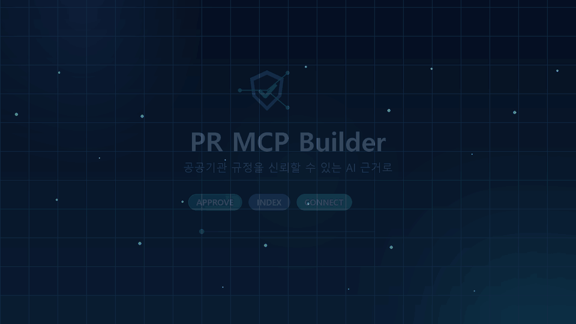
</p>

**사람이 승인·색인한 공공기관 규정을 독립 로컬 Qwen 챗봇에서 고르고 바로 대화하거나,
같은 승인 데이터를 MCP로 연결하는 Windows용 규정 전처리·RAG 빌더입니다.**

v1.2.21에서는 독립 Qwen 챗봇이 기본적으로 빠른 승인 BM25/lexical 검색을 사용합니다.
질문을 보내면 검색·답변·인용 검증의 실제 진행률과 경과 시간이 계속 보이고, 승인·색인이
끝난 규정만 선택할 수 있습니다. MCP 생성·연결 경로와 기존 승인 데이터는 그대로 유지됩니다.


[MP4로 데모 보기](docs/assets/public-regulation-qwen-rag-demo.mp4) ·
[처음 사용자 1–6단계로 바로 이동](#qwen-first-chat) ·
[문제 해결표로 이동](#4-문제-해결표) ·
[업데이트 내역 보기](#update-history)

[](https://github.com/koul777/Public-Regulation-MCP-Builder/releases/latest)
[](pyproject.toml)
[](docs/mcp_quickconnect_ko.md)
[](LICENSE)

**흩어진 공공기관 규정을, AI가 목록·목차·조문·참조 관계까지 찾아 쓰는 승인형 규정
MCP로 바꿉니다.**

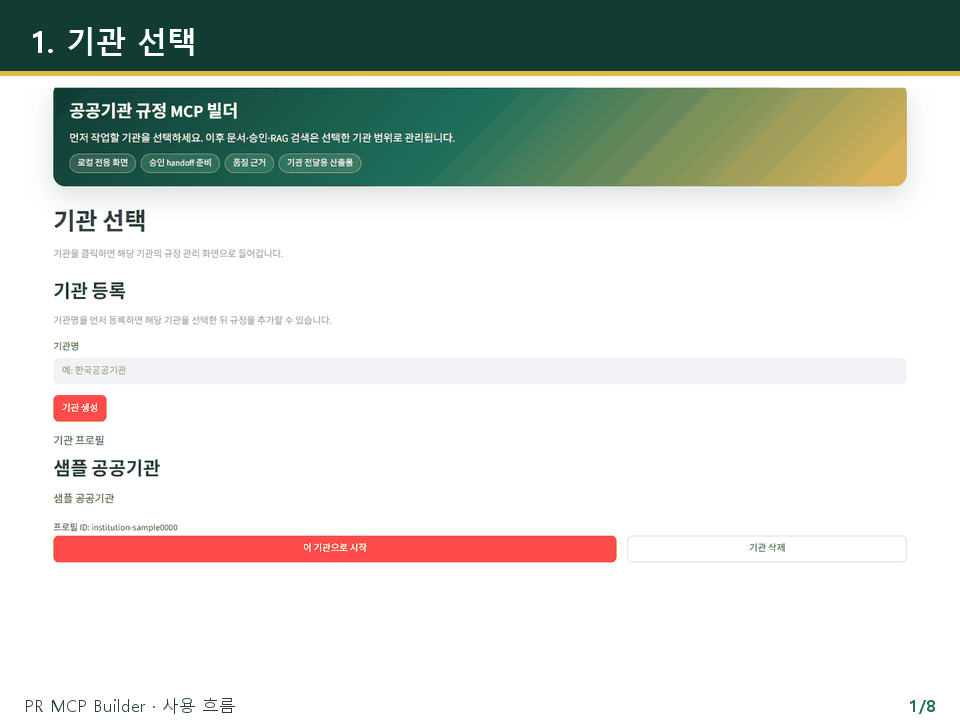

PR MCP Builder는 PDF·HWP·HWPX·DOCX로 흩어진 규정을 정리하고, **사람이 원문과
비교해 승인한 내용만** ChatGPT·Codex·Claude에서 조회하게 만드는 Windows용
프로그램입니다. 단순한 문서 검색기가 아니라 다음 세 부분을 한 흐름으로 묶습니다.

1. **계층형 규정 카탈로그** — 규정 목록과 장·절·조·별표·서식·부칙 구조를 보존합니다.
2. **승인 기반 RAG 검색엔진** — 사람이 승인한 청크만 검색하고 원문 근거를 돌려줍니다.
3. **로컬 Qwen 챗봇과 MCP 서버** — Qwen으로 이 PC에서 바로 질문하거나, 같은 승인 RAG를
   로컬 STDIO 또는 Vercel HTTPS MCP로 AI 프로그램에 연결합니다.

## 처음 사용자를 위한 5분 빠른 시작

이 안내를 읽는 데 약 5분이 걸립니다. 문서 자체의 전처리 시간은 파일 크기·형식에 따라
별도로 걸릴 수 있습니다. 처음에는 아래의 사용 방법 하나를 고른 뒤, 공통 ①~③을 마치고
선택에 맞는 ④만 완료하세요.

[Windows 실행판](https://github.com/koul777/Public-Regulation-MCP-Builder/releases/latest)의
압축을 풀어 프로그램을 실행하고, 작업할 기관을 만들거나 선택하면 시작할 수 있습니다.

> [!NOTE]
> 이 작업 트리에 새로 추가된 **초보자 안내 모드와 Windows 실행 보완은 다음 portable
> 릴리스에 포함될 예정**입니다. 현재 `releases/latest` 실행판에 첫 선택 화면이 보이지
> 않으면 소스 실행으로 확인하거나, 새 portable 릴리스와 fresh-Windows 검증이 끝난 뒤
> 다운로드하세요.

### 먼저, 규정을 어디에서 질문할지 고르기

첫 시작 화면의 **최종 사용 방법**에서 아래 둘 중 하나를 고릅니다. 둘 다 이미 승인된
동일한 로컬 RAG 색인만 읽으므로 **별도 RAG를 만들거나 다시 색인할 필요가 없습니다.**
선택을 잘못해도 왼쪽 메뉴의 **Qwen 또는 MCP 선택**에서 언제든 바꿀 수 있고, MCP를
고르더라도 로컬 Qwen 챗봇이 사라지지 않습니다.

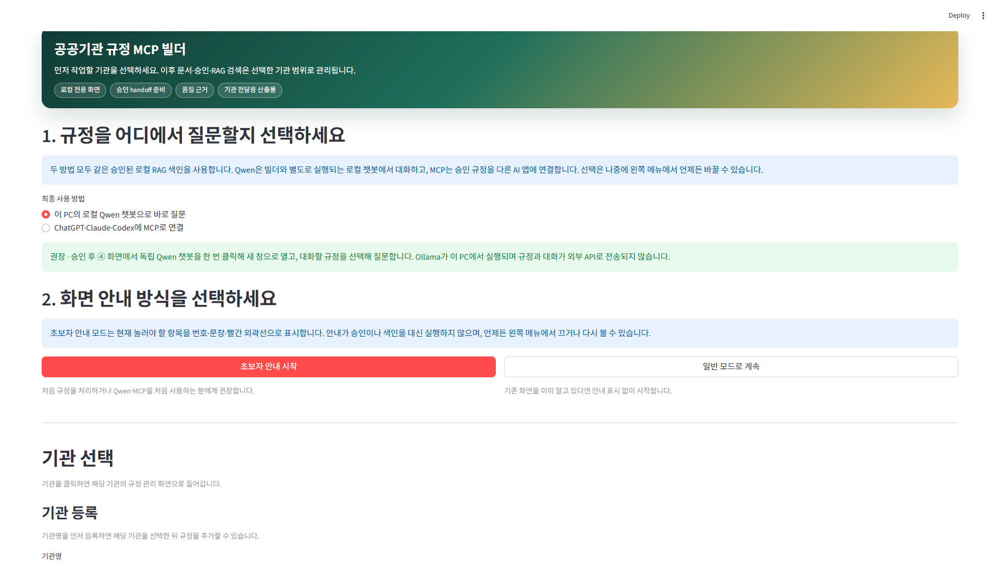

| 첫 선택 | 이런 경우에 고르세요 | ④에서 하게 되는 일 | 미리 필요한 것 |
| --- | --- | --- | --- |
| **이 PC의 로컬 Qwen 챗봇으로 바로 질문** — 처음에는 이 경로 권장 | 규정을 외부 AI API로 보내지 않고 이 PC에서 바로 묻고 싶음 | 별도 localhost 챗봇을 한 번에 열고, 승인 규정 선택 → `qwen3:8b` 연결 확인 → 질문·근거 확인 | 실행 중인 Ollama, 설치된 `qwen3:8b`, 승인·색인이 끝난 규정 |
| **ChatGPT·Claude·Codex에 MCP로 연결** | 다른 AI 앱에서 규정 도구를 호출하고 싶음 | MCP 번들 생성 → 앱 등록 → `list_regulations`·`search`·`fetch` 확인 | 연결할 AI 앱과 로컬 STDIO 또는 원격 HTTPS 방식 결정 |

### 시작 전 준비 체크

아래 항목 중 하나라도 준비되지 않았다면 질문 버튼을 반복해서 누르지 말고 표시된 단계로
돌아갑니다.

- [ ] 작업할 기관을 만들거나 정확한 기존 기관을 선택했다.
- [ ] 결과 확인 화면에서 규정명·조문·표·별표를 원문과 비교했다.
- [ ] 검수·승인 화면에서 사람이 최종본을 확정했다.
- [ ] 규정 상태에 **승인 완료**와 **색인 완료**가 함께 표시된다.
- [ ] 로컬 Qwen 경로라면 Ollama가 실행 중이고 `ollama list`에 `qwen3:8b`가 보인다.
- [ ] MCP 경로라면 외부 AI로 전달해도 되는 승인 데이터인지 확인했다.

`qwen3:4b`는 기본 대화에 필수가 아닙니다. 독립 챗봇의 **Qwen3 4B 정밀 근거 감사**를
직접 켤 때만 필요하며, 기본값은 꺼짐입니다.

첫 업로드 전에 화면의 **공식 MCP 품질 준비 확인**을 먼저 보세요. PDF·HWP·HWPX·DOCX 모두
일반 본문과 조문 구조를 빠르게 읽는 전처리는 Kordoc 설치 전에도 시작할 수 있습니다. 다만 이 네
지원 형식으로 **공식 MCP 파일 묶음을 만들 때는 Kordoc 표 파싱 품질 증거가 반드시 필요**합니다.
준비되면 **Kordoc 사용 가능**, 없으면 **Kordoc 설치·검증 시작**이 표시됩니다. 설치 버튼은
Node.js/npm을 이용한 사용자 전역 설치임을 설명하며, 동의해 버튼을 누른 경우에만
설치를 시작합니다. 설치가 끝나면 앱을 완전히 종료하세요. Windows 실행판은
`PR MCP Builder.exe`를 다시 더블클릭하고, 소스 실행은 `START_HERE.bat`을 다시 실행해
**Kordoc 사용 가능** 표시를 확인하세요. Kordoc 없이 처리한 PDF·HWP·HWPX·DOCX는 ④ 전에
Kordoc을 설치한 뒤 새 초안으로 다시 전처리·검수·승인해야 합니다. 이 재전처리는
화면 진입만으로 시작되지 않으며, 예상 작업을 읽고 **안전 재전처리** 버튼을 직접 눌렀을 때만 시작됩니다.

| 순서 | 화면에서 할 일 | 다음으로 넘어가는 신호 |
| --- | --- | --- |
| ① | `① 문서 올려서 전처리`에서 **문서 업로드** → 자동 인식 정보 확인 → **전처리 시작** 순서로 진행. AI 검수를 함께 돌리려면 그 전에 왼쪽 사이드바 **AI 검수**에서 켜고 API 키를 입력한다 | **전처리 완료** |
| ② | `② 결과 확인`에서 원문·문서 구조·**정리된 내용(청크)** 확인과 품질 경고·이슈 확인을 각각 완료 | 두 확인란이 모두 완료됨 |
| ③ | (1단계) 규정 디렉터리에서 **규정 열기** → (2단계) 스크롤하며 **원본·전처리본·AI 검수본**을 비교하고 ✅ 최종본 칸을 직접 수정 → (3단계) **이 규정 최종 확정 · 승인하고 색인** 또는 **선택한 조항 반려**로 처리 → 다음 미완료 규정에서 반복. 여러 규정을 한 번에 끝내려면 **전체 규정 확인**을 켜고 **전체 규정 최종 확정** | 선택한 모든 규정의 **승인·색인 완료** 또는 명시 반려로 처리 방향 결정 |
| ④ | **로컬 Qwen 선택:** 독립 Qwen 챗봇 실행 → 별도 앱에서 승인·색인 규정 선택 → 연결 확인 → 질문 → 답변과 근거 조문 확인. **MCP 선택:** MCP 원리·변환 과정 확인 → 규정 범위 → AI 앱 → 저장 설정·**생성할 MCP 이름 (필수 입력)** → **MCP로 쓸 파일 묶음 만들기** → 앱별 등록·연결 진단 → `list_regulations` → `search` → `fetch` | Qwen은 독립 앱의 답변과 근거 조문 확인, MCP는 여섯 개의 실제 연결 확인 완료 |

첫 화면에서 **초보자 안내 시작**을 선택한 뒤 기관을 만들거나 선택하면,
지금 눌러야 할 곳에 빨간 테두리·화살표·단계 번호가 표시됩니다. 번호는 사이드바의
**세부 확인 절차** 목록과 같은 `3-2` 형식이라, 지금이 몇 번째 절차인지 화면과 목록에서
똑같이 확인할 수 있습니다. 사이드바에서는 끝난 절차가 ✅, 지금 할 차례가 👉로 표시되며,
아직 준비가 안 된 화면에서는 번호 대신 `!` 표시와 함께 먼저 끝내야 할 준비 작업을
알려 줍니다. 빨간 테두리는 오류가 아니라 **현재 안내 대상**이라는 뜻입니다. 버튼을 누르기
전 짧은 설명을 읽고, 실제 완료 상태를 확인한 뒤 다음 단계로 이동하세요. 안내가 필요 없으면 첫 선택 화면에서
**일반 모드로 계속**을 누르면 됩니다. 기관을 이미 선택한 상태라면 사이드바의
**초보자 안내 모드**를 켜도 됩니다.

- 안내를 잠시 끄려면 **안내 건너뛰기**를 누르거나 사이드바에서 모드를 끕니다.
- 다시 보려면 **처음부터 다시 보기**를 누릅니다.
- **이전 단계**와 **다음 단계**는 설명 위치만 바꿉니다. 승인과 색인은 자동으로
  실행하지 않으므로 반드시 사람이 원문을 확인해야 합니다.
- 마지막 연결 확인은 하나의 확인란이 아니라 **AI 앱 등록, 앱 재시작 또는 새 대화,
  연결 진단, `list_regulations`, `search`, `fetch`**의 여섯 항목입니다. 앞 항목을
  완료해야 다음 확인란이 열립니다. 문서 범위·저장 방식이 다른 묶음을 새로 만들면
  새 묶음에서 다시 확인해야 완료로 표시됩니다.
- 실제 AI 대화에서는 먼저 `list_regulations`로 승인된 규정 목록이 보이는지 확인한 다음,
  필요한 규정을 `search`로 찾고 `fetch`로 승인 원문과 출처를 확인하세요.
- 규정별 파일을 여러 개 올려도 되고, 여러 규정을 합친 규정집 한 개를 올려도 됩니다.
  제목·조문 경계가 분명하면 MCP의 규정 목록·목차·조문 결과는 같게 만들어집니다. 합본에서
  별표·붙임 뒤에 새 규정을 이어 넣을 때는 새 페이지의 편·장 제목처럼 분명한 경계를 두세요.

처음에 **로컬 Qwen**을 골랐다면 왼쪽의 **독립 Qwen 챗봇 실행**으로 별도 앱을 열면 됩니다.
**MCP 연결**을 골랐다면 ④는 `MCP 생성·외부 AI 연결`로 보이고 MCP 탭부터 시작합니다.
어느 경우에도 기존 승인 색인과 MCP 기능은 남아 있습니다. MCP를 쓸
때 Codex·Claude의 같은-PC 연결은 STDIO를 쓰지만, **ChatGPT는 같은 PC의 로컬 서버에도
직접 연결하지 않고 원격 HTTPS 또는 OpenAI Secure MCP Tunnel을 사용합니다.** 상세 설정은
빠른 시작을 마친 뒤 [방법 A~E 중 내 앱 하나 고르기](#2-다섯-방법-중-하나-선택하기)에서
실제로 사용할 방법 하나만 펼쳐 보세요. 원격 서버가 꼭 필요한 경우에만 방법 D·E의
Vercel 안내로 넘어가면 됩니다.

### 무엇을 할 수 있나요?

| 필요한 일 | PR MCP Builder가 제공하는 방법 |
| --- | --- |
| 승인된 규정 전체 목록 확인 | `list_regulations`가 중복 없는 규정 목록, 페이지, `total_count`를 반환 |
| 규정 구조 탐색 | `get_regulation_toc`로 장·절·조·별표·서식 계층 확인 |
| “인사규정 제16조” 정확히 찾기 | `get_regulation_article`로 규정과 조문 번호를 지정해 조회 |
| 다른 규정을 인용한 부분 찾기 | `get_regulation_references`로 들어오고 나가는 참조 확인 |
| 서로 물고 도는 참조 점검 | `list_regulation_reference_cycles`로 순환참조 묶음 확인 |
| 자연어로 관련 규정 찾기 | `search`로 후보를 찾고 `fetch`로 승인 원문과 출처 확인 |
| 최신 개정본 반영 | 같은 규정의 새 버전을 등록하고 해당 규정만 다시 처리·색인 |
| 시행일에 맞는 현재본 조회 | 개정 이력과 효력 기간을 보존하고 조회 기준일에 맞는 버전 선택 |
| 내 PC 또는 원격 AI에서 사용 | Codex·Claude의 같은-PC 연결은 STDIO, ChatGPT와 원격 AI는 HTTPS `/mcp`로 연결 |

### 규정 한 건이 AI 도구가 되기까지

```text
규정 파일 추가
  → 규정명·버전·장·절·조·별표·부칙 구조화
  → 원문과 처리 결과 비교
  → 사람이 승인
  → 승인 데이터만 검색 색인
  → MCP 번들 생성
  → ChatGPT·Codex·Claude에서 목록·목차·조문·검색 도구 사용
```

개정본도 같은 원칙을 따릅니다. 새 파일을 기존 규정의 다음 버전으로 등록하고 시행일과
개정 관계를 확인한 뒤 승인합니다. 그러면 변경된 규정 단위만 갱신되며, 나머지 규정을
전부 다시 처리할 필요가 없습니다.

<details>
<summary><strong>프로그램 전체 화면 구성 보기</strong></summary>


</details>

> [!NOTE]
> 현재 개발 중인 공개 소스 프로젝트이며 Windows 10/11 64비트 우선 지원입니다.
> Streamlit 화면은 로컬 운영자용이며 완성형 공개 SaaS 화면이 아닙니다.

> [!IMPORTANT]
> 문서를 올렸다고 바로 AI 검색에 공개되지 않습니다. 승인하지 않은 내용은 MCP의
> `search`와 `fetch` 결과에 포함하지 않습니다.
> 사람 검수와 승인을 거쳐 승인된 규정만 MCP 데이터로 생성합니다.
> 사람에게 승인되지 않은 청크는 검색 색인과 MCP 번들에 포함하지 않습니다.

이 README는 처음 설치하는 운영자부터 Vercel 배포와 소스 검증이 필요한 개발자까지
순서대로 필요한 깊이만 읽도록 구성했습니다. 화면 예시는 이해를 돕기 위한 샘플이며 앱
버전에 따라 버튼 위치나 이름이 조금 달라질 수 있습니다. **경로, 서버 이름, ID는
예시를 타이핑하지 말고 내 PC에서 생성된 값을 복사하세요.**

## 이 문서에서 할 일

처음 사용하는 운영자는 0→1을 공통으로 읽은 뒤, 로컬 Qwen이면 1-6에서 대화를 시작하고
MCP이면 2→3→4로 진행합니다. 이미 번들을 만든 사람은 사용할 AI 앱의 방법 A~E로 바로
이동하세요. 보안·개발·배포 세부 정보는 뒤쪽에 모아 두었으므로 처음부터 모두 이해할
필요는 없습니다.

| 단계 | 내가 하는 일 | 끝났다는 신호 |
| --- | --- | --- |
| 0. 출발점 선택 | 독립 로컬 Qwen 또는 MCP 연결 중 선택 | 질문할 위치와 ④ 메뉴 결정 |
| 1. 규정 준비 | 파일 추가 → 결과 확인 → 사람 검수·승인 | 승인 데이터의 색인 완료 |
| 1-6. 로컬 Qwen 대화 | 질문 가능 규정 선택 → 8B 연결 → 질문·근거 확인 | 진행률 100%와 승인 근거 조문 표시 |
| 2. MCP 연결 | 방법 A~E 중 실제 사용할 앱 하나만 설정 | 서버 또는 커넥터가 활성 상태 |
| 3. 기능 검증 | 목록·목차·조문·`search`·`fetch` 호출 | 승인 원문과 출처 반환 |
| 4. 문제 해결 | 증상별 표에서 원인 확인 | 실패한 단계의 성공 신호 확인 |

바로 이동:

- [이 프로그램이 제공하는 기능](#무엇을-할-수-있나요)
- [완전 처음이라면 여기부터](#0-완전-처음이라면-여기부터)
- [처음 설치하고 승인 데이터 만들기](#1-처음-설치하고-승인-데이터-만들기)
- [독립 로컬 Qwen 여섯 단계](#qwen-first-chat)
- [새 규정과 개정본 관리하기](#새-규정과-개정본-관리하기)
- [방법 A~E 중 내 앱 하나 고르기](#2-다섯-방법-중-하나-선택하기)
- [방법 A: Claude Code 로컬 STDIO](#method-a)
- [방법 B: Codex CLI / Codex IDE 로컬 STDIO](#method-b)
- [방법 C: Claude Desktop 로컬 STDIO](#method-c)
- [방법 D: ChatGPT · Vercel HTTPS MCP](#method-d)
- [방법 E: Claude · Vercel HTTPS MCP](#method-e)
- [search와 fetch로 최종 확인하기](#3-search와-fetch로-최종-확인하기)
- [문제 해결표](#4-문제-해결표)

## 먼저 알아둘 네 단어

| 단어 | 쉬운 뜻 |
| --- | --- |
| MCP | AI 프로그램이 이 규정 검색기에 질문할 수 있게 해 주는 연결 규칙 |
| 번들 | 설정 파일, 실행 파일, 승인 검색 데이터를 한 폴더에 모은 것 |
| STDIO | 같은 PC의 AI 프로그램이 서버를 직접 켜고 대화하는 로컬 연결. Windows 실행판은 포함된 EXE, 소스 실행은 Python을 사용 |
| HTTPS | Vercel에 서버를 배포하고 `https://.../mcp` 주소로 접속하는 원격 연결 |

MCP에는 두 종류의 읽기 도구가 함께 들어 있습니다.

- **구조를 알고 찾을 때**: `list_regulations` → `get_regulation_toc` →
  `get_regulation_article` 순서로 목록, 목차, 정확 조문을 조회합니다. 규정 간 관계는
  `get_regulation_references`와 `list_regulation_reference_cycles`로 확인합니다.
- **질문으로 찾을 때**: `search`가 승인된 규정 후보와 `id`를 돌려주고, `fetch`가 그
  `id`의 원문 내용과 출처를 돌려줍니다.

따라서 **서버 이름이 보이는 것만으로는 성공이 아닙니다.** 도구 목록을 확인하고 실제
규정 목록 또는 검색 결과와 승인 원문까지 반환돼야 연결 완료입니다.

## 0. 완전 처음이라면 여기부터

처음이라면 승인 규정과 Qwen이 모두 이 PC에 머무는 **독립 로컬 Qwen 챗봇**부터 확인하는
것을 권장합니다. 다른 AI 앱에서 규정 도구를 써야 할 때만 MCP 경로로 바꾸면 됩니다.
Codex나 Claude의 MCP는 **로컬 STDIO부터 성공시킨 뒤**, 꼭 인터넷 주소가 필요할 때만
Vercel HTTPS로 넘어갑니다. ChatGPT만 쓴다면 방법 D의 원격 HTTPS 경로를 선택합니다.
로컬 Qwen과 로컬 STDIO에는 Vercel 계정, 도메인과 공개 서버가 필요하지 않습니다.
빠른 일반 구조 전처리는 Kordoc 설치 전에도 가능하지만, PDF·HWP·HWPX·DOCX
네 지원 형식으로 공식 MCP 묶음을 만들려면 ④ 전에 Kordoc 표 파싱 품질 증거가 필요합니다.
Kordoc 설치에는 Node.js/npm이 필요합니다.

### 0-1. 나에게 맞는 출발점

| 지금 상황 | 먼저 읽을 곳 | 필요한 것 |
| --- | --- | --- |
| 이 PC에서 승인 규정에 바로 질문 | [로컬 Qwen 여섯 단계](#qwen-first-chat) | Ollama, `qwen3:8b`, 승인·색인이 끝난 규정 |
| 같은 PC의 Claude Code에서 사용 | [방법 A](#method-a) | Claude Code CLI, 생성한 번들 폴더 |
| 같은 PC의 Codex CLI 또는 IDE에서 사용 | [방법 B](#method-b) | Codex CLI 또는 IDE, 생성한 TOML |
| Claude Desktop과 이 프로그램을 같은 PC에서 사용 | [방법 C](#method-c) | Claude Desktop, 생성한 번들 폴더 |
| ChatGPT에서 사용 | [방법 D](#method-d) | ChatGPT 웹 Developer mode, 지원 플랜·관리자 권한, 원격 HTTPS MCP |
| Claude에서 Vercel 주소로 원격 사용 | 로컬 검색 성공 후 [방법 E](#method-e) | Vercel 계정, Node.js, 공개 승인 데이터 |
| 아직 규정 파일을 처리하지 않음 | [1장](#1-처음-설치하고-승인-데이터-만들기) | Windows PC, 규정 원문 |

**처음 연결하는 사람의 권장 순서**

```text
Windows 실행판 설치
  → 규정 1개 업로드
  → 원문과 비교
  → 사람 승인
  → 색인 완료 확인
  → 독립 Qwen에서 승인 규정 선택·연결 확인·첫 질문
  → 필요하면 방법 A·B·C 중 사용할 로컬 MCP 앱 하나 연결
  → MCP의 search와 fetch 확인
  → 필요할 때만 Vercel HTTPS 배포
```

### 0-2. 이 문서의 명령과 경로 읽는 법

- 회색 명령 상자 오른쪽 위에 복사 버튼이 보이면 눌러서 복사합니다.
- **Claude Desktop 로컬 연결에서는 서버 이름이나 Python 경로를 다시 타이핑하지
  않습니다.** Builder가 만든 JSON 복사 상자를 사용합니다.
- Vercel 주소도 예시를 고쳐 쓰지 않습니다. 배포가 끝난 뒤 PowerShell의 `Aliased:`
  줄에 나온 실제 주소를 복사합니다.
- `C:\MCP-Bundles\...`는 설명용 예시입니다. 생성 완료 화면이나 내 파일 탐색기의 실제
  경로를 복사합니다.
- JSON 안의 `C:\\MCP-Bundles\\...`처럼 역슬래시가 두 개인 것은 정상입니다. JSON이
  Windows 경로를 안전하게 저장한 모습입니다.
- PowerShell 명령이 여러 줄이면 줄 끝의 백틱 `` ` ``까지 포함해 한 덩어리로
  복사합니다. 불편하면 한 줄로 붙여 넣어도 됩니다.
- 명령을 실행하는 검은색 또는 파란색 창을 이 문서에서는 **PowerShell**이라고 부릅니다.

### 0-3. 원하는 폴더에서 PowerShell 여는 가장 쉬운 방법

1. 파일 탐색기로 명령을 실행할 폴더를 엽니다.
2. 위쪽 주소 표시줄의 폴더 경로를 한 번 클릭합니다.
3. 경로 대신 `powershell`이라고 입력하고 `Enter`를 누릅니다.
4. 열린 창의 줄 앞에 현재 폴더 이름이 보이면 준비 완료입니다.
5. 문서의 명령을 붙여 넣고 `Enter`를 누릅니다.

명령 실행 중 빨간 글씨가 보이면 창을 바로 닫지 마세요. 마지막 20줄을 복사하거나
캡처해 두면 [문제 해결표](#4-문제-해결표)에서 원인을 찾기 쉽습니다. API 키, 토큰,
기관명과 개인 경로가 포함됐다면 공유하기 전에 가립니다.

### 0-4. 시작 전 1분 점검

- [ ] 규정 파일 한 개 이상을 사람이 원문과 비교했다.
- [ ] 사용할 조문을 승인했다.
- [ ] 승인 데이터의 검색 색인이 완료됐다.
- [ ] 번들 폴더를 앞으로 이동하거나 이름을 바꾸지 않을 위치에 만들었다.
- [ ] 로컬 연결이면 방법 A·B·C에서 선택한 앱을 설치하고 로그인했다.
- [ ] Vercel 연결이면 외부 공개가 허용된 데이터인지 담당자에게 확인했다.

## 1. 처음 설치하고 승인 데이터 만들기

이 장의 각 단계는 다음 성공 신호를 확인하고 넘어갑니다.

| 단계 | 클릭하거나 할 일 | 왜 필요한가 | 성공 신호 | 막히면 |
| --- | --- | --- | --- | --- |
| 1-1 | Release ZIP 압축 해제 후 `PR MCP Builder.exe` 실행 | 운영 화면 시작 | 기관 선택 화면 표시 | ZIP 안에서 바로 실행하지 않았는지 확인 |
| 1-2 | 기관 생성 또는 기존 기관 선택 | 데이터와 승인을 기관 범위로 분리 | 선택한 기관의 대시보드 표시 | 잘못 골랐다면 파일을 올리기 전에 다시 선택 |
| 1-3 | `① 문서 올려서 전처리`에서 규정 파일 추가 | 문서를 규정·조문 구조로 변환 | 전처리 완료 표시 | 규정명·버전·날짜와 오류 단계 확인 |
| 1-4 | `② 결과 확인`에서 원문과 결과 비교 | 잘못 나뉜 조문·표·별표를 승인 전에 발견 | 검토할 청크와 앞뒤 문맥 확인 | 원문과 다르면 수정 또는 재처리 |
| 1-5 | 검토한 청크 승인 후 색인 | 승인된 근거만 RAG와 MCP에 포함 | **승인 완료 + 색인 완료** | [문제 해결표](#4-문제-해결표)에서 승인·색인 상태 확인 |

### 1-1. 프로그램 내려받기

1. [최신 Windows 실행판](https://github.com/koul777/Public-Regulation-MCP-Builder/releases/latest)을
   엽니다.
2. Windows용 ZIP 파일을 내려받습니다.
3. ZIP 파일에서 바로 실행하지 말고, 새 폴더에 **압축을 모두 풉니다**.
4. 압축을 푼 폴더에서 `PR MCP Builder.exe`를 실행합니다.
5. Windows가 실행 여부를 물으면 게시자와 내려받은 주소가 이 저장소의 Release인지 먼저
   확인합니다.

개발자가 소스에서 실행하는 방법은 [개발자용 실행과 검증](#개발자용-실행과-검증)에
있습니다.

**성공 신호:** 기관을 새로 만들거나 기존 기관을 고르는 첫 화면이 열립니다.

### 1-2. 기관 선택

기관을 만들거나 기존 기관을 선택합니다. 문서와 승인 데이터는 선택한 기관 범위로
분리됩니다.

아래 이미지는 **초보자 안내 시작** 또는 **일반 모드로 계속**을 고른 다음 나타나는 기관
선택 화면입니다. 현재 버전에서는 이 이미지보다 앞에 안내 모드 선택 화면이 한 번 더
나옵니다.

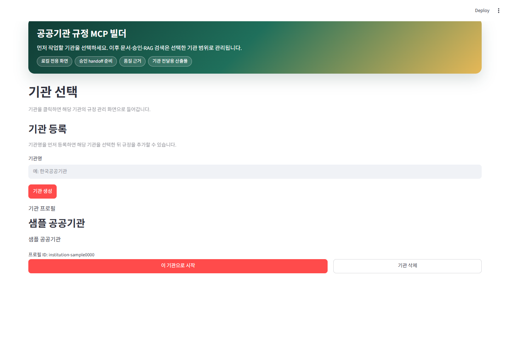

선택 후 대시보드에서 현재 작업 상태와 다음 단계를 확인합니다.

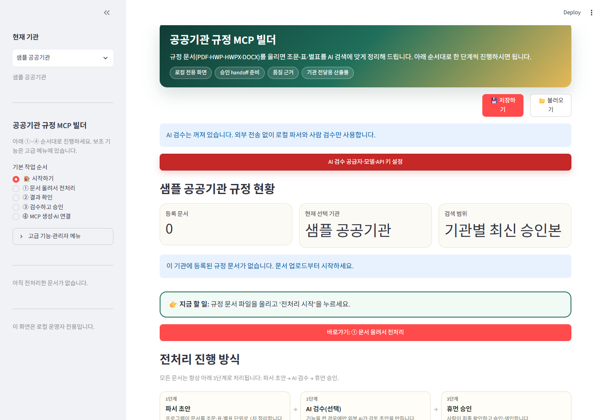

**성공 신호:** 대시보드 위쪽에 지금 작업할 기관이 표시됩니다. 기관을 잘못 선택했다면
규정 파일을 올리기 전에 돌아가서 바꿉니다.

### 1-3. 규정 파일 올리기

1. `① 문서 올려서 전처리`로 이동합니다.
2. PDF·HWP·HWPX·DOCX 규정 파일을 선택합니다.
3. 여러 규정은 한 번에 올릴 수 있지만 처음이라면 한 파일로 연습하는 것이 쉽습니다.
4. 자동 인식된 규정명, 버전과 개정일을 원문과 비교합니다.
5. 값이 맞으면 전처리를 시작합니다.

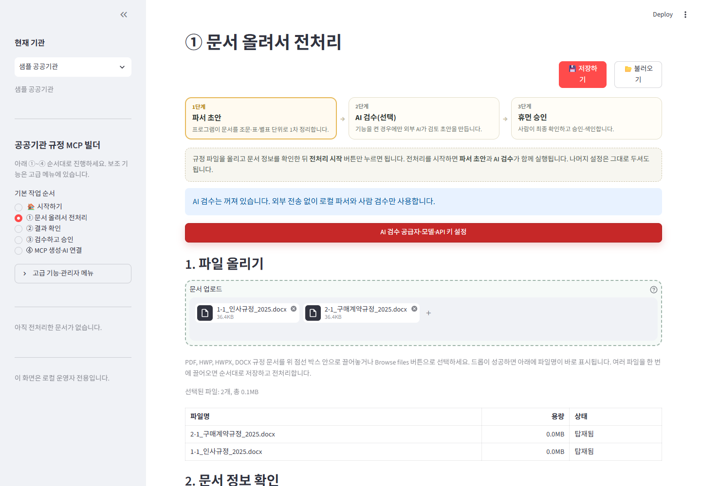

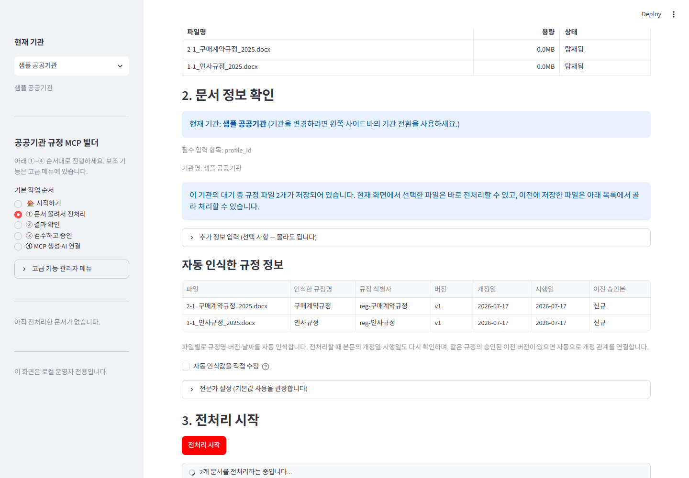

처리가 끝나면 완료 표시가 나타납니다.

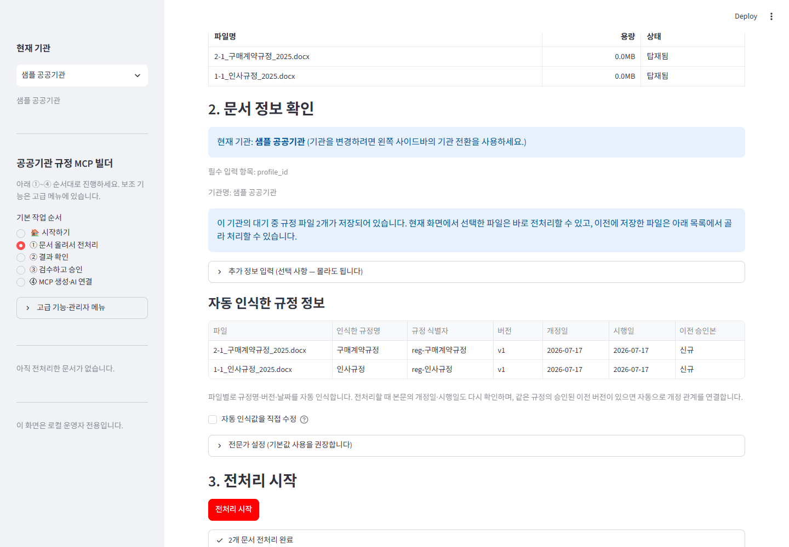

**왜 하나요?** 이 단계가 문서의 평면 텍스트를 규정명·버전·장·절·조·별표·부칙
단위로 나눕니다. **성공 신호는 진행률 숫자가 아니라 전처리 완료 상태와 결과 확인
단계에서 실제 청크를 열 수 있는 것**입니다.

### 1-4. 처리 결과 확인

`② 결과 확인`에서 처리할 규정을 불러옵니다. 품질 결과가 표시되어도 자동 승인된 것은
아닙니다.

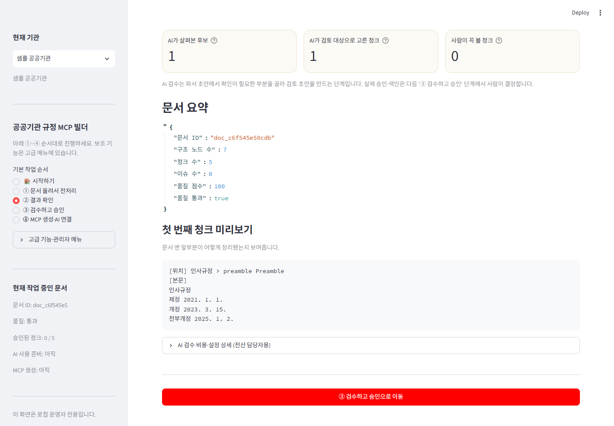

여러 규정을 올렸다면 각 규정의 품질과 상태를 확인합니다.

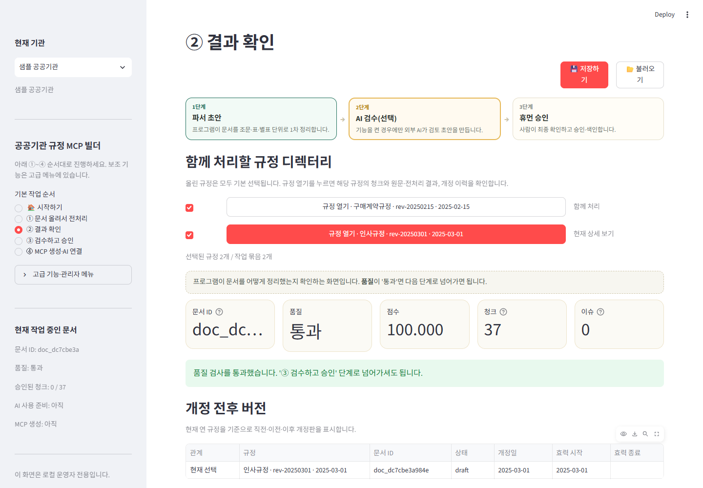

원문, 전처리 결과와 앞뒤 문맥을 비교합니다. 조문 번호, 제목, 본문, 별표와 표 내용이
원문과 다르면 승인하기 전에 수정하거나 다시 처리합니다.

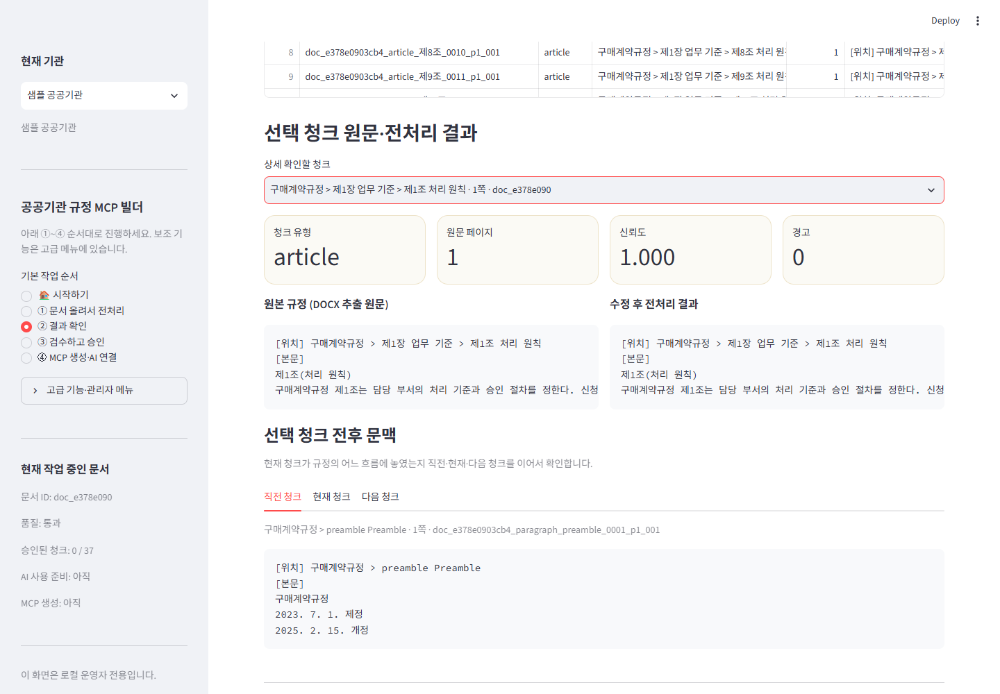

**성공 신호:** 규정명과 조문 번호가 원문과 일치하고, 조문 본문·표·별표가 엉뚱한
조문에 섞이지 않았습니다. 다르면 다음 단계로 넘기지 말고 수정하거나 다시 처리합니다.

### 1-5. 사람이 검수하고 승인

AI 제안은 참고용입니다. 사람이 원문을 확인하고 승인한 내용만 검색 색인과 MCP에
들어갑니다.

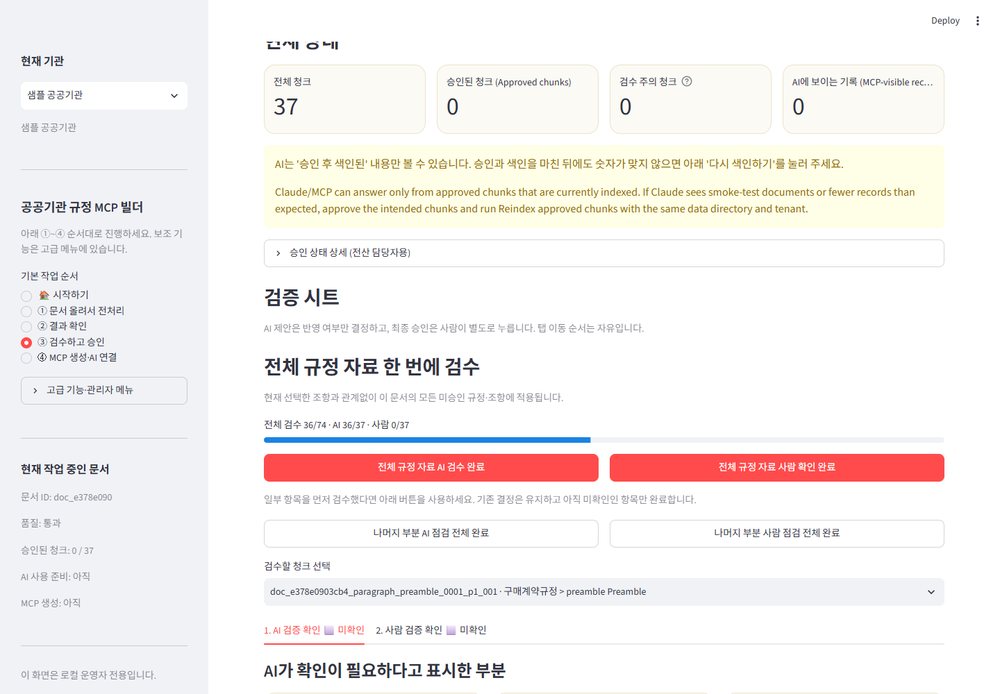

승인 화면에서 사용할 조문을 선택하고 승인 동작을 실행합니다.

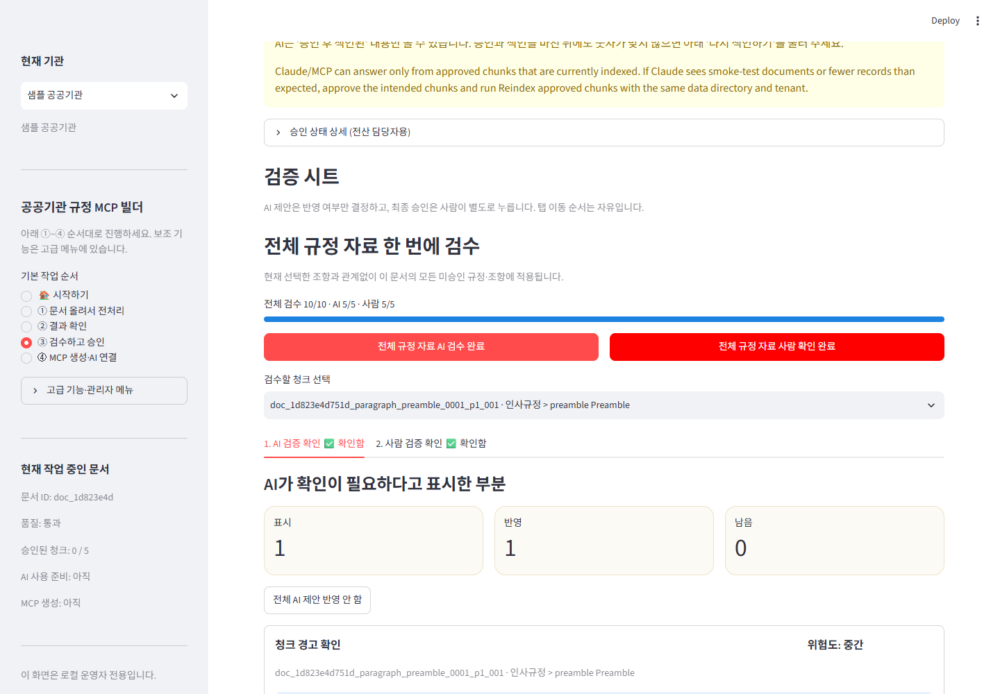

색인 완료 상태가 표시돼야 Qwen 챗봇·MCP 연결 단계로 갈 수 있습니다.

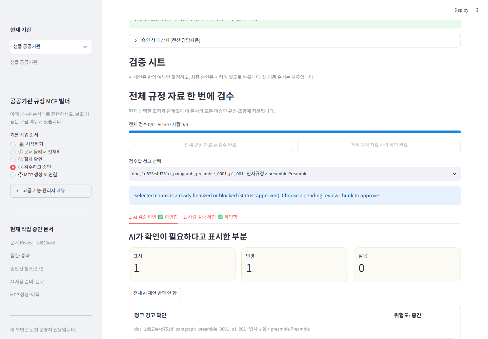

**성공 신호:** 승인 완료와 검색 색인 완료가 함께 표시됩니다. 승인만 끝나고 색인이
실패했다면 `③ 검수하고 승인`에서 **문서 색인 복구**를 실행합니다. 이는 승인 청크를
검색에 넣는 문서 색인 작업입니다. `④ Qwen 규정 챗봇·AI 연결`에서 만드는 **계층 색인**은
MCP 파일 묶음을 만들거나 갱신할 때 자동으로 생성되므로, 따로 복구하거나 다시 만들 필요가 없습니다.

<a id="qwen-first-chat"></a>

### 1-6. 로컬 Qwen으로 처음 질문하기 — 여섯 단계

첫 화면에서 **이 PC의 로컬 Qwen 챗봇으로 바로 질문**을 골랐다면, 승인·색인이 끝난 뒤
빌더와 분리된 Qwen 앱에서 아래 여섯 단계만 차례대로 진행하세요. 이 과정은 MCP를 만들거나
지우지 않습니다. Qwen과 MCP는 같은 승인 로컬 RAG를 공유하므로 별도 RAG 구축도 필요 없습니다.

1. **독립 챗봇 열기** — 빌더 왼쪽의 **독립 Qwen 챗봇 실행**을 한 번 누릅니다. 새 창이
   자동으로 열리지 않으면 화면에 표시된 `127.0.0.1` 주소의 **열려 있는 Qwen 챗봇으로
   이동**을 누릅니다. 빌더와 챗봇은 서로 다른 로컬 프로세스이므로 빌더 화면 안에서 대화하지 않습니다.

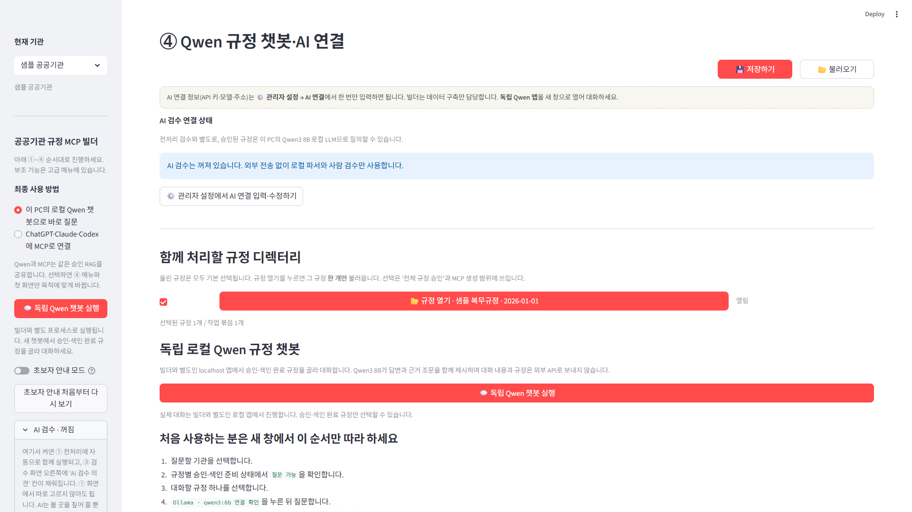

2. **기관과 승인 규정 선택** — 독립 앱에서 기관을 고른 다음 목록의 **대화할 규정**을
   하나 선택합니다. `질문 가능`은 활성 청크의 검수 결정이 끝났고 승인 청크 수와 색인
   레코드 수가 일치하며 stale 기록이 0개라는 뜻입니다. `승인·색인 필요`는 선택할 수 없으므로
   빌더의 ③으로 돌아가 승인 또는 **문서 색인 복구**를 완료합니다.

3. **Ollama · qwen3:8b 연결 확인** — 버튼을 누르고 `연결되었습니다`가 표시될 때까지
   기다립니다. 첫 확인은 모델을 메모리나 GPU에 올리므로 수십 초 걸릴 수 있습니다. 이때
   버튼을 반복해서 누르지 않습니다. 실패하면 새 PowerShell에서 `ollama list`를 실행해
   `qwen3:8b`를 확인하고, 없으면 `ollama pull qwen3:8b`를 실행한 뒤 Ollama를 다시 시작합니다.

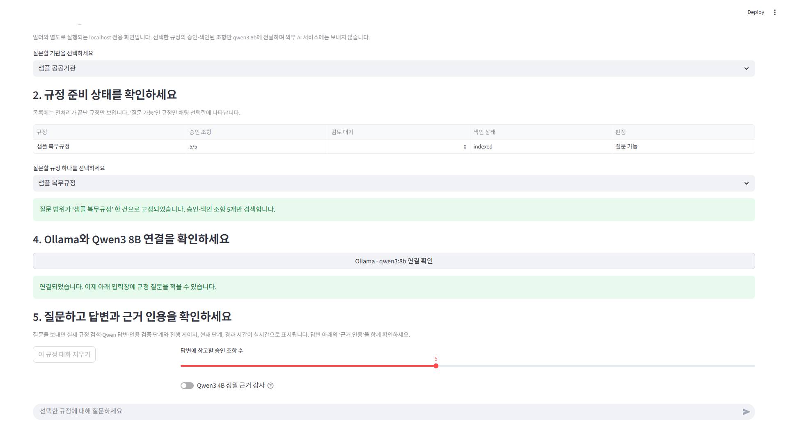

4. **답변 방식 선택** — 처음에는 **Qwen3 4B 정밀 근거 감사**를 끈 기본값 그대로 둡니다.
   기본 빠른 모드는 승인 BM25/lexical 검색 → Qwen3 8B 짧은 답변 → 결정론적 근거 ID 검증
   순서로 실행됩니다. 의미 단위의 추가 검토가 꼭 필요할 때만 토글을 켭니다. 토글을 켜면
   8B 답변 뒤 4B 감사가 추가되고 GPU 모델 교체 때문에 훨씬 오래 걸릴 수 있습니다.
5. **질문하고 진행 게이지 보기** — `선택한 규정에 대해 질문하세요`에 예를 들어
   `제5조 내용은 뭐야`를 입력합니다. 화면에는 **질문·범위 확인 → 승인 근거 검색 → 문맥 구성
   → Qwen3 8B 답변 → 인용 검증**의 현재 단계, 백분율과 경과 시간이 계속 표시됩니다.
   정확한 단일 조문 질문은 이전 대화와 분리해 빠르게 찾고, `그 내용은?`처럼 앞 질문이
   필요한 후속 질문만 최근 사용자 질문을 검색 문맥으로 사용합니다.

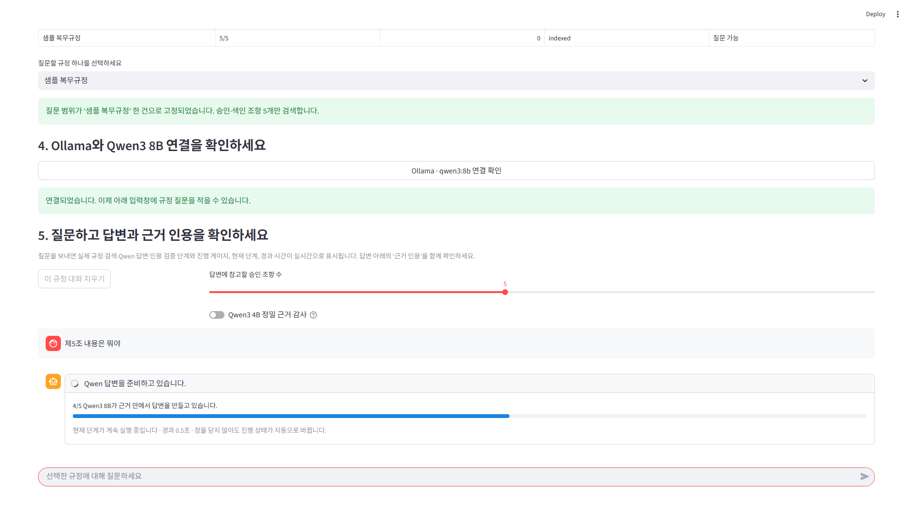

6. **답변과 근거 조문 함께 확인** — 답변만 읽고 끝내지 말고 아래 **근거 조문**에서
   규정명·조문 번호·페이지·승인 인용을 원문과 비교합니다. 기본 모드에서도 답변의 모든
   `[E번호]`가 선언된 승인 검색 결과와 정확히 일치해야 표시됩니다. 존재하지 않는 조문이나
   근거가 부족한 질문은 비슷한 다른 조문으로 바꾸지 않고 고정된 근거 부족 답변을 표시합니다.

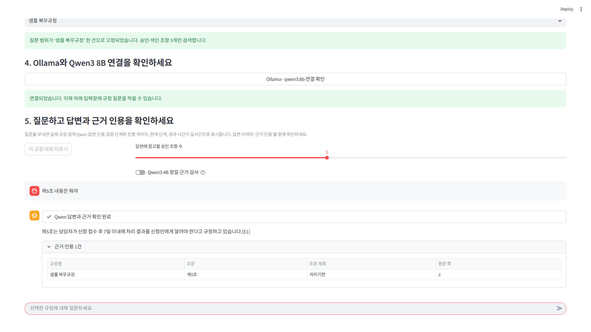

위 캡처와 데모는 **합성 샘플**만 사용했습니다. **실제 기관명**, 기관 문서, **사용자 로컬 경로**는
포함하지 않았습니다.

실제 로컬 승인 데이터에서 이전 제1조 대화 뒤 `제5조 내용은 뭐야`를 질문했을 때, 기본 빠른
모드의 검색은 0.49초, 이미 적재된 Qwen3 8B 답변과 인용 검증까지는 7.34초가 걸렸습니다.
별도의 정밀 수용시험에서는 1.7B → Reranker → 8B → 4B 전체 역할도 계속 검증합니다.

빌더가 열려 있지 않아도 프로젝트 폴더의 `RUN_QWEN_CHAT.bat`를 실행하거나 설치 환경에서
`reg-rag-qwen-chat`을 실행하면 같은 독립 앱이 열립니다. 이 앱은 MCP 설정 화면을 포함하지 않고,
매번 현재 로컬 테넌트·기관 프로필·문서 소유 관계·승인 저널·색인 상태를 다시 검사합니다.

### MCP 경로는 그대로 유지됩니다

첫 화면에서 **ChatGPT·Claude·Codex에 MCP로 연결**을 골랐다면 ④가 **MCP 생성·외부 AI
연결**로 바뀝니다. 승인 규정 범위와 사용할 앱을 고르고 MCP 묶음을 만든 뒤
`list_regulations` → `search` → `fetch`를 확인하세요. 이 선택은 독립 Qwen 앱, 승인 색인,
기존 MCP 번들을 삭제하지 않으며 왼쪽 **Qwen 또는 MCP 선택**에서 언제든 바꿀 수 있습니다.

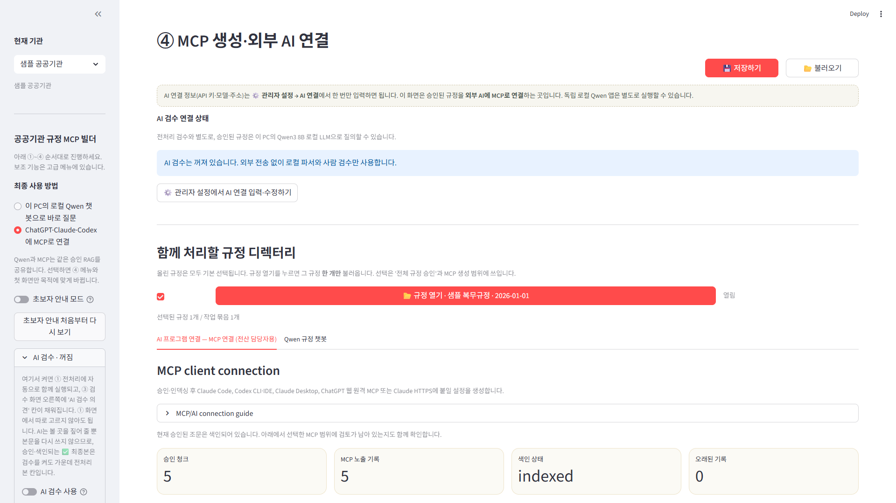

> [!WARNING]
> 원문 업로드, 미승인 데이터, API 키, 비밀번호와 기관 내부 비밀 자료를 공개 저장소나
> 공개 Vercel 배포에 넣지 마세요.

## 새 규정과 개정본 관리하기

규정 데이터는 파일이 들어온 순서가 아니라 다음 논리 계층으로 관리됩니다.

```text
기관
└─ 규정
   ├─ 개정 버전과 효력 기간
   └─ 장 → 절 → 조 → 항·호
      └─ 별표·서식·부칙
```

> [!TIP]
> 규정별 파일 여러 개와 여러 규정을 합친 통합 규정집 한 개는 모두 `④ Qwen 규정 챗봇·AI 연결`에서
> 규정 단위로 자동 정규화됩니다. 따라서 `list_regulations` → `get_regulation_toc` →
> `get_regulation_article`의 논리 결과는 같은 규정·목차·조문을 가리켜야 합니다. 계층 색인은
> 번들을 만들거나 갱신할 때 자동 생성되므로 별도로 다시 만들 필요가 없습니다. 다만 출처 추적을
> 위해 원본 `document_id`와 보관 파일 수는 다를 수 있습니다. 원문에 규정 제목이나 조문 번호가
> 없어 규정 단위를 구분할 수 없으면 결과 확인 단계에서 검수가 필요합니다. 특히 별표·붙임 뒤의
> 같은 페이지에서 새 규정이 시작한다면, 새 규정 제목과 제1조만 두지 말고 **번호가 있는 목차**나
> **새 페이지의 편·장 제목**처럼 경계를 확인할 수 있는 표지를 남기세요. 경계가 불명확하면 일부
> 규정만 잘못 만드는 대신 생성이 안전하게 멈춥니다.

> [!IMPORTANT]
> `④ MCP로 쓸 파일 묶음 만들기`는 선택한 규정의 **현재 청크가 모두 승인되었거나 명시적으로 거부된
> 상태**여야 진행됩니다. 검토가 남은 청크가 하나라도 있으면 안전하게 멈춥니다. 이때는
> `③ 검수하고 승인`으로 돌아가 원문과 비교해 승인 또는 거부를 결정하고, **문서 색인**까지
> 완료한 뒤 다시 ④를 실행하세요. 한 규정의 현재 청크를 모두 명시적으로 거부했다면 그 규정은
> MCP에서 제외되며, 다른 승인 규정의 생성을 막지 않습니다. 단, MCP에 넣을 승인·색인 규정이
> 최소 한 건은 있어야 합니다. 반려는 사유·담당자·결정 시각과 결정 후 내용 해시가 검토 기록에
> 남아야 하며, 파일의 상태 글자만 임의로 `rejected`로 바꾼 경우에는 생성기가 안전하게 멈춥니다.
> 계층 색인을 사용자가 따로 만들 필요는 없습니다.
> 거부·분할·병합으로 빠진 청크의 본문은 전달 ZIP에 넣지 않습니다. 대신 모든 현재 청크가 왜
> 포함되거나 제외됐는지 확인할 수 있도록 결정 ID·시각·내용 해시·분류만 담은 봉인된 최소 감사
> 스냅샷을 함께 만듭니다. 검토 사유, 담당자, 원문 경로와 원본 검토 저널은 전달 ZIP과 MCP
> 답변에 포함하지 않습니다.
> 전달 ZIP의 `approvals.jsonl` 역시 원본 검토 저널이 아니라 승인 ID·기관·문서·승인 시각·청크
> ID·승인 내용 해시만 남긴 최소 결정 원장입니다. 담당자 이름, 메모, 검토 이벤트와 작업 PC
> 경로는 포함하지 않습니다.

### 처음 보는 규정을 추가할 때

1. `① 문서 올려서 전처리`에서 파일을 올립니다.
2. 자동 인식된 규정명, 규정 번호, 버전, 개정일과 시행일을 원문과 비교합니다.
3. `② 결과 확인`에서 구조와 내용을 검수합니다.
4. 사용할 청크를 승인하고 색인 완료를 확인합니다.
5. MCP를 다시 만들거나 기존 운영 절차에 따라 갱신한 뒤 `list_regulations`의
   `total_count`와 새 규정명을 확인합니다.

**성공 신호:** 새 규정은 목록에 한 번만 나타나고, 목차에서 조문·별표·부칙으로
내려갈 수 있습니다.

### 기존 규정의 최신 개정본을 넣을 때

기존 파일을 덮어쓰지 말고 **같은 규정의 새 버전**으로 추가합니다. 그래야 언제 어떤
본문이 유효했는지 이력을 잃지 않습니다.

1. 개정본 파일을 추가하고 기존 규정과 같은 규정 계열인지 확인합니다.
2. 새 버전, 개정일, 시행일과 이전 버전 관계를 확인합니다.
3. 바뀐 조문뿐 아니라 목차·별표·부칙과 인용 관계도 원문과 비교합니다.
4. 새 버전을 승인하고 색인합니다.
5. 변경된 규정 단위의 색인이 끝났는지 확인합니다. 변경 없는 다른 규정은 다시
   색인하지 않습니다.
6. 현재 날짜 조회와 과거 기준일 조회를 각각 실행해 올바른 버전이 선택되는지 봅니다.

**성공 신호:** 기본 조회에는 기준일에 유효한 현재본이 나오고, 이력 포함 또는 과거
`as_of_date` 조회에는 승인된 이전 버전과 효력 기간이 구분되어 나옵니다.

> [!IMPORTANT]
> 제목이 비슷하다는 이유만으로 새 파일을 기존 규정에 임의로 연결하지 마세요. 규정
> 번호·버전·시행일과 원문의 개정 관계가 불명확하면 별도 규정으로 검토하거나 담당자가
> 계보를 확인한 뒤 승인합니다.

### 구조·조문·참조·개정 상태를 확인하는 질문 예시

```text
승인된 규정 전체 목록과 total_count를 보여줘.
인사규정의 목차에서 장·절·조·별표·부칙을 보여줘.
인사규정 제16조의 승인 원문과 출처를 보여줘.
인사규정이 다른 규정을 참조하는 부분과 인사규정을 참조하는 규정을 보여줘.
현재 적재된 규정 사이의 순환참조를 보여줘.
2026-08-01을 기준으로 인사규정 제16조에 적용되는 버전을 보여줘.
```

목록·목차·조문은 구조 도구로 확인하고, 주제나 표현을 모를 때는 `search`와 `fetch`를
사용합니다. 참조 대상 규정이 아직 적재되지 않았다면 참조는 미해결 상태로 표시될 수
있으므로, “미해결”을 “참조가 없음”으로 해석하지 않습니다.

## 2. 다섯 방법 중 하나 선택하기

`④ Qwen 규정 챗봇·AI 연결`에 보이는 다섯 동그라미와 아래 방법 A~E는 **순서와 이름이
정확히 같습니다.** 내가 실제로 사용할 앱 한 줄만 고른 뒤 그 방법만 따라갑니다.

| 방법 | Builder에서 누를 정확한 글자 | 연결되는 곳 | 최종적으로 옮길 값 |
| --- | --- | --- | --- |
| **A** | `Claude Code` | 같은 PC의 Claude Code CLI | 생성된 `claude_code_add_stdio.ps1` 실행 |
| **B** | `Codex CLI / Codex IDE` | 같은 PC의 Codex | 생성된 TOML 블록 |
| **C** | `Claude Desktop` | 같은 PC의 Claude Desktop | Builder가 만든 전체 JSON 또는 서버 한 항목 |
| **D** | `ChatGPT · Vercel HTTPS MCP` | ChatGPT의 원격 MCP | 검증을 통과한 고정 `https://...vercel.app/mcp` 주소 |
| **E** | `Claude · Vercel HTTPS MCP` | Claude의 원격 Connector | 검증을 통과한 고정 `https://...vercel.app/mcp` 주소 |

> [!IMPORTANT]
> **방법 A·B·C는 로컬 STDIO이고, 방법 D·E는 Vercel HTTPS입니다.**
>
> - A·B·C에는 이 PC의 `command`, `args`, `env` 또는 생성된 설정 파일을 사용합니다.
> - D·E에는 Vercel의 HTTPS `/mcp` URL만 사용합니다.
> - Claude Desktop의 **개발자 > 구성 편집**과 Claude의 **Connectors**는 서로 다른
>   화면입니다.
> - ChatGPT는 로컬 STDIO에 직접 연결하지 않습니다. 방법 D의 ChatGPT 웹 Developer
>   mode와 원격 HTTPS MCP를 사용하세요.
> - `Claude Code`는 명령창에서 쓰는 Claude CLI인 방법 A이고, `Claude Desktop`은
>   설정 JSON을 편집하는 데스크톱 앱인 방법 C입니다.

아래 다섯 줄 중 **내가 실제로 쓸 앱 한 줄만** 고르면 됩니다.

1. **Claude Code / Claude CLI**에 붙일 것 → **방법 A**
2. **Codex CLI / Codex IDE**에 붙일 것 → **방법 B**
3. **Claude Desktop 앱의 JSON 설정 파일**에 붙일 것 → **방법 C**
4. **ChatGPT의 HTTPS MCP URL 칸**에 붙일 것 → **방법 D**
5. **Claude Connectors의 HTTPS URL 칸**에 붙일 것 → **방법 E**

헷갈리면 이 한 줄만 기억하면 됩니다.

- **A는 Claude Code(Claude CLI)** 입니다.
- **C는 Claude Desktop** 입니다.
- **D와 E는 로컬 명령이 아니라 HTTPS URL만 넣는 원격 연결**입니다.

### 방법 A — Claude Code 로컬 STDIO

**언제 선택하나요?** Builder와 Claude Code를 같은 PC에서 사용할 때 선택합니다.

1. Builder에서 `Claude Code` 왼쪽 동그라미를 누릅니다.
2. 저장 폴더와 MCP 이름을 넣고 **MCP로 쓸 파일 묶음 만들기**를 누릅니다.
3. 생성된 번들 폴더를 열고 그 폴더에서 PowerShell을 엽니다.
4. `.\claude_code_add_stdio.ps1`을 실행합니다.
5. `claude mcp list`에서 방금 만든 이름을 확인합니다.
6. Claude Code를 다시 열고 `search`와 `fetch`를 차례로 호출합니다.

[방법 A 화면과 명령을 그대로 따라가기](#method-a)

**성공 신호:** `claude mcp list`에 서버가 보이고 실제 승인 원문이 반환됩니다.
**막히면:** 상세 절차의 `claude mcp get` 결과와 번들 진단 스크립트를 확인합니다.

### 방법 B — Codex CLI / Codex IDE 로컬 STDIO

**언제 선택하나요?** Codex CLI 또는 Codex IDE를 Builder와 같은 PC에서 사용할 때
선택합니다. ChatGPT 사용자는 방법 D로 이동하세요.

1. Builder에서 `Codex CLI / Codex IDE` 왼쪽 동그라미를 누릅니다.
2. 저장 폴더와 MCP 이름을 넣고 번들을 만듭니다.
3. 생성된 `codex_config_snippet.toml`의 블록 전체를
   사용자 `~/.codex/config.toml`에 붙여 넣고 Codex를 다시 시작합니다.
4. 새 대화에서 `search`와 `fetch`를 차례로 호출합니다.

[방법 B 화면과 각 입력 칸을 그대로 따라가기](#method-b)

**성공 신호:** Codex가 설정 블록을 읽고 도구 목록을 표시합니다. **막히면:** TOML 블록을
기존 설정 아래에 별도 블록으로 붙였는지, 번들 폴더를 생성 뒤 옮기지 않았는지 확인합니다.

Builder가 만든 `mcp_config.bundle.json`의 `quickstart.codex_claude_team`에는
Codex를 구현·수정 담당, Claude Code를 독립 감리 담당으로 두는 기본 handoff 순서와
공유 검증 산출물이 함께 들어 있습니다. 두 클라이언트를 같은 승인 번들로 병행 운용할 때는
이 계약을 기준으로 `validate_client_config_smoke.ps1` 이후 `search`와 `fetch`를 양쪽에서
같이 확인하세요.

저장소에는 Claude Code의 읽기 전용 프로젝트 에이전트
`regulation-security-auditor`와 `regulation-release-reviewer`도 포함됩니다. Codex가
구현과 focused test를 마치면 보안 감리, 보완, 릴리스 회귀 감리 순으로 handoff하며,
Claude 에이전트는 구현 파일을 직접 수정하지 않습니다. 에이전트 정의를 새로 추가하거나
바꾼 뒤에는 Claude Code 세션을 새로 열어 프로젝트 정의를 다시 읽게 하세요.

### 방법 C — Claude Desktop 로컬 STDIO

**언제 선택하나요?** Claude Desktop과 Builder를 같은 Windows PC에서 사용할 때
선택합니다.

1. Builder에서 `Claude Desktop` 왼쪽 동그라미를 누릅니다.
2. 저장 폴더와 MCP 이름을 넣고 번들을 만듭니다.
3. Builder 완료 화면에서 **첫 번째 JSON 상자**인
   **처음 연결할 때: 설정 파일 전체에 붙여 넣을 JSON 복사**를 누릅니다.
4. Claude Desktop에서
   **프로필 > 설정 > 개발자 > 로컬 MCP 서버 > 구성 편집**을 누릅니다.
5. 처음 설치한 빈 설정 파일이면 **열린 `claude_desktop_config.json` 파일 전체**를
   선택해 3번에서 복사한 JSON으로 바꾸고 저장합니다.
6. 기존 서버가 있으면 지우지 말고 Builder의 **두 번째 JSON 상자**인
   **기존 서버가 있을 때: `mcpServers` 안에 넣을 새 서버 한 항목 복사**를 사용합니다.
   정확한 삽입 위치는 [방법 C의 기존 설정 병합 예시](#claude-existing-config)에
   완성된 JSON으로 보여 줍니다.
7. Claude Desktop을 완전히 종료했다가 다시 열고 `running`을 확인합니다.
8. 새 대화에서 `search`와 `fetch`를 차례로 호출합니다.

[방법 C 화면과 JSON 위치를 그대로 따라가기](#method-c)

**성공 신호:** 서버 이름 옆 파란 배지가 `running`이고 승인 원문이 반환됩니다.
**막히면:** 기존 서버 설정을 지우지 말고 상세 절차의 JSON 병합 예시와
`disconnected` 진단을 확인합니다.

### 방법 D — ChatGPT · Vercel HTTPS MCP

Vercel 주소가 아직 없어도 D를 선택하고 URL을 비운 채 **배포 준비용 MCP 묶음**을 먼저
만들 수 있습니다. 실제 ChatGPT 연결은 검증된 `https://.../mcp` 주소를 넣어 묶음을
다시 만든 뒤 완료됩니다.

1. Builder에서 `ChatGPT · Vercel HTTPS MCP`를 선택하고 배포 준비용 묶음을 만든 뒤
   [Vercel 공통 준비 V-1~V-7](#vercel-common)을
   따라 Production 배포와 검증을 끝냅니다.
2. Builder로 돌아와 **배포된 Vercel HTTPS `/mcp` 주소** 칸에 V-7을 통과한 전체 주소를 붙여 넣습니다.
3. 묶음을 다시 만든 뒤 ChatGPT 웹에서
   **Settings > Apps > Advanced settings > Developer mode**를 켭니다.
4. Apps 설정에서 새 앱을 만들고 같은 `/mcp` 주소와 승인된 인증을 등록합니다.
5. 새 대화에서 앱을 선택하고 `search`와 `fetch`를 차례로 호출합니다.

[방법 D의 정확한 URL 입력 칸 보기](#method-d)

**성공 신호:** Production `/mcp` URL의 원격 smoke가 통과하고 ChatGPT에 일곱 개의
읽기 도구가 보입니다. **막히면:** Preview URL이 아니라 `Aliased:` Production
주소인지, 끝에 `/mcp`가 있는지 확인합니다.

### 방법 E — Claude · Vercel HTTPS MCP

**언제 선택하나요?** Vercel에 배포한 하나의 HTTPS 주소를 Claude의 원격
Connector로 사용할 때 선택합니다.

1. Builder에서 `Claude · Vercel HTTPS MCP` 왼쪽 동그라미를 누릅니다.
2. 주소가 아직 없다면 URL을 비운 채 **배포 준비용 MCP 묶음**을 먼저 만들고
   [Vercel 공통 준비 V-1~V-7](#vercel-common)을 끝냅니다.
3. Builder로 돌아와 **배포된 Vercel HTTPS `/mcp` 주소** 칸에 V-7을 통과한 전체 주소를
   붙여 넣고 묶음을 다시 만듭니다.
4. Claude에서 **설정 또는 Customize > Connectors > 사용자 지정 커넥터 추가**를
   누릅니다.
5. 이름을 넣고 URL 칸에 같은 `/mcp` 주소를 붙여 넣어 저장합니다.
6. 새 대화에서 `search`와 `fetch`를 차례로 호출합니다.

[방법 E의 정확한 Connector 입력 칸 보기](#method-e)

**성공 신호:** Connector가 활성화되고 목록·목차·조문 또는 `search`·`fetch` 호출이
성공합니다. **막히면:** 로컬 `command`를 입력하지 않았는지와 인증 방식을 확인합니다.

<a id="생성-완료-화면-읽는-법"></a>
<details>
<summary><strong>생성 완료 화면의 각 항목이 궁금하면 펼치기</strong></summary>

### 생성 완료 화면 읽는 법

`MCP 파일 묶음 생성 완료`가 나오면 아래의 **직접 MCP 연결 및 최종 확인**까지 내려갑니다.
이 영역은 두 방식을 항상 비교해 보여 주고, 이번에 선택한 방식에는 실제 다음 명령과 등록
위치를 표시합니다.

#### 실제 생성 완료 화면에서 확인할 곳

현재 생성 완료 화면의 값은 선택한 앱에 따라 달라집니다. ChatGPT는 웹 원격 HTTPS만,
Codex·Claude의 같은-PC 연결은 로컬 STDIO로 표시됩니다. 이전 화면의 ChatGPT 로컬 설정
파일은 현재 실행 설정이 아니라 지원 종료 경고 파일이므로 이 안내에서는 사용하지 않습니다.

위에서 아래로 다음 다섯 곳을 확인합니다.

1. **MCP 파일 묶음 생성 완료**: 로컬 번들과 연결 파일 생성이 끝났다는 뜻입니다.
2. 첫 번째 **HTTP MCP 주소**: Vercel에 등록할 `/mcp` 주소 자리입니다. 캡처에서는
   지웠지만 내 화면에서는 실제 주소를 끝까지 복사합니다.
3. **생성된 파일**: `connect_mcp_client.ps1`, 앱별 설정 파일, `README.ko.md` 등이
   만들어졌는지 확인합니다.
4. 초록색 **선택한 AI 앱**: 이번에 먼저 따라야 할 연결 절차를 알려 줍니다.
5. 아래쪽 **최근 생성한 MCP 파일 묶음**: 방금 만든 ZIP과 폴더를 다시 찾을 위치입니다.

> [!IMPORTANT]
> 이 화면의 초록색 완료 문구는 **로컬 파일 생성 완료**입니다. Vercel 배포 완료가
> 아닙니다. Vercel은 [V-6](#v-6-production-배포)의 `vercel --prod`를 실행한 뒤
> `Ready`, `Aliased`와 원격 smoke 성공까지 확인해야 합니다.

#### 생성 버튼을 누르기 전 — 연결 앱·저장 폴더·서버 이름

완료 화면보다 먼저 아래 입력 화면이 나옵니다. 여기서 선택한 앱에 따라 아래쪽에 표시되는
등록 안내와 생성 설정 파일이 달라집니다. 캡처의 규정명, 저장 경로, ZIP 경로와 서버 이름은
공개용으로 지웠습니다. **내 화면에서는 이 칸을 비우지 말고 실제 값을 입력해야 합니다.**

##### Codex CLI·IDE에 로컬 STDIO로 연결할 때

위 화면에서는 다음 순서로만 움직입니다.

1. 맨 위 **선택 규정 MCP 준비 상태**의 오른쪽 상태가 `준비 완료`인지 확인합니다.
2. **연결할 AI 앱**에서
   `Codex CLI / Codex IDE` 왼쪽 동그라미를 누릅니다.
3. 바로 아래에 `선택된 연결 방식: 로컬 stdio`가 보이는지 확인합니다.
4. **Windows 탐색기에서 저장 폴더 선택**을 누르고, 나중에 옮기지 않을 폴더를 고릅니다.
5. 처음에는 **폴더 + 전달용 ZIP (권장)**을 그대로 선택합니다.
6. **생성할 MCP 이름 (필수 입력)**에 앱에서 알아보기 쉬운 이름을 넣습니다.
   이 값은 폴더 경로나 실행 명령이 아니라 MCP 서버 목록에 표시될 이름입니다.
7. 빨간 **MCP로 쓸 파일 묶음 만들기** 버튼을 한 번 누르고 100%가 될 때까지 기다립니다.

> [!IMPORTANT]
> 전달용 ZIP을 **다른 Windows PC**로 옮겨 로컬 STDIO MCP를 실행하려면 그 PC에
> Python 3.11 이상이 필요합니다. ZIP을 푼 뒤 먼저 `install_local_package.ps1`을
> 실행해 포함된 wheel을 설치하고, 그 다음 앱 등록·진단을 진행하세요. wheel은 Python
> 자체가 아닙니다. `Python 설치 불필요` 안내는 원래 PC에서 생성 폴더를 그대로 사용하는 경우,
> 즉 `PR MCP Builder.exe`가 함께 있는 경우에만 해당합니다.

`Claude Desktop`, `ChatGPT · Vercel HTTPS MCP` 같은 다른 동그라미를 동시에 선택하는 것이
아닙니다. 한 번 생성할 때 하나의 연결 앱만 고릅니다.

##### Claude Desktop에 로컬 STDIO로 연결할 때

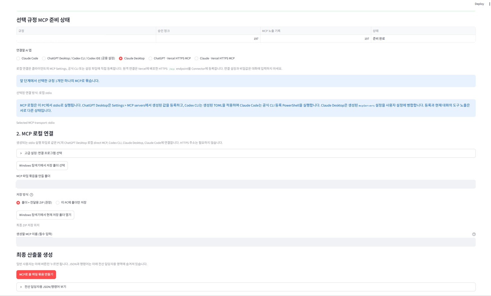

Claude Desktop은 위 화면에서 다음 차이만 주의합니다.

1. **연결할 AI 앱**에서 `Claude Desktop` 왼쪽 동그라미를 누릅니다.
2. `Claude · Vercel HTTPS MCP`가 아니라 `Claude Desktop`이 선택됐는지 다시 봅니다.
3. 저장 폴더와 MCP 이름을 채우고 **MCP로 쓸 파일 묶음 만들기**를 누릅니다.
4. 생성이 끝나면 아래 방법 C에서 **JSON 복사 → 구성 편집 → 파일 전체 붙여 넣기**를
   순서대로 진행합니다.

> [!TIP]
> 저장 경로와 서버 이름이 회색 또는 흰색 빈칸처럼 보이는 것은 공개용 비식별 처리입니다.
> 실제 사용자는 Builder가 표시한 경로와 자신이 입력한 서버 이름을 그대로 사용합니다.

- **같은 Windows PC의 Claude Code·Codex·Claude Desktop에서 쓸 것**이면
  방법 A·B·C 중 해당 앱의 로컬 STDIO 절차만 따라갑니다.
- **ChatGPT 또는 Claude에서 Vercel 주소로 원격 사용할 것**이면 방법 D 또는 E로 갑니다.
- 화면에 `command`, `args`, `env`가 보이면 로컬 STDIO 안내입니다. 이때는 URL을 넣지 않습니다.
- 화면에 `https://.../mcp`가 보이면 Vercel HTTPS 안내입니다. 이때는 내 PC의 폴더 경로나
  `command`, `args`, `env`를 넣지 않습니다.
- 어느 쪽이든 마지막은 서버 이름이 보이는 것에서 끝나지 않고 `search`와 `fetch`가 실제로
  성공해야 완료입니다.
- **로컬 STDIO를 선택한 경우**: 생성된 실제 `command/args/env`, 앱별 설정 파일과 완전
  재시작 순서가 보입니다. Windows 실행판은 포함된 `PR MCP Builder.exe --mcp-server`를
  사용하므로 Python 진단 스크립트를 실행하지 않습니다. 소스 실행에서만
  `doctor_mcp_connection.ps1`과 `validate_mcp_smoke.ps1`가 표시됩니다.
- **Vercel HTTPS를 선택한 경우**: 입력한 Production `/mcp` URL, staging 명령,
  `vercel --prod`, Connectors 등록, 원격 smoke 순서가 보입니다.
- 번들 폴더에는 양쪽 연결 파일이 들어갈 수 있지만, **현재 선택한 방식의 절차부터**
  완료합니다.
- `MCP 파일 묶음 생성 완료`는 Vercel 배포 완료가 아닙니다. Vercel은 `Ready`와
  `Aliased` URL을 확인하고 원격 smoke까지 통과해야 합니다.

화면의 문구를 다음처럼 읽으면 됩니다.

| 완료 화면에 보이는 항목 | 정확한 뜻 | 지금 할 일 |
| --- | --- | --- |
| `MCP 실행 데이터와 연결 파일 묶음을 만들었습니다` | 내 PC에 번들 폴더를 만들었음 | 아래 `최근 생성한 MCP 파일 묶음` 경로 열기 |
| `HTTP MCP 주소` | 앞으로 등록할 원격 주소 | Vercel이 `Ready`가 되기 전에는 아직 사용하지 않기 |
| `선택한 AI 앱` | 이번에 우선 보여 줄 등록 절차 | 표시된 앱의 안내부터 따라 하기 |
| `생성된 파일` | 로컬 번들 안의 설정·진단 파일 목록 | 파일명과 폴더 경로 확인 |
| `직접 MCP 연결 및 최종 확인` | 실제 설치·배포·검증 안내 | 이 영역 끝의 `search`·`fetch`까지 완료 |

> [!IMPORTANT]
> 완료 화면에 HTTPS 주소가 이미 적혀 있어도 서버가 자동으로 인터넷에 올라간 것은
> 아닙니다. **번들 생성 → staging 생성 → Vercel Production 배포 → 원격 smoke**는 서로
> 다른 네 단계입니다.

초보자 기준으로는 이 화면을 아래처럼 읽으면 됩니다.

1. 맨 위 `이번에 선택한 방식` 줄을 먼저 봅니다.
2. `로컬 STDIO`라면 `claude_desktop_config.json` 또는 해당 앱 설정 파일만 따라갑니다.
3. `Vercel Streamable HTTP(HTTPS)`라면 로컬 명령은 무시하고 `vercel --prod` 뒤
   `Aliased:` 줄에서 복사한 실제 `/mcp` 주소만 사용합니다.
4. `doctor_mcp_connection.ps1`, `validate_mcp_smoke.ps1`는 **소스 실행 전용** 로컬
   진단입니다. Windows 실행판은 생성된 EXE 설정을 그대로 등록하고 앱을 완전히
   재시작한 뒤 새 대화에서 `search`와 `fetch`를 확인합니다.
5. `reg-rag-mcp-vercel-stage`, `vercel`, `reg-rag-mcp-client-config-smoke`는 원격 배포 및 검증용입니다.
6. 마지막 줄의 `search then fetch` 예시까지 성공해야 끝입니다. 서버 이름만 보여도 아직 완료가 아닙니다.

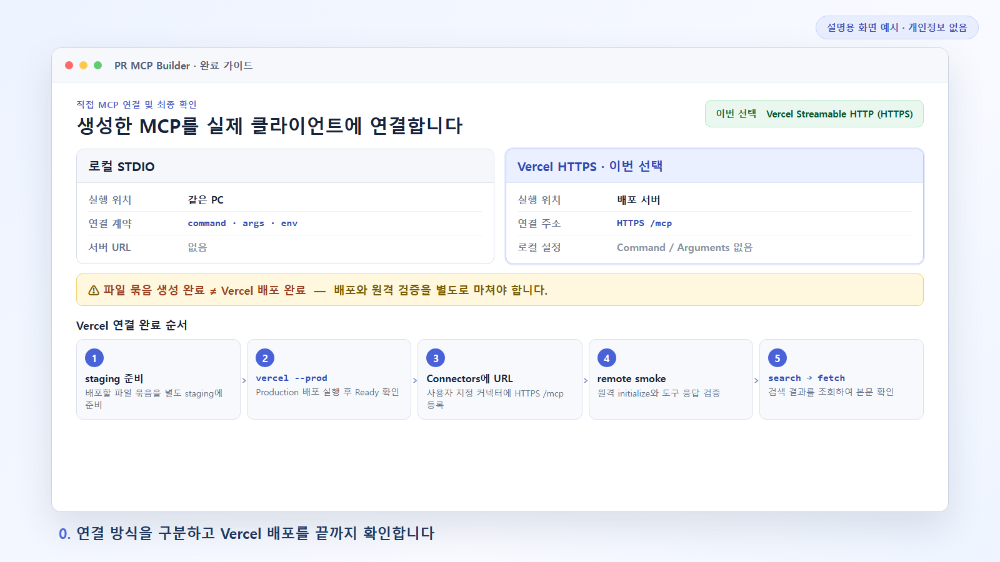

</details>

<a id="method-a"></a>

<details>
<summary><strong>방법 A 상세 절차 펼치기 — Claude Code 로컬 STDIO</strong></summary>

## 방법 A 상세: Claude Code 로컬 STDIO 연결

1. Builder의 `④ Qwen 규정 챗봇·AI 연결`에서 `Claude Code` 왼쪽 동그라미를 누릅니다.
2. **선택된 연결 방식: 로컬 stdio**가 보이는지 확인합니다.
3. 저장 폴더와 MCP 이름을 넣고 **MCP로 쓸 파일 묶음 만들기**를 누릅니다.
4. 생성이 끝나면 Windows 파일 탐색기에서 방금 만든 번들 폴더를 엽니다.

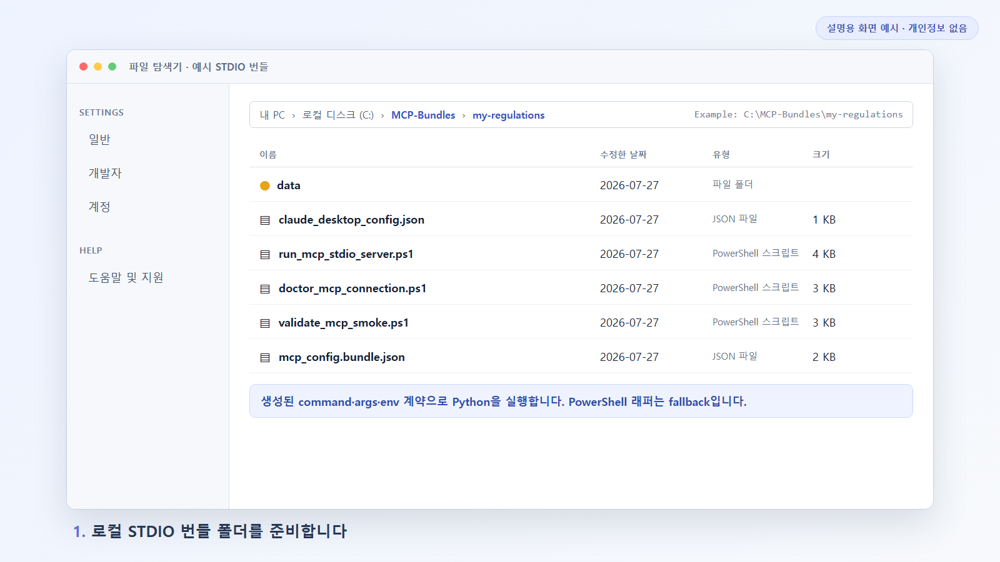

위 그림은 위치를 설명하는 예시입니다. 그림 속 `C:\MCP-Bundles\my-regulations`를
입력하지 말고, 방금 Builder가 만든 **내 번들 폴더**를 여세요.

5. 탐색기 위쪽 주소 표시줄을 클릭하고 `powershell`을 입력한 뒤 `Enter`를 누릅니다.
6. 열린 PowerShell에서 아래 한 줄을 실행합니다.

```powershell
.\claude_code_add_stdio.ps1
```

7. 같은 PowerShell에서 아래 명령으로 등록된 서버 이름을 확인합니다.

```powershell
claude mcp list
```

8. 목록에 방금 만든 서버 이름이 보이면 그 이름을 그대로 넣어 다시 조회합니다. 예를
   들어 내 서버 이름을 `test2`로 만들었다면 아래처럼 실행합니다.

```powershell
claude mcp get test2
```

9. Claude Code를 완전히 종료했다가 다시 열고 새 대화에서 아래 두 줄을 보냅니다.

```text
연결한 규정 MCP의 search 도구로 복무를 검색해 줘.
첫 번째 검색 결과의 id를 fetch 도구에 넣어 원문과 출처를 보여 줘.
```

`search` 결과와 `fetch` 본문·출처가 모두 나오면 방법 A가 끝난 것입니다. 생성된
스크립트는 공식 `claude mcp add --transport stdio --scope user` 형식으로 등록합니다.

아래 그림처럼 `search`, `fetch`와 본문 반환이 모두 성공해야 끝입니다. 서버 이름만
목록에 보이는 것은 아직 연결 완료가 아닙니다.

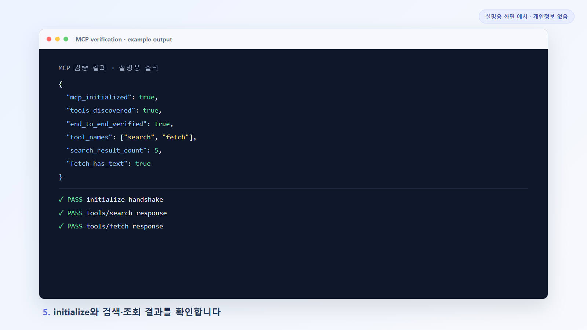

</details>

<a id="method-b"></a>

<details>
<summary><strong>방법 B 상세 절차 펼치기 — Codex CLI·IDE 로컬 STDIO</strong></summary>

## 방법 B 상세: Codex CLI / Codex IDE 로컬 STDIO 연결

1. Builder의 `④ Qwen 규정 챗봇·AI 연결`에서 `Codex CLI / Codex IDE`를 선택합니다.
2. 저장 폴더와 MCP 이름을 입력하고 **MCP로 쓸 파일 묶음 만들기**를 누릅니다.
3. `100%`와 **MCP 파일 묶음 생성 완료**가 보이면 아래 B-2로 이동합니다.

> [!WARNING]
> ChatGPT는 로컬 STDIO MCP에 직접 연결하지 않습니다. 과거 화면에 ChatGPT용 STDIO
> 입력란이 보이더라도 이 프로그램의 지원 경로로 사용하지 말고 [방법 D](#method-d)의
> ChatGPT 웹 원격 MCP를 사용하세요.


### B-2. Codex CLI·IDE에 생성된 TOML 넣기

ChatGPT의 인자 입력 화면은 열지 않습니다. **Codex CLI 또는 Codex IDE**에서 아래
순서를 계속합니다.

1. Codex CLI와 Codex IDE를 완전히 종료합니다.
2. Windows 파일 탐색기에서 Builder가 만든 번들 폴더를 엽니다.
3. `codex_config_snippet.toml`을 메모장이나 VS Code로 엽니다.
4. 파일 안에서 `Ctrl+A`를 누른 다음 `Ctrl+C`를 눌러 **파일 전체를 복사**합니다.
5. `Win+R`을 누릅니다.
6. 아래 한 줄을 그대로 입력하고 `Enter`를 누릅니다.

```text
notepad %USERPROFILE%\.codex\config.toml
```

7. 열린 `config.toml`이 비어 있으면 그대로 `Ctrl+V`를 누릅니다.
8. 기존 설정이 있으면 지우지 말고 **파일 맨 아래**를 클릭합니다.
9. `Enter`를 두 번 눌러 빈 줄을 만든 뒤 `Ctrl+V`를 누릅니다.
10. `Ctrl+S`로 저장하고 메모장을 닫습니다.
11. Codex CLI 또는 Codex IDE를 다시 실행합니다.
12. MCP 목록에서 방금 만든 서버가 보이는지 확인합니다.
13. 새 대화에서 아래 두 문장을 보내 `search`와 `fetch`를 실제로 호출합니다.

```text
연결한 규정 MCP의 search 도구로 복무를 검색해 줘.
첫 번째 검색 결과의 id를 fetch 도구에 넣어 원문과 출처를 보여 줘.
```

기존 파일이 아래처럼 다른 MCP 서버 하나를 가지고 있었다고 가정합니다.

```toml
[mcp_servers.weather]
command = "weather-mcp"
args = []
```

Builder가 만든 `codex_config_snippet.toml` 전체를 **그 아래에** 붙이면 위치는 아래처럼
됩니다. 이 예시의 경로나 이름을 직접 입력하지 말고, 내 번들의 파일 전체를 복사하세요.

```toml
[mcp_servers.weather]
command = "weather-mcp"
args = []

[mcp_servers.기관_규정]
command = "powershell.exe"
startup_timeout_sec = 45
cwd = "C:/MCP 번들/기관 규정"
args = [
  "-NoProfile",
  "-ExecutionPolicy",
  "Bypass",
  "-File",
  "C:/MCP 번들/기관 규정/run_mcp_stdio_server.ps1",
  "--data-dir",
  "C:/MCP 번들/기관 규정/data",
  "--tenant-id",
  "default",
  "--transport",
  "stdio",
  "--profile-id",
  "institution-example",
  "--flat-storage",
  "--tool-profile",
  "chatgpt-data",
  "--no-warm-cache",
]
```

확인할 것은 세 가지뿐입니다.

1. 기존 `weather` 블록은 그대로 남아 있습니다.
2. 새 `[mcp_servers.기관_규정]` 블록은 파일 맨 아래의 별도 블록입니다.
3. 같은 `[mcp_servers.기관_규정]` 제목이 이미 있으면 두 개를 만들지 말고 **기존 그
   블록만** 지운 뒤 새 블록으로 바꿉니다.

`search` 결과와 그 결과의 `id`를 사용한 `fetch` 본문·출처가 모두 나오면 Codex 연결
완료입니다.

</details>

<a id="method-c"></a>

<details>
<summary><strong>방법 C 상세 절차 펼치기 — Claude Desktop 로컬 STDIO</strong></summary>

## 방법 C 상세: Claude Desktop 로컬 STDIO 연결

> [!IMPORTANT]
> 이 안내에서는 명령어나 경로를 직접 만들지 않습니다. Builder에서 복사하고,
> Claude Desktop 설정 파일에 붙여 넣은 다음 `running`만 확인합니다.

> [!TIP]
> **처음 연결이면 C-1부터 C-7까지만 그대로 하면 끝입니다.**
>
> 1. Builder에서 `Claude Desktop`과 `로컬 STDIO`를 선택하고 번들을 만듭니다.
> 2. 완료 화면에서 **처음 연결할 때: 설정 파일 전체에 붙여 넣을 JSON 복사**를 누릅니다.
> 3. Claude Desktop에서 **프로필 → 설정 → 개발자 → 구성 편집**으로 들어갑니다.
> 4. 열린 `claude_desktop_config.json` 파일 전체에 `Ctrl+A` → `Ctrl+V` → `Ctrl+S`를 합니다.
> 5. Claude Desktop을 **종료(Quit)**까지 해서 완전히 끕니다.
> 6. Claude Desktop을 다시 켭니다.
> 7. **프로필 → 설정 → 개발자 → 로컬 MCP 서버**에서 파란색 `running`을 확인합니다.
>
> **C-8과 C-9는 기존 설정이 있거나 실패했을 때만 읽습니다.**

> [!NOTE]
> 실제 캡처에서는 계정 이름, 이메일, 최근 대화, 로컬 절대경로, 서버 이름과 ID처럼
> 공개하면 안 되는 글자만 주변과 같은 색으로 가렸습니다.
> 가려진 빈칸을 비워 두라는 뜻은 아닙니다.
> Windows 작업표시줄도 개인정보 노출을 막기 위해 제거했습니다.

### C-1. Builder에서 Claude Desktop 번들 만들기

1. Builder의 `④ Qwen 규정 챗봇·AI 연결` 화면까지 내려갑니다.
2. **연결할 AI 앱**에서 `Claude Desktop`을 누릅니다.
3. **로컬 STDIO**가 선택되었는지 확인합니다.
4. 저장할 폴더와 MCP 이름을 입력합니다.
5. 빨간 **MCP로 쓸 파일 묶음 만들기** 버튼을 누릅니다.
6. 파란 진행 막대가 `100%`가 되고 **MCP 파일 묶음 생성 완료**가 보일 때까지 기다립니다.


### C-2. Builder에서 JSON 복사하기

1. 생성 완료 화면을 아래로 내립니다.
2. **Claude Desktop에 등록하는 방법**을 찾습니다.
3. 먼저 보이는 **생성된 설정 파일 경로 복사**와 **Claude Desktop 설정 위치**는
   경로 확인용입니다. 이 두 상자의 복사 아이콘은 누르지 않습니다.
4. 제목이 정확히
   **처음 연결할 때: 설정 파일 전체에 붙여 넣을 JSON 복사**를 찾습니다.
5. 그 제목 바로 아래 코드 상자 오른쪽 위 **복사 아이콘**을 한 번 누릅니다.
6. 복사한 내용은 수정하지 않습니다. 서버 이름, Python 경로, `args`, `env`가 모두
   들어 있습니다.

> 아래 캡처는 이전 버전 Builder 화면이라 같은 상자의 제목이
> **병합할 `mcpServers` JSON 복사**로 보일 수 있습니다. 처음 연결이라면 그 상자 전체를
> 복사하면 됩니다. 현재 Builder에서는
> **처음 연결할 때: 설정 파일 전체에 붙여 넣을 JSON 복사**로 표시됩니다.

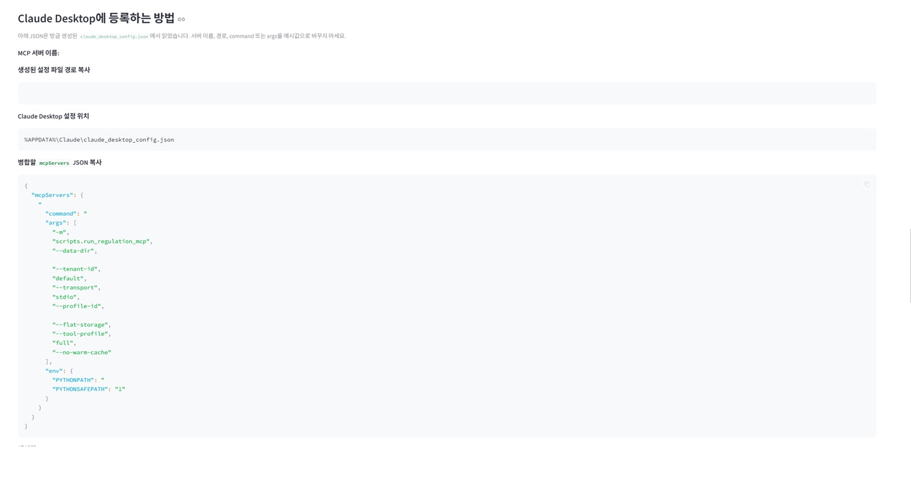

스크린샷에서 개인정보 보호를 위해 가린 서버 이름과 경로를 직접 입력하지 마세요.
**내 Builder 화면의 복사 아이콘으로 가져온 값만 사용합니다.**

### C-3. Claude Desktop 설정 파일 열기

#### 1. Claude Desktop에서 설정 열기

1. 설치된 **Claude Desktop 앱**을 엽니다.
2. 왼쪽 아래 **프로필 영역**을 누릅니다.
3. 열린 메뉴에서 톱니바퀴 모양 **설정**을 누릅니다.

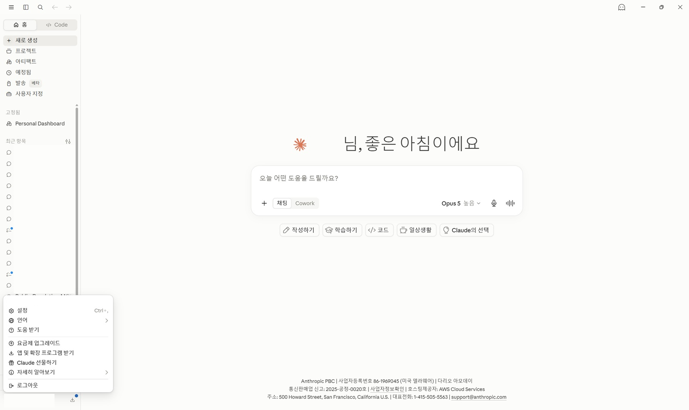

#### 2. 구성 편집 누르기

1. 설정 창 왼쪽 메뉴를 아래로 내립니다.
2. `데스크톱 앱` 아래의 **개발자**를 누릅니다.
3. 오른쪽 **로컬 MCP 서버** 화면에서 **구성 편집**을 누릅니다.

클릭 경로는 **설정 > 개발자 > 로컬 MCP 서버 > 구성 편집**입니다.

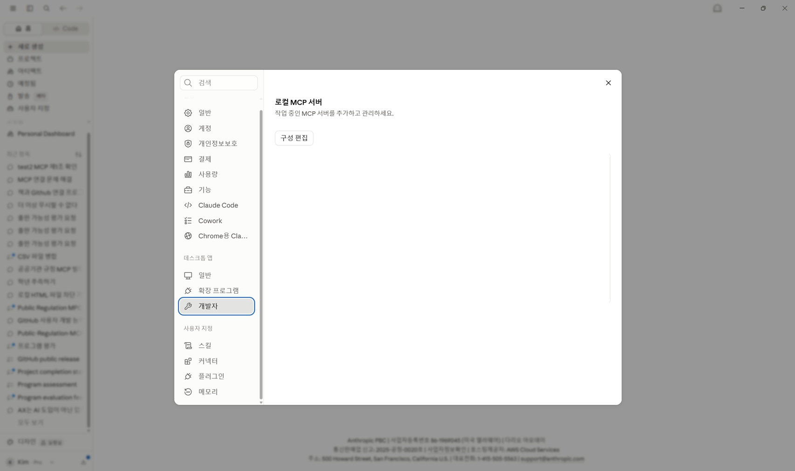

#### 3. 설정 파일 열기

1. Windows 파일 탐색기가 열리면 가운데에서
   **`claude_desktop_config`** 파일을 찾습니다.
2. 파일을 두 번 클릭합니다.
3. 어떤 앱으로 열지 묻는다면 **메모장** 또는 **Visual Studio Code**를 선택합니다.

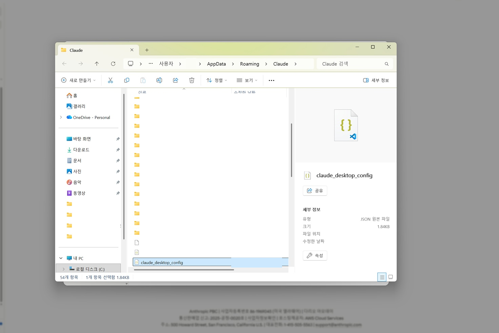

파일 확장명이 숨겨진 Windows에서는 `.json`이 보이지 않을 수 있습니다.
파일 종류가 **JSON 원본 파일**이면 맞습니다.

직접 폴더를 열어야 한다면 실제 위치는 아래입니다.

```text
%APPDATA%\Claude\claude_desktop_config.json
```

### C-4. JSON 붙여 넣고 저장하기

처음 설치해 설정 파일이 비어 있거나 `{}`만 보이는 경우입니다.

초보자는 아래 한 문장만 기억하면 됩니다.

- **Builder의 첫 번째 JSON 상자 전체를 복사해서, 열린 `claude_desktop_config.json` 파일 전체를 덮어씁니다.**

1. 열린 설정 파일 안을 한 번 클릭합니다.
2. 키보드에서 `Ctrl+A`를 눌러 기존 내용을 모두 선택합니다.
3. `Ctrl+V`를 눌러 C-2에서 복사한 JSON을 붙여 넣습니다.
4. `Ctrl+S`를 눌러 저장합니다.
5. 편집기를 닫습니다.

> **붙여 넣을 위치는 파일 전체입니다.** `{}` 안쪽에 넣는 것이 아닙니다.
> `{}`가 보이면 `Ctrl+A`로 `{}`까지 선택한 뒤 복사한 전체 JSON으로 바꿉니다.
> 초보자는 `mcpServers` 안쪽 줄을 손으로 맞추지 않습니다. **파일 전체 선택 후 그대로
> 붙여 넣기**만 하면 됩니다.

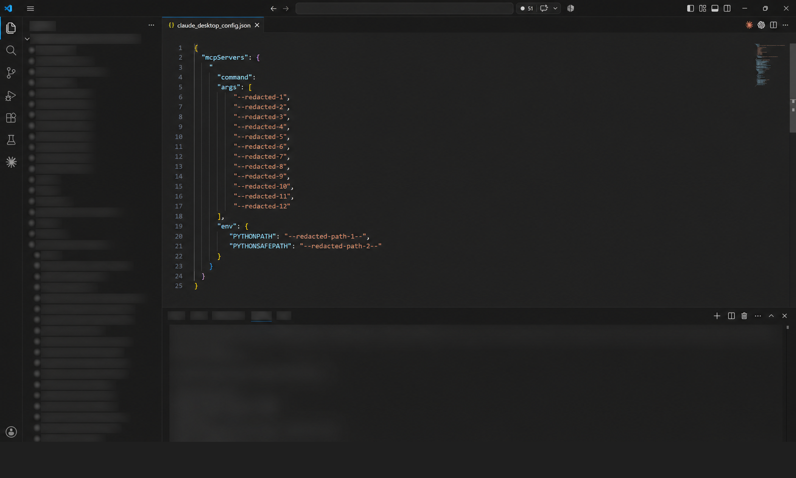

스크린샷의 서버 이름, 경로, profile ID는 공개용으로 가렸고 Windows 작업표시줄도
제거했습니다. 빈칸을 따라 입력하지 말고 C-2에서 복사한 JSON을 그대로 붙여 넣습니다.

파일 안에 다른 서버나 `preferences`가 이미 있었다면 덮어쓰지 마세요. 저장하지 말고
닫은 뒤 [C-8](#c-8-기존-설정이-있을-때-병합하기)로 내려갑니다.

### C-5. Claude Desktop 완전히 종료하고 다시 열기

1. Claude Desktop 창 오른쪽 위 `X`를 누릅니다.
2. Windows 화면 오른쪽 아래의 `^` **숨겨진 아이콘 표시**를 누릅니다.
3. Claude 아이콘을 마우스 오른쪽 버튼으로 누릅니다.
4. **종료(Quit)**를 누릅니다.
5. Claude Desktop을 다시 실행합니다.

창만 닫으면 이전 설정이 남을 수 있으므로 **종료(Quit)**까지 해야 합니다.

### C-6. `running` 확인하기

1. Claude Desktop 왼쪽 아래 **프로필**을 누릅니다.
2. **설정**을 누릅니다.
3. 왼쪽의 **개발자**를 누릅니다.
4. **로컬 MCP 서버**에서 방금 만든 서버 이름을 누릅니다.
5. 서버 이름 옆 파란 배지가 **`running`**인지 확인합니다.

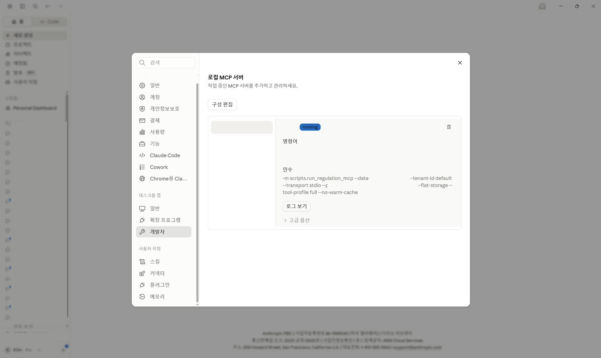

이 화면에서는 다음 세 곳만 보면 됩니다.

1. 서버 이름 옆에 **`running`**
2. 가운데에 **명령어**와 **인수**
3. 아래에 **로그 보기**

`running`이 보이면 서버 실행까지 성공한 것입니다.

여기서 끝내지 말고 바로 아래 C-7까지 진행해야 실제 검색도 되는지 확인됩니다.

### C-7. `search`와 `fetch` 확인하기

1. Claude Desktop 설정 창을 닫습니다.
2. **새 대화**를 엽니다.
3. 아래 두 줄을 통째로 복사해 대화창에 붙여 넣고 전송합니다.

```text
연결한 규정 MCP의 search 도구로 복무를 검색해 줘.
첫 번째 검색 결과의 id를 fetch 도구에 넣어 원문과 출처를 보여 줘.
```

아래 세 가지가 모두 보이면 연결 완료입니다.

1. 설정 화면의 서버 상태가 `running`
2. 대화에서 `search` 도구가 호출됨
3. 첫 검색 결과를 `fetch`로 열어 본문과 출처가 표시됨

여기까지 되면 Claude Desktop 연결은 끝입니다.

<a id="claude-existing-config"></a>

### C-8. 기존 설정이 있을 때 병합하기

`claude_desktop_config.json`에 다른 서버나 `preferences`가 이미 있으면
`Ctrl+A`로 지우면 안 됩니다. 가장 쉬운 방법은 자동 병합입니다.

1. Claude Desktop을 **종료(Quit)**합니다.
2. 파일 탐색기에서 Builder가 만든 **번들 폴더**를 엽니다.
3. 탐색기 위쪽 주소 표시줄을 클릭합니다.
4. `powershell`이라고 입력하고 `Enter`를 누릅니다.
5. 열린 PowerShell에 아래 한 줄 전체를 붙여 넣고 `Enter`를 누릅니다.

```powershell
powershell.exe -NoProfile -ExecutionPolicy Bypass -File ".\connect_mcp_client.ps1" -InstallPackage -Target claude-desktop -InstallClaudeDesktop
```

6. 명령이 끝나면 Claude Desktop을 다시 실행합니다.
7. C-6으로 돌아가 `running`을 확인합니다.

정상이라면 PowerShell에서 `Installed-config stdio verification passed`가 보입니다.
이어서 `CLAUDE DESKTOP VERIFICATION REQUIRED`가 보여도 정상입니다. Claude를 다시 열어
`running`을 확인하라는 뜻입니다.

직접 붙여 넣기를 원한다면 Builder의 두 번째 상자인
**기존 서버가 있을 때: `mcpServers` 안에 넣을 새 서버 한 항목 복사**를 사용합니다.
이 상자는 기존 파일의 `"mcpServers": { ... }` 중괄호 안에만 추가합니다. JSON 쉼표가
헷갈리면 직접 편집하지 말고 위 자동 병합을 사용하세요.

#### 직접 병합할 때 정확히 어디에 붙여 넣는지

딱 두 줄로 요약하면 아래와 같습니다.

1. **첫 번째 JSON 상자**는 새 파일이거나 빈 파일일 때 파일 전체에 붙여 넣습니다.
2. **두 번째 JSON 상자**는 기존 파일에 다른 서버가 있을 때 `"mcpServers"` 중괄호 안에만 붙여 넣습니다.

아래 세 상자는 **위치를 설명하기 위한 완성 예시**입니다. 예시의 서버 이름이나 경로를
입력하지 말고, 내 Builder의 두 번째 복사 상자에 나온 내용을 사용합니다.

1. 기존 파일을 열면 아래처럼 다른 서버와 `preferences`가 있을 수 있습니다.

```json
{
  "mcpServers": {
    "weather-mcp": {
      "command": "C:\\Tools\\weather-mcp.exe",
      "args": []
    }
  },
  "preferences": {
    "theme": "dark"
  }
}
```

2. Builder에서 **기존 서버가 있을 때: `mcpServers` 안에 넣을 새 서버 한 항목 복사**의
   복사 아이콘을 누릅니다. 복사되는 모양은 아래처럼 **서버 이름 한 항목**입니다.

```json
"기관-규정": {
  "command": "C:\\Public Regulation MCP\\.venv\\Scripts\\python.exe",
  "args": [
    "-m",
    "scripts.run_regulation_mcp",
    "--data-dir",
    "C:\\MCP 번들\\기관 규정\\data",
    "--tenant-id",
    "default",
    "--transport",
    "stdio",
    "--profile-id",
    "institution-example",
    "--flat-storage",
    "--tool-profile",
    "full",
    "--no-warm-cache"
  ],
  "env": {
    "PYTHONPATH": "C:\\Public Regulation MCP",
    "PYTHONSAFEPATH": "1"
  }
}
```

3. 기존 `weather-mcp`의 마지막 `}` 뒤에 쉼표 `,`를 하나 붙이고, 바로 다음 줄에
   Builder에서 복사한 서버 한 항목을 붙여 넣습니다. 최종 파일은 아래처럼 됩니다.

```json
{
  "mcpServers": {
    "weather-mcp": {
      "command": "C:\\Tools\\weather-mcp.exe",
      "args": []
    },
    "기관-규정": {
      "command": "C:\\Public Regulation MCP\\.venv\\Scripts\\python.exe",
      "args": [
        "-m",
        "scripts.run_regulation_mcp",
        "--data-dir",
        "C:\\MCP 번들\\기관 규정\\data",
        "--tenant-id",
        "default",
        "--transport",
        "stdio",
        "--profile-id",
        "institution-example",
        "--flat-storage",
        "--tool-profile",
        "full",
        "--no-warm-cache"
      ],
      "env": {
        "PYTHONPATH": "C:\\Public Regulation MCP",
        "PYTHONSAFEPATH": "1"
      }
    }
  },
  "preferences": {
    "theme": "dark"
  }
}
```

확인할 것은 세 가지뿐입니다.

1. 새 서버는 `"mcpServers": {`와 그 닫는 `}` **사이**에 있습니다.
2. 기존 `weather-mcp`와 새 서버 **사이에만 쉼표가 하나** 있습니다.
3. 기존 `preferences`는 `mcpServers` 밖에 그대로 남아 있습니다.

새 서버를 파일 맨 아래에 붙이거나, `args` 대괄호 안에 넣거나, 두 번째
`"mcpServers"`를 새로 만들면 안 됩니다. 저장하기 전에
PowerShell에서 아래 명령을 실행하면 Python 없이도 JSON 쉼표나 중괄호 오류를 먼저
찾을 수 있습니다.

```powershell
Get-Content "$env:APPDATA\Claude\claude_desktop_config.json" -Raw | ConvertFrom-Json | Out-Null
```

### C-9. `disconnected`일 때 진단하기

> [!IMPORTANT]
> 아래 두 스크립트는 **소스 실행 사용자 전용**입니다. Windows 실행판 사용자는 이
> 스크립트를 실행하거나 Python을 설치하지 말고, Builder가 생성한
> `PR MCP Builder.exe --mcp-server` 설정을 그대로 등록한 뒤 Claude Desktop을 완전히
> 재시작하고 새 대화에서 `search`와 `fetch`를 확인하세요.

1. Builder가 만든 번들 폴더를 엽니다.
2. 탐색기 위쪽 주소 표시줄에 `powershell`을 입력하고 `Enter`를 누릅니다.
3. 아래 첫 줄을 실행하고, 끝나면 둘째 줄을 실행합니다.

```powershell
.\doctor_mcp_connection.ps1
.\validate_mcp_smoke.ps1
```

첫 명령은 Python·프로젝트·import 오류를 정확히 표시합니다. 둘째 명령은
`initialize` → `tools/list` → `search` → `fetch`까지 실제 STDIO 연결을 확인합니다.

</details>

<a id="vercel-common"></a>

<details>
<summary><strong>Vercel HTTPS 배포 V-1~V-7 전체 절차 펼치기</strong></summary>

## 방법 D·E 공통 준비: Vercel HTTPS 배포와 검증

Vercel HTTPS는 승인된 MCP runtime을 인터넷에서 접속 가능한 서버로 배포하는 방법입니다.
Vercel 홈페이지는 계정·환경변수·로그를 관리하고, 처음 배포할 파일 준비와 업로드는 내
PC의 PowerShell에서 진행합니다.

처음이라면 Builder에서 원문 검수·승인·색인과 규정 조회를 먼저 확인하세요. Codex나
Claude를 함께 쓴다면 방법 A, B 또는 C의 로컬 `search`와 `fetch`까지 성공한 뒤 진행하는
것이 가장 안전합니다. 로컬에서도 검색되지 않는 데이터는 Vercel에 올린다고 검색되기
시작하지 않습니다.

> [!WARNING]
> Vercel로 전송한 MCP 응답은 외부 AI 서비스로 전달될 수 있습니다. 공개 자료 또는
> 반출 승인을 받은 자료에만 사용하세요. 기관 내부 자료에는 공개 무인증 모드를 사용하지
> 말고 bearer 인증이나 OAuth를 먼저 설계하세요.

### V-1. 준비물 확인

- Vercel 계정: <https://vercel.com>에서 **Sign Up** 후 이메일 또는 GitHub 계정으로 가입
- Node.js LTS와 npm: <https://nodejs.org>에서 **LTS** 설치판 사용
- Python 3.11 이상
- 사람 승인과 검색 색인이 끝난 **배포 준비용 MCP 전달 ZIP**
- 소스 실행자는 이 저장소를 그대로 사용할 수 있음

Vercel 주소가 전혀 없는 첫 배포라면 아래 순서로 준비합니다.

1. Builder에서 방법 D 또는 E를 선택하고 URL을 비운 채 **배포 준비용 MCP 묶음**을
   만듭니다.
2. 생성된 전달 ZIP을 새 폴더에 완전히 풉니다.
3. 그 PC에 Python 3.11 이상이 없다면 먼저 설치합니다.
4. 압축을 푼 폴더에서 `install_local_package.ps1`을 한 번 실행해 포함된 wheel과
   `reg-rag-mcp-vercel-stage` 명령을 설치합니다.
5. 같은 폴더의 `data`를 사용해 V-2부터 V-7까지 배포와 검증을 끝냅니다.
6. Builder로 돌아가 같은 D 또는 E를 선택하고 검증된 `/mcp` 주소를 입력해 묶음을 다시
   만듭니다.

`④ Qwen 규정 챗봇·AI 연결`의 생성 버튼은 첫 배포 전에도 사용할 수 있습니다. 이때 만들어지는
것은 **배포 준비용 파일**이며 실제 AI 연결 완료가 아닙니다. 화면의 URL 예시를 복사하지
말고 V-6에서 얻고 V-7에서 검증한 주소를 넣어 묶음을 다시 만들어야 합니다.

Node.js를 설치한 뒤 새 PowerShell을 열고 다음 두 명령을 실행합니다.

```powershell
node --version
npm --version
```

두 명령 모두 숫자 버전을 보여야 합니다. `'node' 또는 'npm'을 찾을 수 없습니다`가
나오면 모든 PowerShell 창을 닫고 새로 연 뒤 다시 확인합니다.

### V-2. 배포 전용 폴더 만들기

전달 ZIP을 푼 폴더에서 PowerShell을 열고 먼저 다음 명령을 실행합니다. Windows에서
스크립트 실행을 묻거나 차단하면 파일을 이 저장소의 Release에서 받았는지 확인한 뒤
전체 명령을 그대로 사용합니다.

```powershell
powershell.exe -NoProfile -ExecutionPolicy Bypass -File .\install_local_package.ps1
```

설치가 끝나면 같은 창에서 아래 명령을 실행합니다. 첫 번째 경로는 압축을 푼 폴더의
`data`이고, 두 번째는 새 Vercel 배포 전용 폴더입니다.

```powershell
$RuntimeDataDir = (Resolve-Path ".\data").Path
$StageDir = Read-Host "새 Vercel 배포 전용 폴더 전체 경로"
reg-rag-mcp-vercel-stage `
  --runtime-data-dir "$RuntimeDataDir" `
  --out-dir "$StageDir"
```

소스 실행자는 프로젝트 폴더, 즉 `README.md`, `app`, `scripts`가 함께 보이는 폴더에서
다음 명령을 대신 사용할 수 있습니다.

```powershell
$RuntimeDataDir = Read-Host "생성 번들의 data 폴더 전체 경로"
$StageDir = Read-Host "새 Vercel 배포 전용 폴더 전체 경로"
python scripts\prepare_vercel_mcp_deployment.py `
  --runtime-data-dir "$RuntimeDataDir" `
  --out-dir "$StageDir"
```

패키지를 이미 설치해 CLI 명령을 사용할 수 있다면 같은 작업을 다음처럼 실행할 수 있습니다.

```powershell
reg-rag-mcp-vercel-stage `
  --runtime-data-dir "$RuntimeDataDir" `
  --out-dir "$StageDir"
```

이 명령은 전체 프로젝트나 원본 업로드 폴더를 배포하지 않고 다음 항목만 포함한
`vercel-mcp-stage`를 만듭니다.

- MCP 실행에 필요한 공개 소스
- `api/index.py` Vercel 진입점
- `vercel.json`
- 승인된 MCP runtime

기존 출력 폴더는 자동 덮어쓰지 않습니다. 기존 폴더를 재사용하려면 내용과 비밀값을
확인하고 새 빈 폴더를 선택하는 것이 안전합니다.

명령이 끝나면 방금 입력한 배포 전용 폴더를 파일 탐색기로 열어 최소한 다음 항목이
보이는지 확인합니다.

- `api` 폴더
- `app` 폴더
- `mcp_runtime` 폴더
- `vercel.json`
- `pyproject.toml`

하나라도 없으면 아직 배포하지 말고 staging 명령의 빨간 오류부터 해결합니다.

> [!CAUTION]
> `.env.local`, `.vercel`, 토큰, 원본 업로드와 보고서 전체를 ZIP이나 Git으로 함께
> 올리지 마세요. `.gitignore`만 믿고 폴더 전체를 수동 업로드하지 말고, 위 staging
> 명령으로 만든 범위를 배포 입력으로 사용하세요.

### V-3. Vercel CLI 설치하고 로그인

처음 한 번만 설치합니다.

```powershell
npm install -g vercel
vercel --version
vercel login
```

`vercel --version`이 버전을 보여야 설치된 것입니다. `vercel login`이 브라우저를 열면
방금 만든 Vercel 계정으로 로그인하고 승인합니다. 브라우저에 성공 표시가 나오면
PowerShell로 돌아와 로그인 완료 문구를 확인합니다. 토큰이나 로그인 링크를 다른
사람에게 보내지 마세요.

> [!NOTE]
> Vercel 홈페이지에서 빈 프로젝트를 먼저 만들 수도 있지만 필수는 아닙니다. 아래 CLI가
> 프로젝트 생성과 로컬 staging 폴더 연결을 수행합니다. 홈페이지는 이후 상태와 로그를
> 확인할 때 사용합니다.
>
> 즉, **홈페이지에도 들어가지만 실제 배포 명령은 PowerShell에서 실행**합니다.

### V-4. Vercel 프로젝트 만들고 staging 폴더 연결

아래 명령은 프로젝트 이름을 명령 안에서 찾아 바꾸지 않아도 됩니다. 한 줄씩 그대로
실행하고, 이름을 물을 때만 영문 소문자·숫자·하이픈으로 원하는 이름을 입력합니다.

```powershell
$StageDir = Read-Host "V-2에서 만든 배포 전용 폴더 전체 경로"
$VercelProject = Read-Host "새 Vercel 프로젝트 이름"
vercel project add $VercelProject
vercel link --yes --project $VercelProject --cwd "$StageDir"
```

PowerShell이 `새 Vercel 프로젝트 이름:`이라고 물으면 그때 한 번만 이름을 입력하고
`Enter`를 누릅니다. 완료 후 Vercel 홈페이지 Dashboard에 같은 이름의 프로젝트가
보입니다.

Dashboard에 프로젝트가 보인다고 배포가 끝난 것은 아닙니다. 반드시 뒤의
`vercel --prod`까지 실행하고, 출력의 마지막에 `Ready`와 `Aliased` 주소가 보여야 합니다.

명령이 팀을 선택하라고 물으면 개인 연습은 본인 계정을 선택합니다. 기존 프로젝트에
연결할지 묻고 처음 만드는 경우에는 새 프로젝트를 선택합니다. 프로젝트 이름에는 공백과
한글 대신 영문 소문자, 숫자, 하이픈을 사용합니다.

### V-5. 공개 또는 비공개 방식 선택

#### 공개해도 되는 승인 규정의 read-only endpoint

공개가 허용된 규정만 포함했고 누구나 읽기 전용 목록·계층·조문·검색 도구를 호출해도 되는
경우에만 다음 값을 Production 환경에 넣습니다.

```powershell
$StageDir = Read-Host "V-2에서 만든 배포 전용 폴더 전체 경로"
vercel env add MCP_ALLOW_UNAUTHENTICATED_HTTP production `
  --value "true" --yes `
  --cwd "$StageDir"

vercel env add MCP_TOOL_PROFILE production `
  --value "chatgpt-data" --yes `
  --cwd "$StageDir"
```

이 모드는 쓰기 도구 없이 원격 공개 범위를 `list_regulations`, `get_regulation_toc`,
`get_regulation_article`, `get_regulation_references`,
`list_regulation_reference_cycles`, `search`, `fetch`로 제한하는 용도입니다.

명령 실행 뒤 Vercel 홈페이지에서도 확인할 수 있습니다.

1. Dashboard에서 만든 프로젝트를 엽니다.
2. **Settings > Environment Variables**로 이동합니다.
3. `MCP_ALLOW_UNAUTHENTICATED_HTTP`와 `MCP_TOOL_PROFILE`이 Production에 있는지
   확인합니다.
4. 값이 없거나 오타가 있으면 배포하지 말고 먼저 수정합니다.

#### 기관 내부 자료나 비공개 endpoint

`MCP_ALLOW_UNAUTHENTICATED_HTTP=true`를 사용하지 않습니다. `MCP_AUTH_TOKEN`을 Vercel
Secret으로 관리하고 bearer 인증을 지원하는 클라이언트에 환경변수 이름만 연결하거나
OAuth를 구성합니다. 토큰 값을 README, JSON, TOML, Git 커밋에 기록하지 마세요.

ChatGPT 웹 hosted connector와 Claude remote connector의 인증 지원 범위가 다를 수
있으므로 기관 운영 배포는 [Vercel HTTPS MCP 배포 안내](docs/vercel_https_mcp_ko.md)의
인증 조건을 먼저 확인합니다.

### V-6. Production 배포

미리보기 배포로 오류를 먼저 확인한 뒤 Production으로 배포합니다.

```powershell
$StageDir = Read-Host "V-2에서 만든 배포 전용 폴더 전체 경로"
vercel --cwd "$StageDir"
vercel --prod --cwd "$StageDir"
```

마지막 출력에서 **`Ready`** 줄과 **`Aliased:`** 줄을 찾습니다. `Aliased:` 오른쪽에
실제로 표시된 `https://` 주소가 고정 Production 주소입니다.

1. `Aliased:` 오른쪽 주소만 마우스로 선택해 복사합니다.
2. 메모장에 한 번 붙여 넣습니다.
3. 주소 맨 끝에 `/mcp`를 붙입니다.
4. 완성한 전체 주소를 다시 복사합니다.

예를 들어 복사한 주소가 `https://my-regulation-mcp.vercel.app`이었다면 최종 주소는
`https://my-regulation-mcp.vercel.app/mcp`입니다. **예시 주소를 입력하지 말고 내
PowerShell에 나온 주소를 복사하세요.**

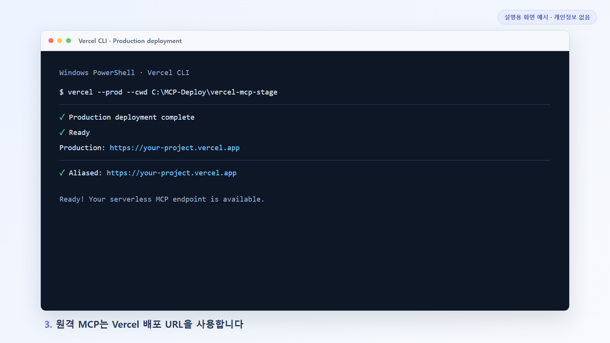

배포마다 생기는 긴 Preview URL 대신 고정 `Aliased` 주소를 사용하세요. 같은 Vercel
배포와 `/mcp` endpoint를 ChatGPT·Codex·Claude가 함께 사용하므로 앱마다 새 서버를
배포할 필요가 없습니다.

PowerShell 출력을 놓쳤다면 Vercel 홈페이지에서 다시 찾을 수 있습니다.

1. Dashboard에서 프로젝트를 엽니다.
2. **Deployments**에서 가장 최근 Production 배포를 엽니다.
3. 상태가 **Ready**인지 확인합니다.
4. **Domains** 또는 배포의 **Aliased** 주소에서 `.vercel.app` 주소를 복사합니다.
5. 복사한 주소 끝에 `/mcp`를 붙입니다.

브라우저 주소창에 `/mcp`를 열었을 때 일반 웹페이지 대신 오류나 메서드 안내가 보일 수
있습니다. MCP는 브라우저로 읽는 홈페이지가 아니므로 이것만으로 실패라고 판단하지 말고
반드시 다음 smoke 명령으로 프로토콜을 검사합니다.

### V-7. 주소를 등록하기 전에 프로토콜 검증

프로젝트 루트에서 실행합니다. 첫 줄을 실행하면 PowerShell이 URL을 물어봅니다.
V-6에서 만든 실제 `/mcp` 주소 전체를 붙여 넣고 `Enter`를 누르세요.

```powershell
$McpUrl = Read-Host "V-6에서 복사한 전체 /mcp 주소"
python scripts\run_mcp_client_config_smoke.py `
  --remote-url $McpUrl `
  --allow-unauthenticated-remote `
  --timeout-seconds 120 `
  --fail-on-issue
```

공개 무인증 endpoint일 때만 `--allow-unauthenticated-remote`를 사용합니다. 비공개
endpoint에는 설정한 인증을 사용합니다.

결과에서 다음이 모두 확인돼야 합니다.

- `mcp_initialized`: `true`
- `tools_discovered`: `true`
- `end_to_end_verified`: `true`
- `tool_names`: `list_regulations`, `get_regulation_toc`, `get_regulation_article`,
  `get_regulation_references`, `list_regulation_reference_cycles`, `search`, `fetch` 포함

이 네 값 중 하나라도 `false`이면 Claude나 ChatGPT에 등록하지 않습니다. Vercel Dashboard의
**Logs**에서 가장 최근 Function 오류를 확인하고 [문제 해결표](#4-문제-해결표)의
Vercel 항목을 먼저 처리합니다.

</details>

<a id="method-d"></a>

<details>
<summary><strong>방법 D 상세 절차 펼치기 — ChatGPT · Vercel HTTPS MCP</strong></summary>

## 방법 D 상세: ChatGPT · Vercel HTTPS MCP 연결

> [!IMPORTANT]
> ChatGPT는 로컬 MCP 서버에 직접 연결하지 않고 원격 MCP 서버에 연결합니다. 이 절차는
> **ChatGPT 웹**의 Developer mode를 사용합니다. 현재 공식 안내상 Pro는 개발자 모드에서
> read/fetch 도구를 연결할 수 있고, full MCP는 Business·Enterprise·Edu에서 제공됩니다.
> 워크스페이스 관리자 승인·RBAC 설정에 따라 메뉴가 보이지 않을 수 있습니다.
>
> - [OpenAI 공식 ChatGPT Developer mode·MCP 지원 안내](https://help.openai.com/en/articles/12584461-developer-mode-apps-and-full-mcp-connectors-in-chatgpt-beta)
> - [로컬·사설망 서버용 OpenAI Secure MCP Tunnel](https://developers.openai.com/api/docs/guides/secure-mcp-tunnels)

1. Builder의 `④ Qwen 규정 챗봇·AI 연결`에서 `ChatGPT · Vercel HTTPS MCP`를 선택합니다.
2. 첫 배포 전이라 HTTPS 주소가 없으면 URL을 비운 채 **배포 준비용 MCP 묶음**을 먼저
   만듭니다. 화면에 표시되는 staging·Vercel 배포 절차를 완료합니다.
3. V-7의 네 가지 검증값이 모두 성공했는지 확인합니다.
4. Builder로 돌아와 **배포된 Vercel HTTPS `/mcp` 주소** 칸에 검증한 전체 URL을 붙여
   넣고 묶음을 다시 만듭니다.
5. **생성된 MCP HTTP URL**에도 같은 주소가 보이는지 확인합니다.
6. ChatGPT 웹에서 **Settings > Apps > Advanced settings > Developer mode**를 켭니다.
7. Apps 설정에서 새 앱을 만들고 검증한 원격 MCP URL을 등록합니다.

### D-1. ChatGPT 웹에 원격 MCP 앱 등록

ChatGPT 웹의 Developer mode에서 **Apps** 설정을 열고 새 앱을 만듭니다. 화면 이름은
플랜과 워크스페이스 정책에 따라 조금 다를 수 있습니다. 메뉴가 없으면 먼저 플랜과 관리자
권한을 확인하세요.

초보자 기준으로는 아래 순서만 그대로 따라가면 됩니다.

1. **이름** 칸에 알아보기 쉬운 서버 이름을 넣습니다.
2. MCP 서버 URL 칸에 `https://.../mcp` 전체 주소를 넣습니다.
3. 비공개 endpoint라면 워크스페이스가 승인한 OAuth 인증 절차를 완료합니다.
4. 이 화면에는 `python.exe`, `powershell.exe`, `-m`, `PYTHONPATH`를 넣지 않습니다.

| ChatGPT 웹 앱 설정 | 넣을 값 |
| --- | --- |
| **이름 (Name)** | 사용자가 알아볼 이름. 예: `기관 규정 MCP` |
| **URL (MCP URL / Server URL)** | Vercel의 고정 `Aliased` 주소 끝에 `/mcp`를 붙인 전체 URL |
| **인증** | 공개가 승인된 read-only endpoint는 별도 인증 없음. 비공개 endpoint는 워크스페이스가 승인한 OAuth |
| **로컬 Command / Arguments / Working directory** | 넣지 않음 |

화면의 예시 URL은 복사하지 마세요. V-6에서 복사하고 V-7에서 검증한 실제 Vercel
주소만 URL 칸에 붙여 넣습니다. 비밀 토큰 문자열 자체를 README나 URL 칸에 붙여 넣으면
안 됩니다.

예를 들어 Vercel `Aliased` 주소가 다음이라면

```text
https://my-regulation-mcp.vercel.app
```

MCP URL 칸에는 정확히 다음을 넣습니다.

```text
https://my-regulation-mcp.vercel.app/mcp
```

`https://`를 빼거나, 끝의 `/mcp`를 빼거나, 배포 staging 폴더의 `C:\...` 경로를
넣으면 연결되지 않습니다.

### D-2. 저장하고 실제 도구 확인

1. 이름과 설명을 입력합니다.
2. URL 칸에 V-7에서 검증한 전체 주소가 들어 있는지 확인합니다.
3. 공개 read-only endpoint라면 별도 인증값을 넣지 않습니다. 비공개 endpoint는 승인된
   OAuth 또는 워크스페이스 인증 정책을 따릅니다.
4. 저장한 뒤 새 ChatGPT 웹 대화를 엽니다.
5. 새로 만든 앱을 현재 대화에서 사용할 수 있도록 선택합니다.
6. [3장](#3-search와-fetch로-최종-확인하기)의 문장을 보내 `search`와 `fetch`를
   실제로 호출합니다.

</details>

<a id="method-e"></a>

<details>
<summary><strong>방법 E 상세 절차 펼치기 — Claude · Vercel HTTPS MCP</strong></summary>

## 방법 E 상세: Claude · Vercel HTTPS MCP 연결

1. Builder의 `④ Qwen 규정 챗봇·AI 연결`에서 `Claude · Vercel HTTPS MCP` 왼쪽 동그라미를
   누릅니다.
2. 첫 배포 전이라 HTTPS 주소가 없으면 URL을 비운 채 **배포 준비용 MCP 묶음**을 먼저
   만들고 [Vercel 공통 준비 V-1~V-7](#vercel-common)을 완료합니다.
3. V-7의 네 가지 검증값이 모두 성공했는지 확인합니다.
4. Builder로 돌아와 **배포된 Vercel HTTPS `/mcp` 주소** 칸에 검증한 전체 URL을 붙여
   넣고 묶음을 다시 만듭니다.
5. **생성된 MCP HTTP URL**에도 같은 주소가 보이는지 확인합니다.
6. Claude 웹 또는 Desktop을 엽니다.
7. **설정 > 커넥터(Connectors)** 또는 **Customize > Connectors**를 엽니다.
8. **사용자 지정 커넥터 추가(Add custom connector)**를 누릅니다.
9. 이름에는 알아보기 쉬운 MCP 이름을 입력합니다.
10. URL에는 V-7을 통과한 같은 `/mcp` 전체 주소를 붙여 넣습니다.
11. 공개 read-only 배포는 별도 토큰을 입력하지 않습니다.
12. 저장한 뒤 새 대화에서 커넥터를 활성화합니다.
13. 커넥터가 목록에 보이면 [3장](#3-search와-fetch로-최종-확인하기)의 문장을 그대로
   보내 실제 도구 호출을 확인합니다.

이 화면은 로컬 STDIO 화면과 다릅니다. 아래 항목은 넣지 않습니다.

- `C:\\...\\python.exe`
- `-m scripts.run_regulation_mcp`
- `PYTHONPATH`
- `run_mcp_stdio_server.ps1`

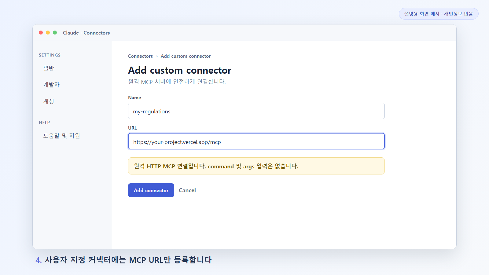

Vercel 연결 화면에는 로컬 `command`, `args`, `cwd`, `PYTHONPATH`를 입력하지 않습니다.
필요한 것은 최종 HTTPS `/mcp` URL과, 비공개 서버일 때 승인된 인증뿐입니다.

전체 흐름을 한 장으로 보면 다음과 같습니다.

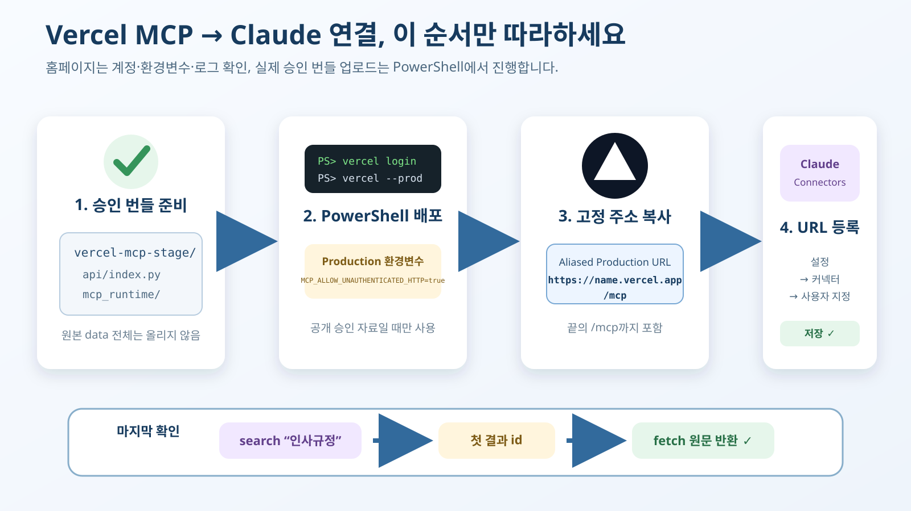

</details>

## 3. search와 fetch로 최종 확인하기

로컬 STDIO와 Vercel HTTPS 모두 같은 방식으로 최종 확인합니다. 연결 직후에는
`search`만 시험하지 말고 **목록 → 구조 → 정확 조문 → 참조 → 검색 원문** 순서로
확인해야 규정 MCP가 제대로 만들어졌는지 알 수 있습니다.

1. AI 프로그램을 완전히 종료하고 다시 실행합니다.
2. 새 대화를 만듭니다.
3. 방금 등록한 MCP 서버 또는 커넥터를 활성화합니다.
4. 아래 요청을 차례로 보내되 규정명과 검색어는 내 데이터에 있는 값으로 바꿉니다.

### 3-1. 전체 목록과 수 확인

```text
연결한 규정 MCP의 list_regulations 도구로 승인된 규정 목록을 보여줘.
페이지를 끝까지 확인하고 total_count와 중복 없는 규정 수를 알려줘.
```

**성공 신호:** 조항·별표·부칙 청크가 각각 규정처럼 중복되지 않고, 하나의 규정이 목록에
한 번만 나타납니다. 규정이 많으면 페이지를 넘겨도 `total_count`가 유지됩니다.

### 3-2. 계층과 정확 조문 확인

```text
목록에서 인사규정을 찾아 get_regulation_toc으로 목차를 보여줘.
그다음 get_regulation_article로 인사규정 제16조의 승인 원문과 출처를 보여줘.
```

**성공 신호:** 목차가 장·절·조·별표·부칙의 부모-자식 관계로 나오고, 제16조 요청에는
다른 조문의 유사 문장이 아니라 **제16조의 본문**이 반환됩니다.

### 3-3. 다른 규정 참조와 순환참조 확인

```text
get_regulation_references로 인사규정이 참조하는 규정과 인사규정을 참조하는 규정을 보여줘.
list_regulation_reference_cycles로 현재 승인 규정 사이의 순환참조를 보여줘.
```

**성공 신호:** 들어오는 참조와 나가는 참조가 구분됩니다. 아직 적재되지 않은 대상은
미해결로 표시될 수 있고, 순환참조가 없으면 빈 목록이 정상입니다.

### 3-4. 자연어 검색과 원문 확인

다음 요청의 검색어만 내 규정에 있는 말로 바꿉니다.

```text
연결한 규정 MCP의 search 도구로 인사규정을 찾아줘.
첫 번째 검색 결과의 id를 fetch 도구에 넣어 원문과 출처를 보여줘.
```

정상이라면 다음 순서가 보입니다.

1. MCP `search` 도구가 실행됩니다.
2. 한 개 이상의 검색 결과와 각 결과의 `id`가 나옵니다.
3. 그중 하나의 `id`로 MCP `fetch` 도구가 실행됩니다.
4. 승인된 규정 본문과 출처가 표시됩니다.

**왜 둘 다 호출하나요?** `search` 성공은 후보를 찾았다는 뜻이고, `fetch` 성공은 그
후보의 승인 원문과 출처를 실제로 읽을 수 있다는 뜻입니다.

반대로 아래 중 하나라도 보이면 아직 완료가 아닙니다. 해당 현상을 그대로
[문제 해결표](#4-문제-해결표)에서 찾습니다.

- 서버 이름만 보이고 도구 목록이 비어 있다.
- Claude Desktop에서 `running`이 아니라 `disconnected`다.
- `list_regulations`의 수가 예상과 다르거나 같은 규정이 청크별로 반복된다.
- 목차에서 장·절·조 관계가 끊기거나 정확 조문 요청에 다른 조문이 나온다.
- `search`는 되지만 결과마다 `id`가 없다.
- `fetch`에 제목이나 본문을 넣고 있고, `search`가 준 `id`를 넣지 않았다.


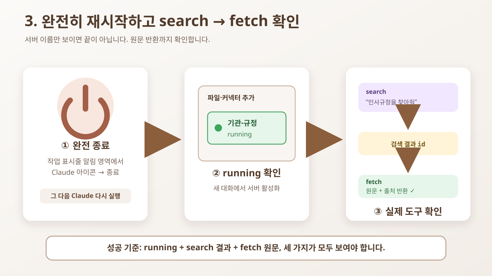

다음 항목을 모두 체크하면 연결 완료입니다.

- [ ] 서버 또는 커넥터가 목록에 보인다.
- [ ] Claude Desktop은 `running`이고, 다른 로컬 앱은 서버가 등록·활성화되어 있다.
- [ ] 도구 목록에 `list_regulations`, `get_regulation_toc`, `get_regulation_article`,
  `get_regulation_references`, `list_regulation_reference_cycles`, `search`, `fetch`가 보인다.
- [ ] `list_regulations`의 `total_count`와 페이지별 고유 규정 수가 맞고, 첫 규정의 목차·조문 조회가 된다.
- [ ] `search`가 한 개 이상의 결과를 반환한다.
- [ ] 검색 결과의 `id`로 `fetch`가 본문과 출처를 반환한다.

## 4. 문제 해결표

| 보이는 현상 | 주된 원인 | 해결 |
| --- | --- | --- |
| **독립 Qwen 챗봇 실행**을 눌렀지만 새 창이 안 열림 | 브라우저 팝업 차단 또는 이미 챗봇 프로세스가 실행 중 | 빌더에 표시된 `127.0.0.1` 주소의 **열려 있는 Qwen 챗봇으로 이동**을 누르고, 없으면 `RUN_QWEN_CHAT.bat`을 한 번만 실행 |
| 규정은 목록에 있지만 선택할 수 없음 | 사람 승인 미완료, 승인 청크와 색인 수 불일치, stale 색인 존재 | 규정 카드의 준비 사유를 읽고 빌더 ③에서 검수·승인을 마친 뒤 필요하면 **문서 색인 복구** 실행 |
| **Ollama · qwen3:8b 연결 확인** 실패 | Ollama가 꺼졌거나 모델 미설치, endpoint가 localhost가 아님 | `ollama list`로 확인하고 없으면 `ollama pull qwen3:8b`; Ollama 재시작 후 `127.0.0.1:11434`로 다시 확인 |
| 첫 연결 확인이 오래 걸림 | `qwen3:8b`를 RAM/GPU에 처음 적재하는 중 | 경과 시간을 보고 기다리며 버튼을 반복해서 누르지 않기; 완료 뒤 같은 세션의 질문은 보통 더 빠름 |
| 질문 뒤 **승인 근거 검색 2/5**에서 오래 멈춤 | 구버전 독립 챗봇 프로세스, 너무 넓은 질문 또는 손상된 BM25 색인 | 독립 챗봇 프로세스만 종료·재실행하고 먼저 `제5조 내용은 뭐야`처럼 선택 규정의 정확 조문 질문으로 확인; 계속되면 색인 상태 점검 |
| **Qwen3 4B 정밀 근거 감사**를 켠 뒤 매우 느림 | 8B 답변 뒤 4B 모델을 추가 적재·실행함 | 일반 대화에서는 토글을 끈 기본 빠른 모드 사용; 의미 감사가 꼭 필요한 질문에만 켜기 |
| 답변 대신 **승인된 규정 근거에서 확인할 수 없습니다** 표시 | 선택 규정에 해당 조문·내용이 없거나 승인 근거가 부족함 | 다른 규정으로 범위를 바꾸기 전에 근거 조문 목록과 원문을 확인하고, 필요한 문서가 실제 승인·색인됐는지 점검 |
| 답변 아래 근거 조문이 예상과 다름 | 다른 규정을 선택했거나 질문이 너무 넓음 | 화면 상단의 기관·선택 규정을 다시 확인하고 규정명·조문 번호를 포함해 질문; 원문과 다르면 답변을 사용하지 말고 운영자에게 검수 요청 |
| Claude Desktop 서버가 목록에 없음 | JSON 문법 오류, 잘못된 설정 파일, 재시작 안 함 | **설정 > 개발자 > 구성 편집**에서 생성 항목을 확인하고 완전히 재시작 |
| ChatGPT 웹에서 새 앱/MCP 메뉴가 안 보임 | 지원 플랜, Developer mode 또는 워크스페이스 관리자 권한 부족 | 공식 ChatGPT MCP 안내에서 플랜을 확인하고 관리자에게 앱·Developer mode 권한 요청 |
| Claude Code 또는 Codex 서버가 목록에 없음 | 등록 스크립트 미실행 또는 TOML 미반영 | `claude mcp list` 또는 `~/.codex/config.toml`을 확인하고 앱을 다시 시작 |
| Vercel 원격 서버가 목록에 없음 | 원격 smoke 실패, ChatGPT 앱/Claude Connector 미저장 | 방법 D는 ChatGPT 웹 Apps, 방법 E는 Claude Connectors에서 URL과 저장 상태 확인 |
| Claude Desktop이 `disconnected` | `command`, `args`, `env` 일부 누락 | 생성 JSON의 한 서버 항목을 수정 없이 다시 병합 |
| 연결 마법사 실행이 차단됨 | PowerShell 실행 정책 또는 명령 일부 누락 | README의 `powershell.exe -NoProfile -ExecutionPolicy Bypass ...` 전체 명령을 다시 복사 |
| Claude가 JSON 편집 뒤 시작되지 않음 | 쉼표·중괄호 오류 | 최신 `claude_desktop_config.json.bak-...`를 원래 파일명으로 복사해 복구 |
| Windows 실행판에서 로컬 서버 시작 실패 | 생성 설정 수정, EXE 이동 또는 앱 재시작 누락 | 번들을 다시 만들고 생성된 `PR MCP Builder.exe --mcp-server` 설정을 수정 없이 등록한 뒤 AI 앱을 완전히 재시작 |
| 소스 실행에서 `Python was not found` | 파일 없음 또는 wrapper probe 실패 | `doctor_mcp_connection.ps1`을 실행해 버전·marker·project root·import 진단 확인 |
| 소스 실행에서 Python import 실패 | Python 3.11 미만, 잘못된 프로젝트 Python, 의존성 누락 | 생성기가 검증한 프로젝트 Python을 사용하고 진단 stderr 확인 |
| 도구가 0개 | 서버 미활성화 또는 시작 실패 | Windows 실행판은 앱 완전 재시작 후 새 대화에서 확인하고, 소스 실행은 `validate_mcp_smoke.ps1`도 실행 |
| 규정 목록이 예상보다 적음 | 첫 페이지만 봤거나 승인·색인이 끝나지 않은 규정이 있음 | `total_count`와 다음 페이지를 확인하고 각 규정의 승인·색인 상태 점검 |
| 같은 규정이 목록에 반복됨 | 오래된 번들 또는 규정 계열·버전 식별이 잘못됨 | 최신 번들을 다시 만들고 규정명·번호·버전 연결을 검토 |
| 목차에서 장·절·조가 끊김 | 전처리 구조가 잘못됐거나 필요한 청크가 미승인 | `② 결과 확인`에서 앞뒤 문맥과 계층을 다시 검수한 뒤 승인·색인 |
| 정확 조문이 안 나옴 | 조문 번호 표기가 다르거나 잘못된 규정을 선택 | 먼저 `list_regulations`와 `get_regulation_toc`로 규정·조문 번호를 확인 |
| 참조가 `unresolved`로 표시됨 | 대상 규정이 아직 없거나 대상 조문을 정확히 연결하지 못함 | 대상 규정을 적재·승인하고 규정명·조문 번호를 원문과 비교 |
| 개정 후에도 이전 본문이 나옴 | 시행일 전이거나 버전·효력 기간·계보가 잘못됨 | 현재 날짜와 `as_of_date`를 확인하고 새 버전의 개정일·시행일·이전 버전 관계 검토 |
| `search` 결과가 0개 | 검색어 불일치 또는 승인·색인된 데이터 없음 | 승인 및 색인 상태를 다시 확인하고 실제 규정 용어로 검색 |
| `fetch` 실패 | 검색 결과의 `id`가 아닌 제목을 전달 | `search` 응답의 정확한 `id` 값을 사용 |
| 전처리·색인이 오래 걸림 | 큰 HWP·표·다수 규정 처리 또는 **문서 색인 복구** 진행 중 | 현재 단계, 처리 규정 수, 마지막 갱신 시각을 확인하고 같은 버튼을 반복해서 누르지 않기 |
| 폴더를 옮긴 뒤 실패 | 설정의 절대경로가 이전 위치를 가리킴 | 새 위치에서 MCP 번들을 다시 생성 |
| `node`, `npm`, `vercel`을 찾을 수 없음 | 설치 뒤 이전 PowerShell을 계속 사용하거나 PATH 미반영 | Node.js LTS와 Vercel CLI를 설치하고 모든 PowerShell을 닫은 뒤 새 창에서 버전 확인 |
| Vercel 프로젝트가 안 보임 | 다른 Vercel 계정·팀으로 로그인 | `vercel whoami`와 Dashboard의 현재 계정·팀을 비교 |
| Vercel `404` | `/mcp`를 빼먹음 또는 잘못된 Preview URL | `Aliased:` 줄의 주소를 다시 복사하고 끝에 `/mcp` 추가 |
| Vercel `401/403` | 공개/비공개 인증 방식 불일치 | 공개 승인 데이터 여부와 환경변수·토큰/OAuth 설정을 다시 확인 |
| 브라우저에서 `/mcp`가 웹페이지처럼 안 열림 | MCP endpoint를 일반 GET 웹페이지처럼 확인 | 브라우저 화면 대신 `run_mcp_client_config_smoke.py` 결과로 판정 |
| Vercel은 Ready지만 도구 호출 실패 | 환경변수, runtime, host 설정 오류 | Vercel Function Logs와 원격 smoke 명령 결과 확인 |
| 다른 MCP 서버가 사라짐 | Claude 설정 전체를 덮어씀 | 백업에서 복구하고 새 `mcpServers` 항목만 병합 |

## 지원 범위와 안전 원칙

| 항목 | 현재 지원 |
| --- | --- |
| 운영체제 | Windows 10/11 64비트 우선 |
| 입력 파일 | PDF, HWP, HWPX, DOCX |
| 규정 구조 | 규정 → 버전 → 장·절·조·항·호, 별표·서식·부칙 |
| 목록·조문 | 승인된 고유 규정 페이지 목록, 목차, 정확 조문 |
| 관계 | 규정·조문 간 들어오는/나가는 참조와 순환참조 |
| 개정 관리 | 규정 단위 갱신, 효력 기간에 따른 현재본과 승인 이력 |
| 검색 데이터 | 사람이 승인한 규정 중 조회 기준일에 유효한 버전 |
| 로컬 연결 | Codex CLI / Codex IDE, Claude Desktop, Claude Code |
| 원격 연결 | ChatGPT 웹 또는 Claude가 사용하는 HTTPS `/mcp` |

### 꼭 지켜야 할 운영 원칙

- 전처리 결과는 검토용 초안이며 자동 승인이 아닙니다.
- 원문, API 키, 토큰, 기관 내부 식별자와 사용자 로컬 경로를 공개 저장소에 올리지 마세요.
- 원격 MCP의 응답은 외부 AI 서비스로 전송될 수 있습니다.
- 공개 Vercel 배포에는 공개가 허용된 승인 데이터만 포함하세요.
- Vercel Function 로그는 기관용 영속 감사 저널을 대신하지 않습니다.
- 공개 또는 기관 운영 전에는 [SECURITY.md](SECURITY.md)를 확인하세요.

<details>
<summary><strong>“승인 기반”이 실제로 뜻하는 범위</strong></summary>

- 파일 업로드와 전처리 완료만으로는 검색 대상이 되지 않습니다.
- 사람이 원문과 비교해 승인한 청크만 공식 색인과 MCP 번들에 들어갑니다.
- 목록·목차·조문·참조·검색 도구도 호출자의 기관·프로필·접근 범위 안에서만
  승인 데이터를 반환합니다.
- 과거 개정본은 승인 증거와 효력 기간이 확인되고 과거 기준일 또는 이력 조회를
  명시했을 때 구분해 사용합니다.
- 공개 Vercel endpoint는 read-only 도구만 노출하고, 공개가 허용된 데이터인지
  기관 담당자가 별도로 판단해야 합니다.

</details>

## 더 자세한 안내

처음 설치 중이라면 이 README만 따라가고, 특정 연결이나 운영 계약을 확인할 때 아래
문서를 여세요.

- [MCP 빠른 연결 안내](docs/mcp_quickconnect_ko.md)
- [이미지 기준 전처리·로컬 QA 파이프라인 구현](docs/image_pipeline_implementation_ko.md)
- [AI 에이전트 오케스트레이션 역할](docs/agent_orchestration_roles_ko.md)
- [로컬 AI 설치·운영 런북](docs/local_ai_runtime_runbook_ko.md)
- [Qwen3 8B 로컬 LLM 플랫폼 구현 계획](docs/local_llm_platform_implementation_plan_ko.md)
- [MCP 클라이언트 설정 예시](docs/mcp_client_config_examples_ko.md)
- [MCP 도구 계약과 프로필](docs/mcp_tool_contract_ko.md)
- [Vercel HTTPS MCP 배포 안내](docs/vercel_https_mcp_ko.md)
- [MCP 로컬 서버 공식 문서](https://modelcontextprotocol.io/docs/develop/connect-local-servers)
- [OpenAI ChatGPT Developer mode·MCP 공식 안내](https://help.openai.com/en/articles/12584461-developer-mode-apps-and-full-mcp-connectors-in-chatgpt-beta)
- [OpenAI Secure MCP Tunnel 공식 안내](https://developers.openai.com/api/docs/guides/secure-mcp-tunnels)
- [Claude Code MCP 공식 문서](https://code.claude.com/docs/en/mcp)
- [Claude 원격 custom connector 공식 안내](https://support.claude.com/en/articles/11175166-get-started-with-custom-connectors-using-remote-mcp)
- [Vercel CLI 배포 공식 안내](https://vercel.com/docs/projects/deploy-from-cli)

## 개발자용 실행과 검증

<details>
<summary><strong>소스에서 실행·테스트·패키징하는 명령 펼치기</strong></summary>

Python 3.11 이상에서 프로젝트 루트 기준으로 실행합니다.

Windows에서 처음 소스를 실행할 때는 `START_HERE.bat`를 사용할 수 있습니다. 수동으로
실행할 때는 가상환경을 만들고 같은 Python으로 Streamlit을 시작합니다. 로컬 runtime은
프로젝트 폴더의 `data\`에 저장되므로 공개 Git 커밋에 포함하지 않습니다.

```powershell
py -3.11 -m venv .venv
.\.venv\Scripts\python.exe -m pip install -e .
.\.venv\Scripts\python.exe -m streamlit run frontend\streamlit_app.py --server.address 127.0.0.1
python -m unittest discover -s tests -v
python -m build --sdist --wheel
.\scripts\build_windows_portable.ps1
python scripts\audit_release_hygiene.py `
  --workflow-scope available `
  --include-untracked `
  --include-source-path-scan
```

기여 규칙은 [CONTRIBUTING.md](CONTRIBUTING.md), 공개 저장소 이력 원칙은
[docs/public_repository_history_policy_ko.md](docs/public_repository_history_policy_ko.md)를
확인하세요.

</details>

## 업데이트 내역

README에는 현재 사용법만 유지합니다. 버전별 변경 내용과 다운로드 파일은
[GitHub Releases](https://github.com/koul777/Public-Regulation-MCP-Builder/releases)에서
확인할 수 있습니다.

## Kordoc 사용 고지

PDF·HWP·HWPX·DOCX로 공식 MCP를 만들 때 필요한 표 파싱 품질 증거와 HWP/HWPX 문서 구조·표
추출 교차 검증에는 [Kordoc](https://github.com/chrisryugj/kordoc)을 사용했습니다. 배포 번들에는
Kordoc 소스나 실행 파일이 포함되지 않음에 유의하세요. 라이선스는
[Kordoc LICENSE](https://github.com/chrisryugj/kordoc/blob/main/LICENSE)와
[THIRD_PARTY_NOTICES.md](THIRD_PARTY_NOTICES.md)에서 확인할 수 있습니다.

---

<a id="update-history"></a>

# 최근 업데이트: 2026년 8월 23일

<details>
<summary><strong>v1.2.21 상세 변경과 기존 사용자 변경 이력 펼치기</strong></summary>

최신 버전은 처음 사용하는 사람이 화면을 보면서 **지금 해야 할 한 가지를 바로 이해하고,
단계가 바뀌어도 안내를 잃지 않도록** 초보자 흐름도 함께 보완했습니다.

## 2026년 8월 23일 — 독립 Qwen 챗봇을 MCP 수준의 빠른 검색·응답 경로로 변경

이전 질문이 `제1조`였던 상태에서 `제5조 내용은 뭐야`를 물으면 두 조문을 하나의 검색문으로
합쳐 CPU 재랭커를 실행하던 문제를 수정했습니다. 독립 Qwen 챗봇의 기본 모드는 이제 MCP와
같이 승인 BM25 인덱스를 빠르게 조회하고, Qwen3 8B는 짧은 답변과 사용한 근거 ID만 만듭니다.

- 현재 질문만으로 조문이 명확하면 이전 대화를 검색어에 섞지 않습니다. `그 내용은?`처럼
  앞 질문이 필요한 경우에만 최근 사용자 질문을 검색 문맥으로 사용합니다.
- 독립 챗봇 기본 검색에서는 Qwen3 1.7B 질문 분석, Qwen3 Embedding 질의 계산, CPU
  Qwen3 Reranker를 실행하지 않습니다. 승인·tenant·기관·문서·ACL·최신본 필터는 유지됩니다.
- 기본 **빠른 모드**는 Qwen3 8B 한 모델을 GPU에 유지하며, 답변에 표시된 근거 ID가 실제
  승인 검색 결과에 존재하는지 결정론적으로 검증합니다.
- 화면의 **Qwen3 4B 정밀 근거 감사**를 켜면 기존 다중 주장 의미 감사를 추가합니다. 로컬
  GPU 메모리에 따라 8B와 4B를 교체하므로 응답이 크게 느려질 수 있어 기본값은 꺼짐입니다.
- 실제 로컬 데이터와 이전 대화가 있는 `제5조 내용은 뭐야` 재현에서 검색은 **0.49초**,
  연결 확인으로 8B를 적재한 뒤 답변·인용 완료는 **7.34초**였습니다.
- 최초 **Ollama · qwen3:8b 연결 확인**은 모델을 GPU에 올리는 과정 때문에 측정 PC에서
  약 23초가 걸렸습니다. 이 적재를 질문 전에 명시적으로 끝내므로 대화 화면이 멈춘 것처럼
  보이지 않고, 빠른 모드에서는 답변 후 4B로 모델을 바꾸지 않습니다.

## 2026년 8월 23일 — 정확한 조문 질문의 검색 지연 개선

독립 Qwen 챗봇에서 규정을 고른 뒤 `제1조에 대해서 알려줘`처럼 조문 하나를 정확히
지정한 질문이 **승인 근거 검색 2/5**에서 오래 멈추던 문제를 수정했습니다. 원인은 답변을
만드는 Qwen3 8B가 아니라, 이미 조문 번호를 알고 있는데도 질문 분석·의미 임베딩과 CPU
재랭커를 매번 실행하던 검색 경로였습니다.

- 선택한 규정 안의 단일 조문 질문은 기존 tenant·기관·문서·승인·ACL·최신본 필터를 모두
  통과한 뒤 `article_no`가 정확히 일치하는 조항만 바로 찾습니다.
- `제1조`는 `제11조`와 섞이지 않으며, 존재하지 않는 `제999조`를 물으면 의미가 비슷한 다른
  조항으로 바꾸지 않고 근거 없음으로 안전하게 답합니다.
- 정확 조문 경로에서는 Qwen3 1.7B 질문 분석, 질의 임베딩, Qwen3 Reranker를 불러오지 않습니다.
  현재 로컬 승인 데이터로 전체 검색 함수를 다시 측정했을 때 검색 단계가 약 **0.51초**에 끝났습니다.
- 독립 챗봇의 일반 자연어 질문도 승인 BM25/lexical 빠른 검색을 사용합니다. Qwen3 1.7B,
  Embedding과 재랭커를 쓰는 전체 하이브리드 경로는 API 기본 모드와 정밀 수용시험에 유지되며,
  이 경로의 CPU 재랭킹 후보는 최대 20개로 제한하고 적재한 재랭커를 재사용합니다.
- 검색 뒤 Qwen3 8B 답변 생성에는 PC 성능에 따른 시간이 추가로 필요합니다. 선택형 4B 정밀
  감사를 켠 경우에만 감사 시간이 더해지며, 진행 상태로 검색·답변·감사를 구분합니다.

## 2026년 8월 23일 — Qwen을 점검 도구가 아닌 실제 로컬 챗봇으로 연결

별도 RAG 프로젝트를 다시 만들 필요는 없습니다. 이 저장소의 기존
`전처리 → 사람 승인 → 로컬 색인` 결과를 Qwen 챗봇과 MCP가 함께 사용합니다.
다만 실제 Qwen 대화는 빌더 안의 탭이 아니라 **빌더와 분리된 로컬 챗봇 앱**에서 진행합니다.
빌더는 문서 구축·승인·색인을 담당하고, 독립 챗봇은 승인된 규정을 골라 질문하는 역할만 합니다.

- 빌더의 **독립 Qwen 챗봇 실행**을 한 번 누르면 `127.0.0.1`의 별도 프로세스와 새 브라우저 창이 열립니다.
- 독립 챗봇은 현재 기관에서 전처리한 규정을 목록으로 보여 주되, 사람 검수와 승인·색인이 모두
  끝난 규정만 `질문 가능`으로 표시하고 질문 입력을 허용합니다.
- 소스 사용자는 `RUN_QWEN_CHAT.bat` 또는 `reg-rag-qwen-chat` 명령으로 빌더 없이 챗봇만 실행할 수도 있습니다.
- 기본 빠른 모드는 Qwen3 8B 답변의 근거 ID를 결정적으로 검증합니다. 선택형 4B 정밀 감사를
  켜면 Qwen3 4B 주장 감사까지 통과해야 그대로 표시됩니다.
- 의미 검색 Python 런타임이 없으면 기존 승인 색인을 다시 만들지 않고 BM25로 안전하게 내려갑니다.
- Qwen 초안이 감사를 통과하지 못하면 오류 화면으로 끝내지 않고, 승인 근거에서 검증 가능한 발췌 답변과 인용을 반환합니다.
- 질문을 보낸 뒤 화면이 멈춘 것처럼 보이지 않도록 **질문 분석 → 승인 근거 검색 → 문맥 구성 →
  Qwen3 8B 답변 → 결정론적 인용 검증**의 실제 단계, 진행 게이지와 경과 시간을 계속 표시합니다.
  정밀 감사 토글을 켠 경우에는 Qwen3 8B 답변 뒤 Qwen3 4B 감사 단계도 표시됩니다.
- 질문 기록은 `기관 프로필 + 선택한 규정` 단위로 분리됩니다. 규정을 바꾸면 이전 규정의 대화가
  섞이지 않으며, 실제 검색 요청도 선택한 `document_id`와 `profile_id`로 제한됩니다.
- MCP는 같은 승인 RAG를 외부 AI 앱에 연결하는 선택 기능이며, 로컬 Qwen 챗봇 사용에 필수는 아닙니다.
- 첫 시작 화면에서 **로컬 Qwen** 또는 **MCP 연결**을 고릅니다. 이 선택은 ④ 메뉴 제목과
  초보자 안내의 마지막 절차만 바꾸며, 나중에 왼쪽 메뉴에서 언제든 바꿀 수 있습니다.
  MCP 기능이나 기존 승인 데이터는 삭제되지 않습니다.

### 이번 Qwen 독립 실행 변경 검증

- 저장소 전체 회귀 테스트 **3,342개 통과**(14개 건너뜀)
- 설치·패키징 엔트리포인트와 `RUN_QWEN_CHAT.bat --check` 통과
- 로컬 Ollama의 Qwen3 1.7B·4B·8B로 질문 분석부터 답변·주장 감사·인용 검증까지 실제 실행 확인
- `python -m build --sdist --wheel`과 공개 릴리스 위생 검사 통과

## 2026년 8월 23일 — 전체 과정 설명과 역할·모델 분배

초보자 모드에서는 첫 화면의 **초보자 안내 시작**을 누른 뒤, 필요할 때 사이드바의
**전체 과정과 담당 모델을 한눈에 보기**를 펼쳐 보세요. 이 긴 설명은 기본으로 접혀 있어
①~④ 작업 메뉴를 가리지 않습니다. 전처리 8단계와 질의·답변
7단계를 각 단계의 `받는 것 → 만드는 것`, 담당 역할, 사용 모델, 문제가 생겼을 때의
다음 행동까지 한 번에 설명합니다. 문서를 실제로 처리한 뒤에는 같은 위치에서
역할별 `대기·실행 중·완료·사람 확인 필요·차단` 상태와 다음 행동을 확인할 수 있습니다.

- 질문 분석·검색어 보정: Qwen3 1.7B
- 구조·표 검수와 주장 감사: Qwen3 4B
- 근거 기반 답변 초안: Qwen3 8B
- 의미 검색·재순위: Qwen3 Embedding/Reranker 0.6B
- 한국어 OCR: PaddleOCR Korean PP-OCRv5
- 보안 검사·승인·인용 검증·색인 반영: 결정론적 규칙과 사람 확인
- 저장소 `.venv` 실제 acceptance: 15/15 단계 통과, 외부 API 호출 0건

AI는 승인되지 않은 원문을 색인에 넣거나 사람 승인을 대신하지 않습니다. 모델이나
전문 런타임을 사용할 수 없으면 해당 역할은 `제한된 실행` 또는 `사람 확인 필요`로
표시하고 자동으로 다음 단계로 건너뛰지 않습니다. 역할 계약과 실제 실행 규칙은
[`docs/agent_orchestration_roles_ko.md`](docs/agent_orchestration_roles_ko.md)에서
확인할 수 있습니다.

## 2026년 8월 22일 — 초보자 모드 실제 사용성 보완

- 각 화면 상단에 `지금은 이것만 하세요` 안내판을 추가했습니다. 현재 단계의 목적,
  지금 해야 할 행동, 끝난 뒤 이동할 위치를 한 문장씩 보여 줍니다.
- 안내판이 고정 문구를 반복하지 않고 기관·문서·승인 상태를 읽어 다음 행동을 계산합니다.
  아직 전처리한 문서가 없으면 ②~④ 화면에서도 먼저 `① 문서 올려서 전처리`로
  이동하도록 안내합니다.
- 초보자 모드 시작 직후 사이드바 토글이 꺼져 보이거나 메뉴 이동 중 모드가 풀리던
  상태 동기화 문제를 수정했습니다. 시작, 메뉴 이동, 안내 모드 켜기·끄기 상태가
  동일하게 유지됩니다.
- Kordoc 준비 상태를 화면 표시 여부가 아니라 실제 사용 가능 여부로 판단하도록
  바꿨습니다. 사이드바와 본문이 서로 다른 다음 행동을 가리키지 않습니다.
- 이전에 저장된 대기 규정은 초보자 모드에서 `선택 사항` 접힌 영역으로 묶었습니다.
  새 파일을 올리는 사용자는 불필요한 목록을 열지 않아도 되고, 기존 파일을 고르면
  자동으로 다음 문서 정보 확인 절차를 안내받습니다.
- 초보자 모드에서는 삭제·전문가 설정처럼 실수 가능성이 큰 기능의 노출을 줄이고,
  필요한 경우 일반 모드에서 처리하도록 설명을 덧붙였습니다.
- 실제 로컬 브라우저에서 초보자 시작 → 기관 선택 → 단계 이동 → 대기 규정 선택까지
  시뮬레이션했습니다. 기존 문서를 실제로 전처리하거나 삭제하는 동작은 데이터 변경을
  피하기 위해 실행하지 않았습니다.

### 이번 변경 검증

- 초보자 모드·운영자 UI 관련 테스트 **106개 통과**
- `python -m py_compile frontend\\streamlit_app.py` 통과
- `git diff --check` 통과
- 공개 릴리스 위생 검사 통과

---

이번에는 **화면에 보이는 것과 실제 상태가 다르던 문제**를 집중적으로 고쳤습니다.
연결이 되는데 안 된다고 하거나, 지웠는데 지워지지 않거나, AI가 본 내용을 안 봤다고
하던 경우들입니다.

## ChatGPT 원격 연결이 "Request timeout"으로 끊기던 문제

- ChatGPT에 Vercel 주소(`https://.../mcp`)를 등록할 때 **커넥터 생성 중 오류 ·
  Request timeout**이 뜨며 연결되지 않던 문제를 수정했습니다.
- 원인은 서버가 절대 오지 않을 응답을 기다리게 만든 것이었습니다. Vercel 서버는 먼저
  말을 거는 기능이 없는데도, 그 통로를 열어 둔 채 아무것도 보내지 않아 ChatGPT가
  첫 응답을 무한정 기다렸습니다. 이제 그 통로를 즉시 닫아 알려 주므로 ChatGPT가
  바로 정상 경로로 연결합니다.
- 실제 배포 주소에서 연결부터 `list_regulations` · `search` · `fetch`까지 정상 동작을
  확인했습니다.

## 전처리 진행 막대가 뒤로 되돌아가던 문제

- 파일이 크거나 처리가 오래 걸릴 때 진행률이 **100%까지 갔다가 74%로 되돌아가는** 등
  뒤로 밀리던 문제를 수정했습니다. 작업이 취소된 것처럼 보여 불안을 주던 증상입니다.
- 이제 한 번 올라간 진행률은 내려가지 않습니다. 아래 막대는 '지금 단계의 낱개 진행'이라
  단계가 바뀌면 다시 0부터 세는 것이 정상이므로, 단계 이름을 함께 표시해 되돌아간 것으로
  오해하지 않도록 했습니다.

## 깨진 HWP 글자 복구

- HWP 원본 안의 그림·좌표 같은 **글자가 아닌 데이터가 한글 사이에 한자나 이상한 기호로
  섞여 들어오던 것**을 찾아내 정리합니다.
- 품질 검사와 본문 정리가 각자 다르게 판단하던 것을 한 곳으로 모아, 같은 글자를 두고
  화면과 검사 결과가 엇갈리지 않습니다.

## AI 검수 의견이 화면에 보이지 않던 문제

- 같은 규정을 다시 올리면 이전 검수 결과를 재사용하느라 AI를 다시 부르지 않는데, 그때
  **이전 검수 의견이 새 문서로 옮겨오지 않아** 검수 화면이 조항마다 "AI 검수 의견 없음"
  으로 보이던 문제를 수정했습니다.
- 이미 저장된 규정에는 `scripts/backfill_agent_review_findings.py`로 전처리를 다시 하지 않고
  의견만 채워 넣을 수 있습니다. 이미 승인·색인이 끝난 조항은 건드리지 않습니다. 승인 당시
  내용이 그대로 보존되어야 색인된 근거와 화면이 어긋나지 않기 때문입니다.

## 기관을 지우면 정말 지워지도록

- 기관 프로필만 지우면 그 기관의 규정과 승인 기록이 남아 있었고, **기관 ID가 기관명
  해시라 같은 이름으로 다시 등록하는 순간 지운 규정이 전부 되살아나던** 문제를
  수정했습니다.
- 되돌릴 수 없는 삭제이므로 두 단계로 나눴습니다. 먼저 **무엇이 몇 개 지워지는지** 화면에
  보여 주고, 확인한 뒤에 지웁니다.
- 이어서 삭제가 **전처리 대기 파일과 저장해 둔 작업 폴더는 찾지 못하던** 문제도
  수정했습니다. 폴더를 만드는 쪽과 지우는 쪽이 폴더 이름을 서로 다르게 계산하고 있어,
  화면은 "지울 데이터 없음"이라고 말한 뒤 실제로 아무것도 지우지 않았습니다. 같은 이유로
  **지금 쓰고 있는 기관이 '주인 없는 데이터'로 표시되어, 그 화면에서 지우면 살아 있는
  기관의 대기 파일이 사라지던** 위험도 함께 없앴습니다.
- 다만 이 수정 **이전에** 만들어진 폴더는 어느 기관 것인지 기록이 없어 자동으로 이어
  붙이지 못합니다. 예전 잔여 폴더가 걱정되면 `data/pending_uploads`와
  `data/operator_projects`를 직접 확인하세요.

## 표가 있는 규정에 없는 손실을 경고하던 문제

- 별표·서식처럼 **표가 들어간 규정마다 "원문에 있는데 색인에 없다"는 경고가 뜨고 품질
  점수가 깎이던** 문제를 수정했습니다.
- 원인은 같은 내용을 서로 다른 모양으로 비교한 것이었습니다. 원문에서 표 한 줄은
  `수상종류 표창대상 포상금액`처럼 글자만 있고, 정리된 본문은 `| 수상종류 | 표창대상 |`
  형태라 구분선 때문에 서로 다른 글로 취급됐습니다. 이제 양쪽에서 표 구분선을 똑같이
  걷어내고 비교합니다.
- 표 바깥의 문장이 **진짜로 빠진 경우는 그대로 잡아냅니다.** 이 검사가 만들어진 이유인
  별표의 `※ … 평균 90점 이상이 된 후보자를 …` 같은 단서 누락은 계속 경고합니다.
- 이 경고에 걸린 문서는 AI 검수 대상으로도 끌려갔기 때문에, 표가 있는 규정을 처리할 때
  불필요하게 늘던 시간과 API 비용도 함께 줄어듭니다.

## 검수 화면과 저장 내용의 크고 작은 수정

- `전체 규정 확인 열기`를 켜는 순간 **원본 · 전처리본 · AI 검수본 비교 화면이 통째로
  사라지던** 문제를 수정했습니다. 아래 전체 목록이 실제로 그 조항을 보여 줄 때만
  위 비교 화면을 접습니다.
- 표가 있는 규정에서 **표의 각 줄이 본문에 두 번 저장되던** 문제를 수정했습니다. 색인
  본문이 불필요하게 커지고 MCP가 인용하는 표 내용이 겹쳐 보이던 원인입니다.
- AI 검수 한도가 `0`(제한 없음)일 때 화면이 "문서당 최대 **0개**까지 보냅니다"라고
  사실과 반대로 안내하던 문구를 바로잡았습니다.
- 보낼 조항이 하나도 없어 AI를 **한 번도 부르지 않은 경우**를 AI 오류로 기록하던 문제를
  수정했습니다. 없던 장애를 알리고 다음 실행의 재사용 판단까지 어긋나게 하던 원인입니다.

## 검증

- 저장소 전체 테스트 **3,146개 통과**(14개 건너뜀). 이번에 고친 문제마다 실패를 재현하는
  테스트를 함께 넣어, 같은 증상이 되돌아오면 테스트가 먼저 깨지도록 했습니다.
- 수정본을 코드 리뷰에 두 차례 태워, 나온 지적을 반영한 뒤 다시 검증했습니다.
- 전처리 진행 막대는 실제 처리 순서를 그대로 재생해 확인했습니다. 고치기 전에는 되돌아감이
  33회(최악 100% → 74%), 고친 뒤에는 129번 갱신 중 **0회**입니다.

---

# 이전 업데이트: 2026년 8월 3일

이 시기에는 처음 사용하는 사람도 규정 파일을 올려 MCP를 만들 수 있도록 화면 안내를
보완하고, 규정을 각각 올렸을 때와 합본 규정집으로 올렸을 때의 결과가 같도록 처리
기준을 강화했습니다.

## 8월 3일 추가 보완 — 단일 규정 오판 수정과 절차별 초보자 안내

- `4-4-3. 여비규정.hwp`처럼 **한 규정 안의 별표 제목**이 있는 문서를 합본 규정집으로
  잘못 판단해 승인을 막던 문제를 수정했습니다. 별표 뒤의 짧은 제목만으로는 새 규정으로
  보지 않고, 실제 `제1조` 재시작과 규정 경계 근거가 함께 있을 때만 합본 경계를
  의심합니다.
- 초보자 안내를 4개의 큰 설명에서 **30개의 세부 확인 절차**로 나눴습니다. 왼쪽에는
  전체 절차와 완료 상태가 계속 보이고, 화면의 빨간 안내는 현재 해야 할 한 항목만
  가리킨 뒤 완료 즉시 다음 미완료 항목으로 이동합니다.
- 전처리 전에는 자동 인식한 규정 정보와 AI 추가 검수 사용 여부를 각각 확인해야 하며,
  결과 화면에서는 조문 구조·청크 확인과 품질 경고·이슈 확인을 따로 마쳐야 합니다.
- 검수 화면에서는 AI 제안별 판단 → AI 검증 결과 확인 → **왼쪽 원본 규정과 오른쪽
  전처리·수정 결과 비교** → 사람 검증 결과 확인 → 다음 미검수 청크 → 승인·색인 순서로
  안내합니다. 규정 하나가 끝나면 `다음 미완료 규정 결과 확인` 버튼을 가리키며, 선택한
  모든 규정에서 같은 절차를 반복하기 전에는 MCP 단계로 넘어갈 수 없습니다. 승인만 끝나고
  색인이 남은 경우에는 `이미 승인된 내용 AI에 등록만 실행` 버튼을 별도로 가리킵니다.
- MCP 화면에서는 먼저 승인 조문이 계층 색인과 MCP 도구로 변환되는 원리, 각 도구의 역할,
  로컬 STDIO와 원격 HTTPS의 차이를 설명하고 확인받습니다. 그다음 규정 범위 → 사용할 AI 앱 →
  저장 위치·방식·MCP 이름 → 파일 묶음 생성을 각각 확인합니다. 이후 선택한 방식에 맞춰
  Claude Code, Codex CLI·IDE, Claude Desktop 로컬 연결 또는 ChatGPT·Claude Vercel HTTPS
  연결 절차만 보여 줍니다.
- 실제 연결 완료도 한 번에 체크하지 않습니다. AI 앱 등록 → 앱 재시작/새 대화 → 연결
  진단 → `list_regulations` → `search` → `fetch`를 순서대로 하나씩 확인해야 완료됩니다.

## 초보자 안내 모드 추가

- 첫 화면에서 **초보자 안내 시작**과 일반 모드 중 하나를 선택할 수 있습니다.
- 초보자 모드에서는 지금 눌러야 할 위치를 빨간 테두리·화살표와 `3-2` 형식의 세부 절차
  번호로 보여 주고, 이전·다음·건너뛰기·다시 시작을 지원합니다. 화면의 번호와 사이드바
  **세부 확인 절차** 목록의 번호가 서로 일치합니다.
- 파일 등록 → 결과 확인 → 사람 검수·승인 → Qwen 챗봇·MCP 연결 순서로 안내하되, 승인이나
  색인을 사용자 확인 없이 자동 실행하지 않습니다.
- 같은 문서를 안내 단계마다 다시 전처리하지 않고 기존 결과를 이어서 사용하도록 해
  불필요한 대기 시간을 줄였습니다.

## 개별 규정 파일과 합본 규정집의 결과 통일

- 규정을 파일별로 각각 올리거나 여러 규정을 합친 규정집 한 개로 올려도 MCP에서 보이는
  **규정 목록·목차·조문·검색 결과의 논리적 구조**가 같도록 정규화했습니다.
- MCP를 만들거나 갱신할 때 계층 색인을 자동 생성하므로 사용자가 별도로 다시 만들 필요가
  없습니다.
- 합본 안의 규정 경계를 확실히 구분할 수 없으면 일부 조문을 잘못 등록하지 않고 검수와
  MCP 노출을 안전하게 차단합니다.
- `chatgpt-data` 연결에는 `list_regulations`를 포함해 목록 → 목차 → 정확 조문 → 참조 관계 →
  검색 → 원문 확인에 필요한 읽기 도구 7개를 노출합니다.

## 안전성과 성능 검증 보강

- 같은 폴더의 HWP 규정 45개를 공통 구조 감지·승인 차단 조건으로 다시 검사해 45개 모두
  파싱 완료, 총 3,128개 청크, 불명확 합본 경계 0건, 동일한 400 승인 차단 0건을 확인했습니다.
- 사람이 승인한 내용만 검색 색인과 MCP에 포함하며, 전달 파일에는 담당자 이름·검토 메모·
  작업 PC 경로 같은 운영 정보를 넣지 않도록 승인 자료를 최소화했습니다.
- 500페이지 합성 텍스트 PDF를 같은 바이트로 다시 측정한 결과 16.981초, 초당 29.445페이지,
  품질 98점을 확인했습니다. 이 수치는 스캔 이미지 OCR이나 모든 HWP/HWPX 문서의 속도를
  보장하는 값은 아닙니다.
- 저장소 전체 3,014개 테스트, 핵심 업로드·계층 MCP·성능 회귀 315개 테스트, 격리된 소스
  배포본 296개 테스트와 Windows 실행판 자체 점검을 통과했습니다.

---

# 이전 업데이트: 2026년 7월 29일~8월 1일

아래 내용은 이 기간에 적용된 주요 변경을 비전공자도 이해하기 쉽도록 기능 중심으로
정리한 것입니다.

## 7월 29일 — 많은 규정을 더 빠르고 정확하게 관리

- 규정을 단순한 파일 목록이 아니라 **규정 → 개정본 → 장·절·조·별표·부칙** 순서로
  살펴볼 수 있도록 구조를 정리했습니다.
- 새 규정이나 개정본을 추가할 때 전체 자료를 처음부터 다시 만들지 않고, **바뀐 규정만
  다시 처리하고 검색 목록에 반영**하도록 개선했습니다.
- 현재 시행 중인 규정과 과거 개정본을 구분해, 질문한 날짜에 맞는 내용을 찾을 수
  있도록 날짜 기준 조회를 보강했습니다.
- ChatGPT·Codex·Claude가 규정을 조회하게 하는 MCP 연결 기능에서 규정 목록, 목차,
  조문, 인용 관계, 순환 인용, 자연어 검색과 원문 확인을 일관되게 사용할 수 있도록
  7개 도구의 동작을 점검했습니다.
- 처음 사용하는 사람도 파일 등록부터 검수·승인, AI 연결까지 따라 할 수 있도록
  README 안내를 쉬운 표현과 단계별 흐름으로 개편했습니다.

## 7월 31일 — 검색 속도와 Windows 배포 안정성 개선

- 규정 수가 많아져도 목록·목차·조문 검색이 느려지지 않도록 반복 작업을 줄이고 검색
  처리 속도를 개선했습니다.
- 검색 속도와 결과 품질을 같은 기준으로 측정할 수 있도록 검증 자료와 자동 점검 절차를
  보강했습니다.
- Windows에서 테스트와 배포를 실행할 때 운영체제별 경로 차이 때문에 실패하던 문제를
  수정했습니다.

## 8월 1일 — 반복 조회와 첫 연결의 대기 시간 단축

- 한 번 안전성을 확인한 검색 데이터를 다시 사용할 수 있도록 저장해, 같은 자료를
  반복해서 확인하는 시간을 줄였습니다.
- 규정의 장·절·조 연결 구조를 매번 새로 계산하지 않고 재사용하도록 개선해, 목록·목차·
  조문을 연속해서 조회할 때의 준비 시간을 단축했습니다.
- 잘못된 형식의 MCP 요청은 실제 검색을 시작하기 전에 명확하게 거절하도록 입력 검사를
  강화했습니다.
- 서버가 시작할 때 미리 수행하던 불필요한 작업을 줄여 첫 연결과 첫 요청의 대기 시간을
  개선했습니다.
- 성능 개선으로 기존 검색 결과가 달라지지 않는지 자동 테스트를 추가했습니다.
- 자동 배포가 다른 변경과 겹쳐도 버전이 잘못 게시되지 않도록 배포 절차를
  안정화했습니다.

버전별 세부 변경 내용과 다운로드 파일은
[GitHub Releases](https://github.com/koul777/Public-Regulation-MCP-Builder/releases)에서
확인할 수 있습니다.

---

</details>
