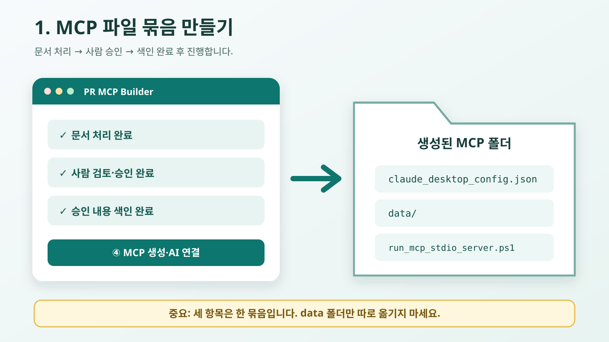
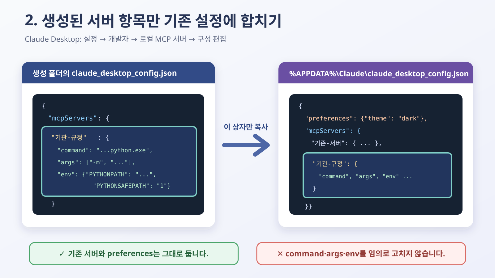

# PR MCP Builder

[](https://github.com/koul777/Public-Regulation-MCP-Builder/releases/latest)
[](pyproject.toml)
[](docs/mcp_quickconnect_ko.md)
[](LICENSE)


공공기관 규정 파일을 정리하고, **사람이 확인해 승인한 내용만** ChatGPT·Codex·Claude에서
검색하게 만드는 Windows용 프로그램입니다.

PDF·HWP·HWPX·DOCX 파일을 올리면 규정명, 개정판, 목차와 조문을 정리합니다. 처리 결과를
사람이 원문과 비교해 승인하면 AI 프로그램에서 사용할 MCP 검색 도구를 만듭니다.

현재 개발 중인 공개 소스 프로젝트이며 Windows 10/11 64비트 우선 지원입니다.
Streamlit 화면은 로컬 운영자용이며 완성형 공개 SaaS 화면이 아닙니다.

> [!IMPORTANT]
> 문서를 올렸다고 바로 AI 검색에 공개되지 않습니다. 승인하지 않은 내용은 MCP의
> `search`와 `fetch` 결과에 포함하지 않습니다.
> 사람 검수와 승인을 거쳐 승인된 규정만 MCP 데이터로 생성합니다.
> 사람에게 승인되지 않은 청크는 검색 색인과 MCP 번들에 포함하지 않습니다.

이 안내서는 MCP를 처음 들어 본 사람도 위에서부터 그대로 따라 할 수 있도록 작성했습니다.
화면 예시는 이해를 돕기 위한 샘플이며 앱 버전에 따라 버튼 위치나 이름이 조금 달라질 수
있습니다. **경로, 서버 이름, ID는 예시를 타이핑하지 말고 내 PC에서 생성된 값을
복사하세요.**

## 이 문서에서 할 일

1. 프로그램을 내려받고 규정 파일을 처리합니다.
2. 원문과 처리 결과를 비교한 뒤 사용할 조문을 승인합니다.
3. 아래 두 연결 중 하나를 선택합니다.
   - 같은 PC에서 쓰는 **로컬 STDIO**
   - 웹이나 다른 기기에서도 쓰는 **Vercel HTTPS**
4. AI 프로그램에 MCP를 등록합니다.
5. `search`와 `fetch`를 실제로 호출해 연결을 검증합니다.

바로 이동:

- [완전 처음이라면 여기부터](#0-완전-처음이라면-여기부터)
- [처음 설치하고 승인 데이터 만들기](#1-처음-설치하고-승인-데이터-만들기)
- [로컬 STDIO와 Vercel HTTPS 중 선택하기](#2-연결-방식-선택하기)
- [강의 A: 같은 PC의 Claude Desktop에 STDIO 연결하기](#강의-a-claude-desktop-로컬-stdio-연결)
- [ChatGPT/Codex Desktop과 CLI에 로컬 연결하기](#chatgptcodex-desktop과-cli에-로컬-연결하기)
- [강의 B: Vercel에 배포하고 HTTPS로 연결하기](#강의-b-vercel-https-배포와-연결)
- [search와 fetch로 최종 확인하기](#3-search와-fetch로-최종-확인하기)
- [문제 해결표](#4-문제-해결표)

## 먼저 알아둘 네 단어

| 단어 | 쉬운 뜻 |
| --- | --- |
| MCP | AI 프로그램이 이 규정 검색기에 질문할 수 있게 해 주는 연결 규칙 |
| 번들 | 설정 파일, 실행 파일, 승인 검색 데이터를 한 폴더에 모은 것 |
| STDIO | 같은 PC의 AI 프로그램이 Python 서버를 직접 켜고 대화하는 로컬 연결 |
| HTTPS | Vercel에 서버를 배포하고 `https://.../mcp` 주소로 접속하는 원격 연결 |

`search`는 승인된 규정을 찾아 결과 목록과 `id`를 돌려줍니다. `fetch`는 그 `id`를 받아
원문 내용과 출처를 돌려줍니다. 따라서 **서버 이름이 보이는 것만으로는 성공이 아니며,
두 도구가 모두 동작해야 연결 완료**입니다.

## 0. 완전 처음이라면 여기부터

처음에는 **로컬 STDIO부터 성공시킨 뒤**, 꼭 인터넷 주소가 필요할 때만 Vercel HTTPS로
넘어가는 것을 권장합니다. 로컬 STDIO는 Vercel 계정, Node.js, 도메인과 공개 서버가
필요하지 않아 문제 원인을 찾기 쉽습니다.

### 0-1. 나에게 맞는 출발점

| 지금 상황 | 먼저 읽을 곳 | 필요한 것 |
| --- | --- | --- |
| Claude Desktop과 이 프로그램을 같은 PC에서 사용 | [강의 A](#강의-a-claude-desktop-로컬-stdio-연결) | Claude Desktop, 생성한 번들 폴더 |
| 다른 PC·웹에서도 접속할 인터넷 주소가 필요 | 강의 A 성공 후 [강의 B](#강의-b-vercel-https-배포와-연결) | Vercel 계정, Node.js, 공개 승인 데이터 |
| 아직 규정 파일을 처리하지 않음 | [1장](#1-처음-설치하고-승인-데이터-만들기) | Windows PC, 규정 원문 |

**처음 연결하는 사람의 권장 순서**

```text
Windows 실행판 설치
  → 규정 1개 업로드
  → 원문과 비교
  → 사람 승인
  → 색인 완료 확인
  → Claude Desktop 로컬 STDIO 연결
  → search와 fetch 확인
  → 필요할 때만 Vercel HTTPS 배포
```

### 0-2. 이 문서의 명령과 경로 읽는 법

- 회색 명령 상자 오른쪽 위에 복사 버튼이 보이면 눌러서 복사합니다.
- `<프로젝트-이름>`처럼 `< >`로 감싼 말은 **내 값으로 바꾸라는 자리 표시자**입니다.
  `<`와 `>`까지 그대로 입력하지 않습니다.
- `C:\MCP-Bundles\...`는 설명용 예시입니다. 생성 완료 화면이나 내 파일 탐색기의 실제
  경로를 복사합니다.
- JSON 안의 `C:\\MCP-Bundles\\...`처럼 역슬래시가 두 개인 것은 정상입니다. JSON이
  Windows 경로를 안전하게 저장한 모습입니다.
- PowerShell 명령이 여러 줄이면 줄 끝의 백틱 `` ` ``까지 포함해 한 덩어리로
  복사합니다. 불편하면 한 줄로 붙여 넣어도 됩니다.
- 명령을 실행하는 검은색 또는 파란색 창을 이 문서에서는 **PowerShell**이라고 부릅니다.

### 0-3. 원하는 폴더에서 PowerShell 여는 가장 쉬운 방법

1. 파일 탐색기로 명령을 실행할 폴더를 엽니다.
2. 위쪽 주소 표시줄의 폴더 경로를 한 번 클릭합니다.
3. 경로 대신 `powershell`이라고 입력하고 `Enter`를 누릅니다.
4. 열린 창의 줄 앞에 현재 폴더 이름이 보이면 준비 완료입니다.
5. 문서의 명령을 붙여 넣고 `Enter`를 누릅니다.

명령 실행 중 빨간 글씨가 보이면 창을 바로 닫지 마세요. 마지막 20줄을 복사하거나
캡처해 두면 [문제 해결표](#4-문제-해결표)에서 원인을 찾기 쉽습니다. API 키, 토큰,
기관명과 개인 경로가 포함됐다면 공유하기 전에 가립니다.

### 0-4. 시작 전 1분 점검

- [ ] 규정 파일 한 개 이상을 사람이 원문과 비교했다.
- [ ] 사용할 조문을 승인했다.
- [ ] 승인 데이터의 검색 색인이 완료됐다.
- [ ] 번들 폴더를 앞으로 이동하거나 이름을 바꾸지 않을 위치에 만들었다.
- [ ] 로컬 연결이면 Claude Desktop을 설치하고 로그인했다.
- [ ] Vercel 연결이면 외부 공개가 허용된 데이터인지 담당자에게 확인했다.

## 1. 처음 설치하고 승인 데이터 만들기

### 1-1. 프로그램 내려받기

1. [최신 Windows 실행판](https://github.com/koul777/Public-Regulation-MCP-Builder/releases/latest)을
   엽니다.
2. Windows용 ZIP 파일을 내려받습니다.
3. ZIP 파일에서 바로 실행하지 말고, 새 폴더에 **압축을 모두 풉니다**.
4. 압축을 푼 폴더에서 `PR MCP Builder.exe`를 실행합니다.
5. Windows가 실행 여부를 물으면 게시자와 내려받은 주소가 이 저장소의 Release인지 먼저
   확인합니다.

개발자가 소스에서 실행하는 방법은 [개발자용 실행과 검증](#개발자용-실행과-검증)에
있습니다.

### 1-2. 기관 선택

기관을 만들거나 기존 기관을 선택합니다. 문서와 승인 데이터는 선택한 기관 범위로
분리됩니다.


선택 후 대시보드에서 현재 작업 상태와 다음 단계를 확인합니다.


### 1-3. 규정 파일 올리기

1. `① 파일 추가·전처리`로 이동합니다.
2. PDF·HWP·HWPX·DOCX 규정 파일을 선택합니다.
3. 여러 규정은 한 번에 올릴 수 있지만 처음이라면 한 파일로 연습하는 것이 쉽습니다.
4. 자동 인식된 규정명, 버전과 개정일을 원문과 비교합니다.
5. 값이 맞으면 전처리를 시작합니다.


처리가 끝나면 완료 표시가 나타납니다.


### 1-4. 처리 결과 확인

`② 결과 확인`에서 처리할 규정을 불러옵니다. 품질 결과가 표시되어도 자동 승인된 것은
아닙니다.


여러 규정을 올렸다면 각 규정의 품질과 상태를 확인합니다.


원문, 전처리 결과와 앞뒤 문맥을 비교합니다. 조문 번호, 제목, 본문, 별표와 표 내용이
원문과 다르면 승인하기 전에 수정하거나 다시 처리합니다.


### 1-5. 사람이 검수하고 승인

AI 제안은 참고용입니다. 사람이 원문을 확인하고 승인한 내용만 검색 색인과 MCP에
들어갑니다.


승인 화면에서 사용할 조문을 선택하고 승인 동작을 실행합니다.


색인 완료 상태가 표시돼야 MCP 생성 단계로 갈 수 있습니다.


> [!WARNING]
> 원문 업로드, 미승인 데이터, API 키, 비밀번호와 기관 내부 비밀 자료를 공개 저장소나
> 공개 Vercel 배포에 넣지 마세요.

## 2. 연결 방식 선택하기

`④ MCP 생성·AI 연결`에서 사용할 앱과 연결 방식을 선택합니다.

아래 한 질문으로 선택하면 됩니다.

**AI 프로그램과 PR MCP Builder가 같은 Windows PC에 있나요?**

- 예 → **로컬 STDIO**를 선택합니다. URL은 필요 없습니다.
- 아니요, 웹이나 다른 PC에서도 써야 합니다 → **Vercel HTTPS**를 선택합니다.

| 사용하려는 곳 | 선택할 방식 | 최종 입력값 |
| --- | --- | --- |
| 같은 PC의 Claude Desktop | 로컬 STDIO | `claude_desktop_config.json`의 `command`, `args`, `env` |
| 같은 PC의 ChatGPT/Codex Desktop | 로컬 STDIO | `chatgpt_desktop_local_mcp.json`의 `ui_fields` |
| 같은 PC의 Codex CLI·IDE | 로컬 STDIO | `codex_config_snippet.toml` |
| 같은 PC의 Claude Code | 로컬 STDIO | `claude_code_add_stdio.ps1` |
| 웹이나 여러 기기의 ChatGPT·Codex·Claude | Vercel HTTPS | 고정 Production 주소 `https://<host>/mcp` |

> [!CAUTION]
> 두 화면을 섞지 마세요.
>
> - 로컬 Claude Desktop: **설정 > 개발자 > 구성 편집**
> - Vercel HTTPS: **설정 또는 Customize > Connectors**
>
> 로컬 설정에는 `command/args/env`가 필요하고, Vercel 연결에는 HTTPS URL만 필요합니다.

### 초보자용 한 줄 결정

- Claude Desktop이 지금 이 Windows PC에서 같은 규정 데이터를 읽어야 한다면 `로컬 STDIO`를 선택합니다.
- Claude가 웹이나 다른 PC에서도 같은 주소로 접속해야 한다면 `Vercel HTTPS`를 선택합니다.
- `Connectors` 화면에 로컬 `command`, `args`, `PYTHONPATH`를 넣지 않습니다.
- `Developer > Edit Config` 화면에 Vercel URL만 넣지 않습니다.
- 두 방식 중 하나만 선택해서 끝까지 따라가면 됩니다. 중간에 섞으면 거의 항상 실패합니다.

### 생성 완료 화면 읽는 법

`MCP 파일 묶음 생성 완료`가 나오면 아래의 **직접 MCP 연결 및 최종 확인**까지 내려갑니다.
이 영역은 두 방식을 항상 비교해 보여 주고, 이번에 선택한 방식에는 실제 다음 명령과 등록
위치를 표시합니다.

#### 실제 생성 완료 화면에서 확인할 곳

아래는 MCP 파일 묶음을 실제로 생성한 직후의 화면입니다. 기관명, 문서 ID, 확인 해시,
번들 이름과 실제 Vercel 도메인은 공개용으로 지웠습니다.


위에서 아래로 다음 다섯 곳을 확인합니다.

1. **MCP 파일 묶음 생성 완료**: 로컬 번들과 연결 파일 생성이 끝났다는 뜻입니다.
2. 첫 번째 **HTTP MCP 주소**: Vercel에 등록할 `/mcp` 주소 자리입니다. 캡처에서는
   지웠지만 내 화면에서는 실제 주소를 끝까지 복사합니다.
3. **생성된 파일**: `connect_mcp_client.ps1`, 앱별 설정 파일, `README.ko.md` 등이
   만들어졌는지 확인합니다.
4. 초록색 **선택한 AI 앱**: 이번에 먼저 따라야 할 연결 절차를 알려 줍니다.
5. 아래쪽 **최근 생성한 MCP 파일 묶음**: 방금 만든 ZIP과 폴더를 다시 찾을 위치입니다.

> [!IMPORTANT]
> 이 화면의 초록색 완료 문구는 **로컬 파일 생성 완료**입니다. Vercel 배포 완료가
> 아닙니다. Vercel은 [B-6](#b-6-production-배포)의 `vercel --prod`를 실행한 뒤
> `Ready`, `Aliased`와 원격 smoke 성공까지 확인해야 합니다.

- **같은 Windows PC에서 지금 바로 Claude Desktop에 붙일 것**이면 로컬 STDIO 절차만 따라갑니다.
- **다른 PC, 다른 계정, 모바일, 클라우드 AI에서 쓸 것**이면 Vercel HTTPS 절차로 갑니다.
- 화면에 `command`, `args`, `env`가 보이면 로컬 STDIO 안내입니다. 이때는 URL을 넣지 않습니다.
- 화면에 `https://.../mcp`가 보이면 Vercel HTTPS 안내입니다. 이때는 내 PC의 폴더 경로나
  `command`, `args`, `env`를 넣지 않습니다.
- 어느 쪽이든 마지막은 서버 이름이 보이는 것에서 끝나지 않고 `search`와 `fetch`가 실제로
  성공해야 완료입니다.
- **로컬 STDIO를 선택한 경우**: 생성된 실제 `command/args/env`, 앱별 설정 파일,
  `doctor_mcp_connection.ps1`, `validate_mcp_smoke.ps1`, 완전 재시작 순서가 보입니다.
- **Vercel HTTPS를 선택한 경우**: 입력한 Production `/mcp` URL, staging 명령,
  `vercel --prod`, Connectors 등록, 원격 smoke 순서가 보입니다.
- 번들 폴더에는 양쪽 연결 파일이 들어갈 수 있지만, **현재 선택한 방식의 절차부터**
  완료합니다.
- `MCP 파일 묶음 생성 완료`는 Vercel 배포 완료가 아닙니다. Vercel은 `Ready`와
  `Aliased` URL을 확인하고 원격 smoke까지 통과해야 합니다.

화면의 문구를 다음처럼 읽으면 됩니다.

| 완료 화면에 보이는 항목 | 정확한 뜻 | 지금 할 일 |
| --- | --- | --- |
| `MCP 실행 데이터와 연결 파일 묶음을 만들었습니다` | 내 PC에 번들 폴더를 만들었음 | 아래 `최근 생성한 MCP 파일 묶음` 경로 열기 |
| `HTTP MCP 주소` | 앞으로 등록할 원격 주소 | Vercel이 `Ready`가 되기 전에는 아직 사용하지 않기 |
| `선택한 AI 앱` | 이번에 우선 보여 줄 등록 절차 | 표시된 앱의 안내부터 따라 하기 |
| `생성된 파일` | 로컬 번들 안의 설정·진단 파일 목록 | 파일명과 폴더 경로 확인 |
| `직접 MCP 연결 및 최종 확인` | 실제 설치·배포·검증 강의 | 이 영역 끝의 `search`·`fetch`까지 완료 |

> [!IMPORTANT]
> 완료 화면에 HTTPS 주소가 이미 적혀 있어도 서버가 자동으로 인터넷에 올라간 것은
> 아닙니다. **번들 생성 → staging 생성 → Vercel Production 배포 → 원격 smoke**는 서로
> 다른 네 단계입니다.

초보자 기준으로는 이 화면을 아래처럼 읽으면 됩니다.

1. 맨 위 `이번에 선택한 방식` 줄을 먼저 봅니다.
2. `로컬 STDIO`라면 `claude_desktop_config.json` 또는 해당 앱 설정 파일만 따라갑니다.
3. `Vercel Streamable HTTP(HTTPS)`라면 로컬 명령은 무시하고 `https://<host>/mcp`와
   `vercel --prod` 안내만 따라갑니다.
4. `doctor_mcp_connection.ps1`, `validate_mcp_smoke.ps1`는 로컬 진단용입니다.
5. `reg-rag-mcp-vercel-stage`, `vercel`, `reg-rag-mcp-client-config-smoke`는 원격 배포 및 검증용입니다.
6. 마지막 줄의 `search then fetch` 예시까지 성공해야 끝입니다. 서버 이름만 보여도 아직 완료가 아닙니다.


## 강의 A: Claude Desktop 로컬 STDIO 연결

STDIO 연결에서는 Claude Desktop이 내 PC의 Python 서버를 자식 프로세스로 실행합니다.
그래서 웹 주소가 없어도 되지만, 생성된 Python 경로·인자·환경변수가 정확해야 합니다.
Claude Desktop이 어느 폴더에서 시작되더라도 동작하도록 생성 설정은 절대경로와
`PYTHONPATH`를 사용합니다.

### A-1. 로컬 STDIO 번들 만들기

1. `④ MCP 생성·AI 연결`에서 앱으로 **Claude Desktop**을 선택합니다.
2. 연결 방식으로 **로컬 STDIO**를 선택합니다.
3. 알아보기 쉬운 MCP 이름을 입력합니다.
4. 저장 폴더를 선택합니다. 처음에는 짧고 이동하지 않을 폴더가 좋습니다.
5. `MCP로 쓸 파일 묶음 만들기`를 누릅니다.
6. 완료될 때까지 앱과 PowerShell 창을 닫지 않습니다.



생성 폴더에는 최소한 다음 항목이 있어야 합니다.

- `claude_desktop_config.json`: Claude Desktop에 합칠 설정
- `data\`: 사람이 승인한 검색 데이터
- `run_mcp_stdio_server.ps1`: 직접 Python 실행이 불가능할 때의 fallback 실행 파일
- `doctor_mcp_connection.ps1`: Python·프로젝트·import 상태 진단
- `validate_mcp_smoke.ps1`: 실제 MCP 통신 검사
- `mcp_config.bundle.json`: 번들 전체 연결 계약


`data`만 따로 옮기면 설정의 절대경로와 달라져 실행되지 않습니다. 폴더를 옮겨야 한다면
경로를 손으로 고치기보다 새 위치에서 번들을 다시 생성하세요.

### A-2. 생성 파일을 먼저 확인

생성 폴더의 `claude_desktop_config.json`을 메모장으로 엽니다. 정상적인 소스 프로젝트
직접 실행 설정은 다음 구조입니다.

```json
{
  "mcpServers": {
    "<생성된-서버-이름>": {
      "command": "C:\\project\\Public-Regulation-MCP-Builder\\.venv\\Scripts\\python.exe",
      "args": [
        "-m",
        "scripts.run_regulation_mcp",
        "--data-dir",
        "C:\\MCP-Bundles\\my-regulations\\data",
        "--tenant-id",
        "<생성된-tenant-id>",
        "--transport",
        "stdio",
        "--profile-id",
        "<생성된-profile-id>",
        "--flat-storage",
        "--tool-profile",
        "<생성된-tool-profile>",
        "--no-warm-cache"
      ],
      "env": {
        "PYTHONPATH": "C:\\project\\Public-Regulation-MCP-Builder",
        "PYTHONSAFEPATH": "1"
      }
    }
  }
}
```

예시를 복사하지 말고 **내 생성 파일의 서버 이름, 전체 `command`, 모든 `args`, 전체
`env`를 그대로 사용**합니다.

- Windows 경로가 `C:\\폴더\\파일`처럼 역슬래시 두 개로 보이는 것은 정상입니다.
- `args`는 순서를 바꾸거나 일부를 지우면 안 됩니다.
- `env.PYTHONPATH`가 있어야 Claude Desktop의 시작 폴더와 관계없이 모듈을 찾습니다.
- `type: "stdio"`는 현재 Claude Desktop 로컬 설정에 필수가 아니므로 없을 수 있습니다.
- `command`가 `powershell.exe`여도 오류가 아닙니다. 소스 프로젝트나 검증된 Python을
  직접 사용할 수 없는 독립 ZIP/wheel 환경에서는 기존 래퍼가 fallback으로 생성됩니다.

### A-3. 자동 연결 마법사 실행 — 처음 사용자는 이 방법을 권장

수동으로 JSON을 편집하기 전에 생성 번들의 자동 연결 마법사를 사용하세요. 이 방법은
기존 Claude 설정을 백업하고, 다른 MCP 서버와 `preferences`는 보존하면서 **이번 서버
키만 병합**한 뒤 실제 STDIO 설정도 검사합니다.

1. Claude Desktop을 완전히 종료합니다.
2. 생성한 번들 폴더를 파일 탐색기로 엽니다.
3. 주소 표시줄에 `powershell`을 입력하고 `Enter`를 누릅니다.
4. 아래 명령을 통째로 복사해 붙여 넣고 `Enter`를 누릅니다.

```powershell
powershell.exe -NoProfile -ExecutionPolicy Bypass `
  -File ".\connect_mcp_client.ps1" `
  -InstallPackage `
  -Target claude-desktop `
  -InstallClaudeDesktop
```

5. 설치와 진단이 끝날 때까지 창을 닫지 않습니다.
6. `Installed-config stdio verification passed`가 보이면 설정 파일 병합과 직접 STDIO
   검사가 통과한 것입니다.
7. `CLAUDE DESKTOP VERIFICATION REQUIRED`는 실패가 아닙니다. 이제 Claude Desktop을
   다시 시작해 앱 안의 최종 확인을 하라는 뜻입니다.

연결 마법사는 기존
`%APPDATA%\Claude\claude_desktop_config.json` 옆에
`claude_desktop_config.json.bak-...` 백업을 만듭니다. 설치 후 검증이 실패하면 기존
설정을 복원하도록 설계되어 있습니다.

> [!TIP]
> 명령을 실행했는데 PowerShell이 스크립트 실행을 막는다는 메시지가 나오면 명령 앞부분의
> `-ExecutionPolicy Bypass`가 빠지지 않았는지 확인합니다. 관리자 권한 PowerShell은
> 일반적으로 필요하지 않습니다.

### A-4. 자동 연결이 안 될 때 Claude Desktop 설정 파일 열기

1. Claude Desktop을 실행합니다.
2. 왼쪽 아래 프로필 또는 메뉴에서 **설정(Settings)**을 엽니다.
3. **개발자(Developer)**를 누릅니다.
4. **로컬 MCP 서버(Local MCP servers)** 영역에서 **구성 편집(Edit Config)**을 누릅니다.
5. Windows가 `%APPDATA%\Claude\claude_desktop_config.json`을 엽니다.

한글 경로는 **설정 > 개발자 > 로컬 MCP 서버 > 구성 편집**, 영문 경로는
**Settings > Developer > Edit Config**입니다.

메뉴를 못 찾겠다면 Windows에서 `Win + R`을 누르고 아래 경로를 그대로 붙여도 됩니다.

```text
%APPDATA%\Claude\claude_desktop_config.json
```

파일이 열리지 않으면 Claude Desktop을 한 번 실행한 뒤 다시 시도하세요.

> [!NOTE]
> 아래부터 나오는 실제 앱 캡처는 메뉴·버튼·입력 칸·상태 표시는 원본 그대로 두고,
> 계정 이름, 이메일, 최근 대화, 로컬 절대경로, 서버 이름과 profile ID처럼 공개하면 안
> 되는 글자 부분만 주변 배경색으로 지웠습니다. 가려진 빈칸을 비워 두라는 뜻은 아닙니다.

#### 실제 화면 1 — Claude Desktop에서 설정 열기

1. Claude Desktop 왼쪽 아래의 프로필 영역을 누릅니다.
2. 열린 메뉴에서 톱니바퀴 아이콘이 있는 **설정** 행을 누릅니다.
3. 아래 캡처처럼 **설정**, **언어**, **도움 받기** 등이 보이면 올바른 메뉴입니다.


캡처에서 이름과 이메일은 가렸지만 **설정** 행은 그대로 보입니다. 이 행을 누른 뒤
설정 창 왼쪽 메뉴에서 **개발자**를 선택하고, 화면 위쪽의 **구성 편집**을 누릅니다.

이 단계에서 일반 **커넥터(Connectors)** 메뉴를 열면 안 됩니다. 그 메뉴는 강의 B의
Vercel 같은 원격 HTTPS 서버용입니다.

Claude Desktop 로컬 STDIO Config에는 Vercel 주소만 단독으로 넣지 않습니다. 반대로
원격 **Connectors** 화면에는 이 JSON을 넣지 않습니다.

### A-5. 기존 설정을 지우지 않고 새 서버만 수동 병합하기

이 절은 A-3 자동 연결이 실패했거나 설정을 직접 검토해야 할 때만 사용합니다. 먼저
열린 Claude 설정 파일을 다른 이름으로 복사해 백업합니다.

Claude 설정 파일이 완전히 비어 있으면 생성된 `claude_desktop_config.json` 전체를
복사해도 됩니다.

이미 다른 MCP 서버나 `preferences`가 있다면 파일 전체를 덮어쓰지 않습니다. 생성 파일의
`mcpServers` 안에 있는 **새 서버 한 항목만** 기존 `mcpServers` 중괄호 안에 추가합니다.

#### 실제 화면 2 — `claude_desktop_config.json`에서 병합할 위치

아래 캡처는 **구성 편집**을 눌렀을 때 열린 실제 JSON 화면입니다. 캡처의 경로와 식별자는
공개용으로 가렸으므로 이미지의 빈 부분을 타이핑하지 마세요. 생성 번들에 있는
`claude_desktop_config.json`에서 실제 값을 복사해야 합니다.


캡처에서 값이 비어 보이는 자리는 모두 **공개용 비식별 처리**입니다.
초보자 기준으로는 이미지를 보고 구조를 확인하고, 실제 글자는 생성 번들의
`claude_desktop_config.json`에서 그대로 복사한다고 이해하면 가장 안전합니다.

화면에서 다음 위치를 순서대로 찾습니다.

1. 맨 바깥쪽의 `"mcpServers"`를 찾습니다.
2. 그 중괄호 안에 생성된 **서버 이름 한 항목**을 추가합니다.
3. 새 서버 항목 안의 `"command"`에는 생성 파일의 값을 한 글자도 바꾸지 않고 넣습니다.
4. `"args"` 배열은 `-m`부터 마지막 항목까지 **순서와 항목 구분을 그대로** 복사합니다.
5. 생성 파일에 `"env"`가 있으면 객체 전체를 복사합니다. 소스 프로젝트 직접 실행 방식은
   `PYTHONPATH`와 `PYTHONSAFEPATH`가 반드시 있어야 합니다.
6. 캡처 아래쪽에 보이는 기존 `"preferences"` 등 다른 설정은 삭제하지 않습니다.

| Config에서 찾을 위치 | 넣을 내용 |
| --- | --- |
| 맨 바깥 객체 | 기존 `preferences` 등은 그대로 유지 |
| `mcpServers` 객체 안 | 생성 파일의 서버 이름 한 키 추가 |
| 새 서버의 `command` | 생성된 절대 Python 경로 또는 fallback `powershell.exe` |
| 새 서버의 `args` | 생성된 배열 전체를 같은 순서로 복사 |
| 새 서버의 `env` | 생성 파일에 있을 때 전체 복사. 소스 직접 실행은 `PYTHONPATH`, `PYTHONSAFEPATH` 필수 |

예를 들어 기존 설정이 다음과 같다고 가정합니다.

```json
{
  "preferences": {
    "theme": "dark"
  },
  "mcpServers": {
    "already-used-server": {
      "command": "existing-command"
    }
  }
}
```

새 서버를 합친 뒤에는 다음처럼 기존 내용과 새 내용이 모두 남아 있어야 합니다.

```json
{
  "preferences": {
    "theme": "dark"
  },
  "mcpServers": {
    "already-used-server": {
      "command": "existing-command"
    },
    "<생성된-서버-이름>": {
      "command": "<생성 파일의 command>",
      "args": [
        "<생성 파일의 args 전체를 같은 순서로>"
      ],
      "env": {
        "PYTHONPATH": "<생성 파일의 프로젝트 절대경로>",
        "PYTHONSAFEPATH": "1"
      }
    }
  }
}
```

앞 항목 뒤의 쉼표 하나를 빠뜨리거나 마지막 항목 뒤에 불필요한 쉼표를 넣으면 JSON이
열리지 않습니다.

JSON 편집이 자신 없으면 아래 순서로 복구합니다.

1. `%APPDATA%\Claude\claude_desktop_config.json`을 수정하기 전에 같은 폴더에
   `claude_desktop_config.backup.json`으로 한 번 복사합니다.
2. 저장 후 Claude Desktop이 열리지 않거나 서버가 모두 사라졌다면 백업 파일로 먼저 되돌립니다.
3. 그다음 생성 번들의 `claude_desktop_config.json`을 다시 열고, 새 서버 한 항목만
   천천히 다시 병합합니다.
4. 확신이 없으면 생성된 JSON의 값은 타이핑하지 말고 `command`, `args`, `env`를 그대로 복사합니다.



저장 전에 다음 세 가지를 다시 확인합니다.

- 맨 바깥쪽 `{ }`가 정확히 한 쌍입니다.
- 기존 서버 다음에 새 서버를 붙였다면 두 서버 항목 사이에 쉼표가 하나 있습니다.
- 마지막 서버 항목 뒤에는 쉼표가 없습니다.

JSON이 잘못되어 Claude가 시작되지 않으면 편집한 파일을 닫고, A-3에서 만들어진 최신
`claude_desktop_config.json.bak-...` 파일을 원래 이름으로 복사해 복구합니다.

### A-6. 저장하고 Claude Desktop을 완전히 다시 시작

1. 메모장에서 `Ctrl+S`를 눌러 JSON을 저장합니다.
2. Claude 창 오른쪽 위 `X`만 누르지 말고 작업 표시줄 알림 영역의 Claude 아이콘을
   우클릭해 **종료(Quit)**합니다.
3. 작업 관리자에 Claude가 남아 있지 않은지 확인합니다.
4. Claude Desktop을 다시 실행합니다.
5. 왼쪽 아래 프로필 메뉴에서 **설정 > 개발자 > 로컬 MCP 서버**를 다시 엽니다.
6. 방금 추가한 서버 행을 선택합니다.
7. 서버 이름 옆의 파란 상태 배지가 `running`인지 확인합니다.
8. 새 대화를 열고 도구 목록에서 `search`와 `fetch`가 보이는지 확인합니다.

#### 실제 화면 3 — `running` 확인

아래 캡처에서 봐야 할 핵심은 파란색 **`running`** 배지입니다. 서버 이름, Python 절대경로,
data 경로와 profile ID는 공개용으로 지웠지만 **로컬 MCP 서버**, **명령어**, **인수**,
**로그 보기**와 `running` 표시는 원본 그대로입니다.


이 화면에서 `running`이어도 마지막 확인은 끝나지 않았습니다. 새 대화에서 실제로
`search`와 `fetch`를 한 번씩 호출해야 데이터까지 정상 연결된 것입니다.

이 캡처에서 초보자가 꼭 볼 항목은 세 가지입니다.

- 서버 이름 옆 파란 배지가 **`running`** 인지
- 가운데 본문에 **명령어**, **인수** 제목이 보이는지
- 아래쪽에 **로그 보기** 버튼이 있는지

`disconnected`라면 다음 단계로 넘어가지 말고 [문제 해결표](#4-문제-해결표)를
확인합니다.

성공과 실패를 아주 단순하게 구분하면 아래와 같습니다.

- 성공: 서버 이름이 보이고 상태가 `running`이며 도구 목록에 `search`, `fetch`가 나타남
- 실패: `disconnected`, `failed`, 서버가 전혀 안 보임, 도구가 0개임
- 실패 시 첫 조치: Claude를 다시 종료 후 실행하고 `doctor_mcp_connection.ps1`와 `validate_mcp_smoke.ps1`를 순서대로 실행

### A-7. 번들 자체를 먼저 진단하는 방법

Claude 화면에서 이유를 찾기 어렵다면 생성 번들 폴더를 파일 탐색기로 열고, 주소 표시줄에
`powershell`을 입력해 Enter를 누릅니다. 열린 PowerShell에서 실행합니다.

```powershell
.\doctor_mcp_connection.ps1
.\validate_mcp_smoke.ps1
```

첫 명령은 Python 파일 존재 여부만 보지 않고 다음 원인을 구분합니다.

- Python 실행 파일이 없음
- Python 3.11 미만
- 프로젝트 루트를 찾지 못함
- `scripts.run_regulation_mcp` import 실패
- 필수 의존성 import 실패
- runtime marker 검증 실패
- 기록된 runtime Python 경로가 유효하지 않음

진단은 MCP 프로토콜 stdout을 오염시키지 않도록 stderr에 표시됩니다. `validate`는
`initialize` → `tools/list` → `search` → `fetch` 순서의 STDIO 통신을 검사합니다.

## ChatGPT/Codex Desktop과 CLI에 로컬 연결하기

### ChatGPT/Codex Desktop

생성 완료 화면의 **ChatGPT/Codex Desktop에 등록하는 방법** 또는 번들의
`chatgpt_desktop_local_mcp.json`을 엽니다. 앱 버전에 따라 **플러그인(Plugins) >
MCP 서버 추가** 또는 **Settings > MCP servers > Add server**를 엽니다.

#### 실제 화면 따라 하기

1. ChatGPT Desktop 왼쪽 사이드바에서 **플러그인**을 누릅니다.
2. 가운데 위쪽에 큰 **플러그인** 제목과 플러그인 검색창이 보이면 첫 진입은 성공입니다.


3. 왼쪽 아래 계정 메뉴에서 **설정**을 열고, 설정 창 왼쪽의 **플러그인**을 누릅니다.
4. 화면 위쪽의 `플러그인 / 앱 / MCP / 스킬` 탭에서 **MCP**를 누릅니다.


5. `MCP` 탭으로 바뀌면 오른쪽의 **+ 서버 추가**를 누릅니다.
6. 기존 서버 이름은 공개용 캡처에서 지웠습니다. 서버 이름이 비어 보이는 것은 입력을
   생략하라는 뜻이 아닙니다.


7. **맞춤형 MCP에 연결** 화면에서 유형 **STDIO**를 선택합니다.


화면의 `openai-dev-mcp serve-sqlite`, `~/code`, `MCP server name`은 앱이 보여 주는
**예시 placeholder**입니다. 이 문자열을 복사하면 안 됩니다. 반드시 생성 번들의
`chatgpt_desktop_local_mcp.json`에 있는 `ui_fields` 값을 사용하세요.

즉, 화면에 빈칸처럼 보이거나 예시 문구가 보이는 부분은 직접 판단해서 채우는 영역이
아니라, 생성된 JSON의 값을 **칸 이름에 맞춰 그대로 옮겨 적는 영역**입니다.

#### 화면의 각 칸에 넣을 정확한 값

아래 표의 오른쪽 값은 직접 추측하지 말고
`chatgpt_desktop_local_mcp.json`의 `ui_fields`에서 복사합니다.

| 실제 화면의 설정 칸 | 넣을 값 |
| --- | --- |
| **이름 (Name)** | `ui_fields.name` |
| **유형 (Transport / Type)** | `ui_fields.transport`, 즉 `STDIO` |
| **실행 명령 (Executable / Command)** | `ui_fields.command` 한 값만. PowerShell 방식이면 `powershell.exe` |
| **인자 (Arguments / args)** | `ui_fields.args` 배열을 **첫 항목부터 한 항목씩 같은 순서로** |
| **환경 변수 (Environment / env)** | `ui_fields.env`의 각 키와 값. `{}`이면 비워 둠 |
| **환경 변수 패스스루 (Environment passthrough)** | `ui_fields.env_passthrough`가 `[]`이면 비워 둠 |
| **작업 중인 디렉터리 (Working directory / cwd)** | `ui_fields.cwd`의 전체 절대경로 |

`인자`는 전체 명령문 한 줄을 넣는 칸이 아닙니다. 배열의 첫 값 하나를 넣고 **+ 인자 추가**를
눌러 다음 값을 새 줄에 넣는 방식으로, 마지막 값까지 반복합니다. `환경 변수`도 키와 값을
각각 왼쪽·오른쪽 칸에 넣습니다. 모두 입력한 뒤 오른쪽 아래 **저장**을 누릅니다.

#### 실제 입력 완료 화면 — `powershell.exe` 방식

아래 캡처처럼 **실행 명령**에는 `powershell.exe` 하나만 들어가고, 그 아래 **인자**에는
각 값이 한 칸에 하나씩 들어가야 합니다. 서버 이름, 번들 경로와 profile ID는 공개용으로
지웠습니다.


캡처에서 비어 보이는 세 칸은 삭제하거나 비워 둘 칸이 아닙니다.

| 캡처에서 가린 칸 | 내 화면에 넣을 값 |
| --- | --- |
| `-File` 바로 다음 칸 | 생성된 `run_mcp_stdio_server.ps1`의 절대경로 |
| `--data-dir` 바로 다음 칸 | 생성 번들 안 `data` 폴더의 절대경로 |
| `--profile-id` 바로 다음 칸 | 생성된 profile ID |

보이는 순서는 `-NoProfile` → `-ExecutionPolicy` → `Bypass` → `-File` → 래퍼 경로 →
`--data-dir` → data 경로 → `--tenant-id` → tenant 값 → `--transport` → `stdio` →
`--profile-id` → profile 값 → `--flat-storage` → `--tool-profile` → tool profile 값입니다.
화면 아래로 더 내려가 생성된 `ui_fields.args`에 `--no-warm-cache` 같은 다음 항목이 있으면
그것까지 추가해야 합니다. 캡처의 마지막 보이는 줄에서 임의로 끝내지 마세요.

#### Command가 powershell.exe일 때 Arguments 넣는 법

생성 파일이 PowerShell wrapper 방식을 사용한다면 **Command 칸에는
`powershell.exe`만** 넣습니다. 아래 값은 Command 칸에 붙이지 않고 **Arguments 칸에
각각 별도 항목으로** 넣습니다.

```text
1. -NoProfile
2. -ExecutionPolicy
3. Bypass
4. -File
5. C:\내-번들\run_mcp_stdio_server.ps1
6. --data-dir
7. C:\내-번들\data
8. --tenant-id
9. 생성된 tenant ID
10. --transport
11. stdio
12. --profile-id
13. 생성된 profile ID
14. --flat-storage
15. --tool-profile
16. 생성된 tool profile
17. --no-warm-cache
```

위 목록은 구조 설명용입니다. 실제 생성 파일에 항목이 더 있거나 순서가 다르면
**`ui_fields.args`가 정답**입니다. Arguments 입력 화면이 여러 행을 지원하면 한 행에
한 항목을 넣고, `Add argument` 버튼 방식이면 위에서부터 한 번씩 추가합니다.

직접 Python 방식이 생성되었다면 Command에는 생성된
`...\python.exe`, Arguments의 첫 두 항목에는 `-m`,
`scripts.run_regulation_mcp`가 들어갑니다. 이 경우에도 화면 예시를 억지로 따라
`powershell.exe`로 바꾸지 말고 생성된 `ui_fields`를 그대로 사용합니다.

서버 이름은 **Name에만** 넣습니다. Command에는 서버 이름이나 폴더 이름을 넣지 않습니다.
저장 후 앱을 완전히 종료했다가 다시 실행하고 `/mcp` 또는 MCP 서버 목록을 확인합니다.

### Codex CLI·IDE

`codex_config_snippet.toml`의 `[mcp_servers.<이름>]` 블록을 사용자
`~/.codex/config.toml`에 반영합니다. 이미 같은 이름의 블록이 있다면 중복 추가하지 말고
생성된 새 블록으로 갱신합니다. CLI와 IDE 확장을 완전히 재시작한 뒤 확인합니다.

### Claude Code

번들 폴더의 PowerShell에서 실행합니다.

```powershell
.\claude_code_add_stdio.ps1
```

등록 확인:

```powershell
claude mcp list
claude mcp get <생성된-서버-이름>
```

이 스크립트는 공식 `claude mcp add --transport stdio --scope user` 형식으로 등록합니다.

## 강의 B: Vercel HTTPS 배포와 연결

Vercel HTTPS는 승인된 MCP runtime을 인터넷에서 접속 가능한 서버로 배포하는 방법입니다.
Vercel 홈페이지는 계정·환경변수·로그를 관리하고, 처음 배포할 파일 준비와 업로드는 내
PC의 PowerShell에서 진행합니다.

처음이라면 강의 A의 로컬 `search`와 `fetch`가 먼저 성공한 뒤 진행하세요. 로컬에서도
검색되지 않는 데이터는 Vercel에 올린다고 검색되기 시작하지 않습니다.

> [!WARNING]
> Vercel로 전송한 MCP 응답은 외부 AI 서비스로 전달될 수 있습니다. 공개 자료 또는
> 반출 승인을 받은 자료에만 사용하세요. 기관 내부 자료에는 공개 무인증 모드를 사용하지
> 말고 bearer 인증이나 OAuth를 먼저 설계하세요.

### B-1. 준비물 확인

- Vercel 계정: <https://vercel.com>에서 **Sign Up** 후 이메일 또는 GitHub 계정으로 가입
- Node.js LTS와 npm: <https://nodejs.org>에서 **LTS** 설치판 사용
- Python 3.11 이상
- 사람 승인과 검색 색인이 끝난 MCP 번들의 `data` 폴더
- 프로젝트 소스가 있는 이 저장소

`④ MCP 생성·AI 연결`에서 HTTPS 연결을 선택하면 앱별 안내를 볼 수 있습니다. 앱 안에
표시되는 공개 URL은 실제 배포가 끝난 Production 주소로 입력해야 합니다.

Node.js를 설치한 뒤 새 PowerShell을 열고 다음 두 명령을 실행합니다.

```powershell
node --version
npm --version
```

두 명령 모두 숫자 버전을 보여야 합니다. `'node' 또는 'npm'을 찾을 수 없습니다`가
나오면 모든 PowerShell 창을 닫고 새로 연 뒤 다시 확인합니다.

### B-2. 배포 전용 폴더 만들기

프로젝트 폴더, 즉 `README.md`, `app`, `scripts`가 함께 보이는 폴더에서 PowerShell을
엽니다. 다음 명령의 두 경로는 내 실제 경로로 바꿉니다.

```powershell
python scripts\prepare_vercel_mcp_deployment.py `
  --runtime-data-dir "C:\MCP-Bundles\my-regulations\data" `
  --out-dir "C:\MCP-Deploy\vercel-mcp-stage"
```

패키지를 설치해 CLI 명령을 사용할 수 있다면 같은 작업을 다음처럼 실행할 수 있습니다.

```powershell
reg-rag-mcp-vercel-stage `
  --runtime-data-dir "C:\MCP-Bundles\my-regulations\data" `
  --out-dir "C:\MCP-Deploy\vercel-mcp-stage"
```

이 명령은 전체 프로젝트나 원본 업로드 폴더를 배포하지 않고 다음 항목만 포함한
`vercel-mcp-stage`를 만듭니다.

- MCP 실행에 필요한 공개 소스
- `api/index.py` Vercel 진입점
- `vercel.json`
- 승인된 MCP runtime

기존 출력 폴더는 자동 덮어쓰지 않습니다. 기존 폴더를 재사용하려면 내용과 비밀값을
확인하고 새 빈 폴더를 선택하는 것이 안전합니다.

명령이 끝나면 `C:\MCP-Deploy\vercel-mcp-stage`를 파일 탐색기로 열어 최소한 다음
항목이 보이는지 확인합니다.

- `api` 폴더
- `app` 폴더
- `mcp_runtime` 폴더
- `vercel.json`
- `pyproject.toml`

하나라도 없으면 아직 배포하지 말고 staging 명령의 빨간 오류부터 해결합니다.

> [!CAUTION]
> `.env.local`, `.vercel`, 토큰, 원본 업로드와 보고서 전체를 ZIP이나 Git으로 함께
> 올리지 마세요. `.gitignore`만 믿고 폴더 전체를 수동 업로드하지 말고, 위 staging
> 명령으로 만든 범위를 배포 입력으로 사용하세요.

### B-3. Vercel CLI 설치하고 로그인

처음 한 번만 설치합니다.

```powershell
npm install -g vercel
vercel --version
vercel login
```

`vercel --version`이 버전을 보여야 설치된 것입니다. `vercel login`이 브라우저를 열면
방금 만든 Vercel 계정으로 로그인하고 승인합니다. 브라우저에 성공 표시가 나오면
PowerShell로 돌아와 로그인 완료 문구를 확인합니다. 토큰이나 로그인 링크를 다른
사람에게 보내지 마세요.

> [!NOTE]
> Vercel 홈페이지에서 빈 프로젝트를 먼저 만들 수도 있지만 필수는 아닙니다. 아래 CLI가
> 프로젝트 생성과 로컬 staging 폴더 연결을 수행합니다. 홈페이지는 이후 상태와 로그를
> 확인할 때 사용합니다.
>
> 즉, **홈페이지에도 들어가지만 실제 배포 명령은 PowerShell에서 실행**합니다.

### B-4. Vercel 프로젝트 만들고 staging 폴더 연결

프로젝트 이름은 영문 소문자, 숫자, 하이픈으로 정합니다.

```powershell
vercel project add <프로젝트-이름>
vercel link --yes `
  --project <프로젝트-이름> `
  --cwd "C:\MCP-Deploy\vercel-mcp-stage"
```

완료 후 Vercel 홈페이지 Dashboard에 해당 프로젝트가 보입니다.

Dashboard에 프로젝트가 보인다고 배포가 끝난 것은 아닙니다. 반드시 뒤의
`vercel --prod`까지 실행하고, 출력의 마지막에 `Ready`와 `Aliased` 주소가 보여야 합니다.

명령이 팀을 선택하라고 물으면 개인 연습은 본인 계정을 선택합니다. 기존 프로젝트에
연결할지 묻고 처음 만드는 경우에는 새 프로젝트를 선택합니다. 프로젝트 이름에는 공백과
한글 대신 영문 소문자, 숫자, 하이픈을 사용합니다.

### B-5. 공개 또는 비공개 방식 선택

#### 공개해도 되는 승인 규정의 read-only endpoint

공개가 허용된 규정만 포함했고 누구나 `search`·`fetch`를 호출해도 되는 경우에만 다음
값을 Production 환경에 넣습니다.

```powershell
vercel env add MCP_ALLOW_UNAUTHENTICATED_HTTP production `
  --value "true" --yes `
  --cwd "C:\MCP-Deploy\vercel-mcp-stage"

vercel env add MCP_TOOL_PROFILE production `
  --value "chatgpt-data" --yes `
  --cwd "C:\MCP-Deploy\vercel-mcp-stage"
```

이 모드는 쓰기 도구 없이 원격 공개 범위를 `search`, `fetch`로 제한하는 용도입니다.

명령 실행 뒤 Vercel 홈페이지에서도 확인할 수 있습니다.

1. Dashboard에서 만든 프로젝트를 엽니다.
2. **Settings > Environment Variables**로 이동합니다.
3. `MCP_ALLOW_UNAUTHENTICATED_HTTP`와 `MCP_TOOL_PROFILE`이 Production에 있는지
   확인합니다.
4. 값이 없거나 오타가 있으면 배포하지 말고 먼저 수정합니다.

#### 기관 내부 자료나 비공개 endpoint

`MCP_ALLOW_UNAUTHENTICATED_HTTP=true`를 사용하지 않습니다. `MCP_AUTH_TOKEN`을 Vercel
Secret으로 관리하고 bearer 인증을 지원하는 클라이언트에 환경변수 이름만 연결하거나
OAuth를 구성합니다. 토큰 값을 README, JSON, TOML, Git 커밋에 기록하지 마세요.

ChatGPT 웹 hosted connector와 Claude remote connector의 인증 지원 범위가 다를 수
있으므로 기관 운영 배포는 [Vercel HTTPS MCP 배포 안내](docs/vercel_https_mcp_ko.md)의
인증 조건을 먼저 확인합니다.

### B-6. Production 배포

미리보기 배포로 오류를 먼저 확인한 뒤 Production으로 배포합니다.

```powershell
vercel --cwd "C:\MCP-Deploy\vercel-mcp-stage"
vercel --prod --cwd "C:\MCP-Deploy\vercel-mcp-stage"
```

마지막 출력에서 다음 두 줄을 찾습니다.

```text
Ready
Aliased: https://<프로젝트-이름>.vercel.app
```

`Aliased` 주소가 고정 Production 주소입니다. 여기에 `/mcp`를 붙인 주소 하나를
클라이언트에 등록합니다.

```text
https://<프로젝트-이름>.vercel.app/mcp
```

문서에서 일반적으로 쓰는 표기는 `https://<deployment>/mcp`입니다.


배포마다 생기는 긴 Preview URL 대신 고정 `Aliased` 주소를 사용하세요. 같은 Vercel
배포와 `/mcp` endpoint를 ChatGPT·Codex·Claude가 함께 사용하므로 앱마다 새 서버를
배포할 필요가 없습니다.

PowerShell 출력을 놓쳤다면 Vercel 홈페이지에서 다시 찾을 수 있습니다.

1. Dashboard에서 프로젝트를 엽니다.
2. **Deployments**에서 가장 최근 Production 배포를 엽니다.
3. 상태가 **Ready**인지 확인합니다.
4. **Domains** 또는 배포의 **Aliased** 주소에서 `.vercel.app` 주소를 복사합니다.
5. 복사한 주소 끝에 `/mcp`를 붙입니다.

브라우저 주소창에 `/mcp`를 열었을 때 일반 웹페이지 대신 오류나 메서드 안내가 보일 수
있습니다. MCP는 브라우저로 읽는 홈페이지가 아니므로 이것만으로 실패라고 판단하지 말고
반드시 다음 smoke 명령으로 프로토콜을 검사합니다.

### B-7. 주소를 등록하기 전에 프로토콜 검증

프로젝트 루트에서 실제 Production URL로 실행합니다.

```powershell
python scripts\run_mcp_client_config_smoke.py `
  --remote-url "https://<프로젝트-이름>.vercel.app/mcp" `
  --allow-unauthenticated-remote `
  --timeout-seconds 120 `
  --fail-on-issue
```

공개 무인증 endpoint일 때만 `--allow-unauthenticated-remote`를 사용합니다. 비공개
endpoint에는 설정한 인증을 사용합니다.

결과에서 다음이 모두 확인돼야 합니다.

- `mcp_initialized`: `true`
- `tools_discovered`: `true`
- `end_to_end_verified`: `true`
- `tool_names`: `search`, `fetch` 포함

이 네 값 중 하나라도 `false`이면 Claude에 등록하지 않습니다. Vercel Dashboard의
**Logs**에서 가장 최근 Function 오류를 확인하고 [문제 해결표](#4-문제-해결표)의
Vercel 항목을 먼저 처리합니다.

### B-8. Claude에 Vercel URL 등록

1. Claude 웹 또는 Desktop을 엽니다.
2. **설정 > 커넥터(Connectors)** 또는 **Customize > Connectors**를 엽니다.
3. **사용자 지정 커넥터 추가(Add custom connector)**를 누릅니다.
4. 이름에는 알아보기 쉬운 MCP 이름을 입력합니다.
5. URL에는 고정 Production 주소와 `/mcp`를 입력합니다.
6. 공개 read-only 배포는 별도 토큰을 입력하지 않습니다.
7. 저장한 뒤 새 대화에서 커넥터를 활성화합니다.
8. 커넥터가 목록에 보이면 [3장](#3-search와-fetch로-최종-확인하기)의 문장을 그대로
   보내 실제 도구 호출을 확인합니다.

이 화면은 로컬 STDIO 화면과 다릅니다. 아래 항목은 넣지 않습니다.

- `C:\\...\\python.exe`
- `-m scripts.run_regulation_mcp`
- `PYTHONPATH`
- `run_mcp_stdio_server.ps1`


Vercel 연결 화면에는 로컬 `command`, `args`, `cwd`, `PYTHONPATH`를 입력하지 않습니다.
필요한 것은 최종 HTTPS `/mcp` URL과, 비공개 서버일 때 승인된 인증뿐입니다.

#### 원격 MCP 설정 화면의 각 칸에 넣을 정확한 값

ChatGPT Desktop 원격 MCP 입력 화면은 아래와 같습니다. Claude의 사용자 지정 커넥터도
같은 원칙으로 이름과 HTTPS `/mcp` 주소만 넣고, 로컬 STDIO 값은 넣지 않습니다.


화면 위쪽의 유형에서 **스트리밍 가능한 HTTP**를 선택해야 `실행 명령` 대신 `URL` 칸이
나타납니다. `STDIO`가 선택된 채라면 Vercel 주소를 넣을 수 없으므로 유형부터 바꾸세요.

초보자 기준으로는 아래 순서만 그대로 따라가면 됩니다.

1. **이름** 칸에 알아보기 쉬운 서버 이름을 넣습니다.
2. 유형을 **스트리밍 가능한 HTTP**로 바꿉니다.
3. 그다음 나타나는 **URL** 칸에 `https://.../mcp` 전체 주소를 넣습니다.
4. 공개 read-only 배포라면 **기본 token 환경 변수**, **헤더**, **환경 변수의 헤더**는 비워 둡니다.
5. 이 화면에는 `python.exe`, `powershell.exe`, `-m`, `PYTHONPATH`를 넣지 않습니다.

| 실제 화면의 원격 설정 칸 | 넣을 값 |
| --- | --- |
| **이름 (Name)** | 사용자가 알아볼 이름. 예: `기관 규정 MCP` |
| **유형 (Transport / Type)** | `스트리밍 가능한 HTTP` 또는 `Streamable HTTP` |
| **URL (MCP URL / Server URL)** | Vercel의 고정 `Aliased` 주소 끝에 `/mcp`를 붙인 전체 URL |
| **기본 token 환경 변수** | 공개 read-only endpoint는 비워 둠. bearer 인증을 설정했다면 토큰 값 자체가 아니라 배포 지침의 환경 변수 이름(예: `MCP_AUTH_TOKEN`) |
| **헤더** | 공개 read-only endpoint는 비워 둠. 승인된 별도 헤더 인증을 구성한 경우에만 키와 값을 입력 |
| **환경 변수의 헤더** | 공개 read-only endpoint는 비워 둠. 헤더 값을 로컬 환경 변수에서 읽도록 구성한 경우에만 사용 |
| **Command / Executable** | 넣지 않음 |
| **Arguments / Working directory / PYTHONPATH** | 넣지 않음 |

화면에 흐리게 보이는 `https://mcp.example.com/mcp`와 `MCP_BEARER_TOKEN`도
**placeholder**입니다. 실제 Vercel 주소와 실제로 설정한 환경 변수 이름으로 바꿔야 하며,
비밀 토큰 문자열 자체를 README나 URL 칸에 붙여 넣으면 안 됩니다.

예를 들어 Vercel `Aliased` 주소가 다음이라면

```text
https://my-regulation-mcp.vercel.app
```

MCP URL 칸에는 정확히 다음을 넣습니다.

```text
https://my-regulation-mcp.vercel.app/mcp
```

`https://`를 빼거나, 끝의 `/mcp`를 빼거나, 배포 staging 폴더의 `C:\...` 경로를
넣으면 연결되지 않습니다.

전체 흐름을 한 장으로 보면 다음과 같습니다.


### B-9. ChatGPT·Codex·Claude Code에 같은 URL 등록

- ChatGPT/Codex Desktop: `Settings > MCP servers > Add server`에서 Streamable HTTP
  URL에 같은 `https://<host>/mcp`를 입력합니다.
- Codex CLI·IDE 공개 endpoint:

```toml
[mcp_servers.my_regulations]
url = "https://<프로젝트-이름>.vercel.app/mcp"
```

- 비공개 Codex endpoint는 토큰 값이 아니라 환경변수 이름을 설정합니다.

```toml
[mcp_servers.my_regulations]
url = "https://<프로젝트-이름>.vercel.app/mcp"
bearer_token_env_var = "MCP_AUTH_TOKEN"
```

- Claude Code: 번들에서 URL이 반영된 `claude_code_add_http.ps1`을 실행합니다.

```powershell
.\claude_code_add_http.ps1
claude mcp list
```

## 3. search와 fetch로 최종 확인하기

로컬 STDIO와 Vercel HTTPS 모두 같은 방식으로 최종 확인합니다.

1. AI 프로그램을 완전히 종료하고 다시 실행합니다.
2. 새 대화를 만듭니다.
3. 방금 등록한 MCP 서버 또는 커넥터를 활성화합니다.
4. 다음 요청을 그대로 보내되 검색어는 내 규정에 있는 말로 바꿉니다.

```text
연결한 규정 MCP의 search 도구로 인사규정을 찾아줘.
첫 번째 검색 결과의 id를 fetch 도구에 넣어 원문과 출처를 보여줘.
```

정상이라면 다음 순서가 보입니다.

1. MCP `search` 도구가 실행됩니다.
2. 한 개 이상의 검색 결과와 각 결과의 `id`가 나옵니다.
3. 그중 하나의 `id`로 MCP `fetch` 도구가 실행됩니다.
4. 승인된 규정 본문과 출처가 표시됩니다.

반대로 아래 중 하나라도 보이면 아직 완료가 아닙니다.

- 서버 이름만 보이고 도구 목록이 비어 있다.
- `running`이 아니라 `disconnected`다.
- `search`는 되지만 결과마다 `id`가 없다.
- `fetch`에 제목이나 본문을 넣고 있고, `search`가 준 `id`를 넣지 않았다.


다섯 항목을 모두 체크하면 연결 완료입니다.

- [ ] 서버 또는 커넥터가 목록에 보인다.
- [ ] 로컬 STDIO라면 상태가 `running`이다.
- [ ] 도구 목록에 `search`와 `fetch`가 보인다.
- [ ] `search`가 한 개 이상의 결과를 반환한다.
- [ ] 검색 결과의 `id`로 `fetch`가 본문과 출처를 반환한다.

## 4. 문제 해결표

| 보이는 현상 | 주된 원인 | 해결 |
| --- | --- | --- |
| 서버가 목록에 없음 | 잘못된 설정 화면, JSON 문법 오류, 재시작 안 함 | 로컬은 Developer > Edit Config, 원격은 Connectors인지 확인하고 완전히 재시작 |
| Claude Desktop가 `disconnected` | `command`, `args`, `env` 일부 누락 | 생성 JSON의 한 서버 항목을 수정 없이 다시 병합 |
| 연결 마법사 실행이 차단됨 | PowerShell 실행 정책 또는 명령 일부 누락 | README의 `powershell.exe -NoProfile -ExecutionPolicy Bypass ...` 전체 명령을 다시 복사 |
| Claude가 JSON 편집 뒤 시작되지 않음 | 쉼표·중괄호 오류 | 최신 `claude_desktop_config.json.bak-...`를 원래 파일명으로 복사해 복구 |
| `Python was not found` | 파일 없음 또는 wrapper probe 실패 | `doctor_mcp_connection.ps1`을 실행해 버전·marker·project root·import 진단 확인 |
| Python은 있는데 import 실패 | Python 3.11 미만, 잘못된 프로젝트 Python, 의존성 누락 | 생성기가 검증한 프로젝트 Python을 사용하고 진단 stderr 확인 |
| 도구가 0개 | 서버 미활성화 또는 시작 실패 | 새 대화에서 서버를 활성화하고 `validate_mcp_smoke.ps1` 실행 |
| `search` 결과가 0개 | 검색어 불일치 또는 승인·색인된 데이터 없음 | 승인 및 색인 상태를 다시 확인하고 실제 규정 용어로 검색 |
| `fetch` 실패 | 검색 결과의 `id`가 아닌 제목을 전달 | `search` 응답의 정확한 `id` 값을 사용 |
| 폴더를 옮긴 뒤 실패 | 설정의 절대경로가 이전 위치를 가리킴 | 새 위치에서 MCP 번들을 다시 생성 |
| `node`, `npm`, `vercel`을 찾을 수 없음 | 설치 뒤 이전 PowerShell을 계속 사용하거나 PATH 미반영 | Node.js LTS와 Vercel CLI를 설치하고 모든 PowerShell을 닫은 뒤 새 창에서 버전 확인 |
| Vercel 프로젝트가 안 보임 | 다른 Vercel 계정·팀으로 로그인 | `vercel whoami`와 Dashboard의 현재 계정·팀을 비교 |
| Vercel `404` | `/mcp`를 빼먹음 또는 잘못된 Preview URL | `https://<고정-host>/mcp` 사용 |
| Vercel `401/403` | 공개/비공개 인증 방식 불일치 | 공개 승인 데이터 여부와 환경변수·토큰/OAuth 설정을 다시 확인 |
| 브라우저에서 `/mcp`가 웹페이지처럼 안 열림 | MCP endpoint를 일반 GET 웹페이지처럼 확인 | 브라우저 화면 대신 `run_mcp_client_config_smoke.py` 결과로 판정 |
| Vercel은 Ready지만 도구 호출 실패 | 환경변수, runtime, host 설정 오류 | Vercel Function Logs와 원격 smoke 명령 결과 확인 |
| 다른 MCP 서버가 사라짐 | Claude 설정 전체를 덮어씀 | 백업에서 복구하고 새 `mcpServers` 항목만 병합 |

## 지원 범위와 안전 원칙

| 항목 | 현재 지원 |
| --- | --- |
| 운영체제 | Windows 10/11 64비트 우선 |
| 입력 파일 | PDF, HWP, HWPX, DOCX |
| 검색 데이터 | 사람이 승인한 최신 유효 규정 |
| 로컬 연결 | ChatGPT Desktop / Codex CLI / Codex IDE, Claude Desktop, Claude Code |
| 원격 연결 | Vercel에 배포한 HTTPS `/mcp` |

- 전처리 결과는 검토용 초안이며 자동 승인이 아닙니다.
- 원문, API 키, 토큰, 기관 내부 식별자와 사용자 로컬 경로를 공개 저장소에 올리지 마세요.
- 원격 MCP의 응답은 외부 AI 서비스로 전송될 수 있습니다.
- 공개 Vercel 배포에는 공개가 허용된 승인 데이터만 포함하세요.
- Vercel Function 로그는 기관용 영속 감사 저널을 대신하지 않습니다.
- 공개 또는 기관 운영 전에는 [SECURITY.md](SECURITY.md)를 확인하세요.

## 더 자세한 안내

- [MCP 빠른 연결 안내](docs/mcp_quickconnect_ko.md)
- [MCP 클라이언트 설정 예시](docs/mcp_client_config_examples_ko.md)
- [Vercel HTTPS MCP 배포 안내](docs/vercel_https_mcp_ko.md)
- [MCP 로컬 서버 공식 문서](https://modelcontextprotocol.io/docs/develop/connect-local-servers)
- [OpenAI MCP 공식 문서](https://learn.chatgpt.com/docs/extend/mcp)
- [Claude Code MCP 공식 문서](https://code.claude.com/docs/en/mcp)
- [Claude 원격 custom connector 공식 안내](https://support.claude.com/en/articles/11175166-get-started-with-custom-connectors-using-remote-mcp)
- [Vercel CLI 배포 공식 안내](https://vercel.com/docs/projects/deploy-from-cli)

## 개발자용 실행과 검증

Python 3.11 이상에서 프로젝트 루트 기준으로 실행합니다.

Windows에서 처음 소스를 실행할 때는 `START_HERE.bat`를 사용할 수 있습니다. 수동으로
실행할 때는 가상환경을 만들고 같은 Python으로 Streamlit을 시작합니다. 로컬 runtime은
프로젝트 폴더의 `data\`에 저장되므로 공개 Git 커밋에 포함하지 않습니다.

```powershell
py -3.11 -m venv .venv
.\.venv\Scripts\python.exe -m pip install -e .
.\.venv\Scripts\python.exe -m streamlit run frontend\streamlit_app.py --server.address 127.0.0.1
python -m unittest discover -s tests -v
python -m build --sdist --wheel
.\scripts\build_windows_portable.ps1
python scripts\audit_release_hygiene.py `
  --workflow-scope available `
  --include-untracked `
  --include-source-path-scan
```

기여 규칙은 [CONTRIBUTING.md](CONTRIBUTING.md), 공개 저장소 이력 원칙은
[docs/public_repository_history_policy_ko.md](docs/public_repository_history_policy_ko.md)를
확인하세요.

## 업데이트 내역

README에는 현재 사용법만 유지합니다. 버전별 변경 내용과 다운로드 파일은
[GitHub Releases](https://github.com/koul777/Public-Regulation-MCP-Builder/releases)에서
확인할 수 있습니다.

## Kordoc 사용 고지

HWP/HWPX 문서 구조와 표 추출 교차 검증에는
[Kordoc](https://github.com/chrisryugj/kordoc)을 사용했습니다. 배포 번들에는
Kordoc 소스나 실행 파일이 포함되지 않음에 유의하세요. 라이선스는
[Kordoc LICENSE](https://github.com/chrisryugj/kordoc/blob/main/LICENSE)와
[THIRD_PARTY_NOTICES.md](THIRD_PARTY_NOTICES.md)에서 확인할 수 있습니다.
